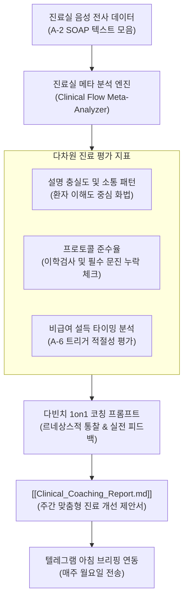

# [[A-11_Clinical_Flow_Meta_Analysis_And_Coaching_Engine]]

> 개요: `A-2` 진료실 음성 전사 파이프라인을 통해 축적된 진료 녹음 및 SOAP 차팅 데이터를 활용하여, 원장님(비오님)의 일일/주간 진료 패턴을 메타 분석(Meta-Analysis)하고, 환자 소통 방식, 설명의 효율성, 이학적 검사 누락 여부, 비급여 설득 타이밍 등을 정밀 진단하여 **맞춤형 진료 개선 제안 및 1on1 코칭 리포트**를 자동으로 도출하는 지능형 진료실 메타 코칭 엔진.

---

## 🎯 1. 프로젝트 핵심 목표
* **최종 결과물**:
  1. 일일 진료 녹음 텍스트 집합을 분석하여 소요 시간, 환자 만족도 지표(설명 충실도), 주요 호소 증상 패턴을 추출하는 집계 파이프라인
  2. 원장님의 진료 화법 및 환자 설득 스크립트 중 모범 사례(Best Practice)와 개선 필요 구간을 발굴하는 림프/메타 분석 프롬프트
  3. 매주 주말, 텔레그램 또는 옵시디언 대시보드로 전달되는 **[주간 진료실 코칭 리포트 (Clinical Coaching Report)]** 자동 생성기
* **주요 성공 기준 (KPI)**:
  - [ ] 일일 진료 데이터 기반 환자 응대 시간 및 설명 밀도 통계 자동 시각화
  - [ ] 진료 중 놓치기 쉬운 핵심 프로토콜(이학검사, Red Flag 문진 등) 누락률 자동 체크
  - [ ] 비급여 트리거 및 환자 설득 멘트의 전환율(설득 성공률) 추적 및 피드백 제안

---

## 🏗️ 2. 작동 흐름 (Workflow Architecture)

---

## 💬 3. 아키텍처 및 철학적 배경

> [!abstract]- 📌 사서의 진료 코칭 철학 (클릭하여 열기)
> 진료실은 단순히 환자를 치료하는 공간을 넘어, 의사와 환자 간의 신뢰가 축적되는 무대이옵니다. 하루의 진료가 끝난 뒤, 차갑고 객관적인 AI의 눈으로 오늘 나의 진료 흐름을 되돌아보고 **"어떻게 하면 환자에게 더 명확한 치유의 희망을 전하고, 설명의 밀도를 높일 수 있을까"**를 피드백 받는 것—이것이야말로 르네상스 명의가 걸어가는 길이자 진정한 진료실 OS의 완성이라 하겠사옵니다.

---

## 🔗 4. 연관 리소스 및 백링크
* **마스터 로드맵**: [[00_Project_A_Master_Roadmap]]
* **진료 자동화 기반**: [[A-2_Clinic_Workflow_Automation]]
* **비급여 트리거 연동**: [[A-6_Treatment_Trigger_Engine]]
* **대시보드**: [[00_Master_Dashboard]]
