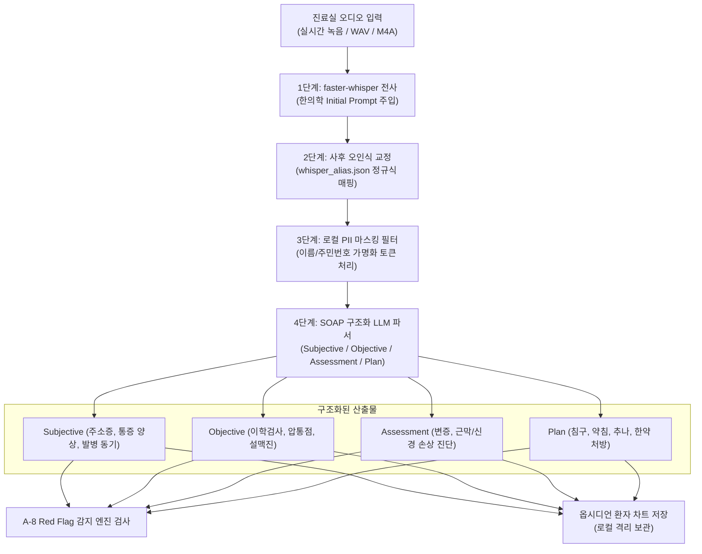

# [[A-2_Clinic_Workflow_Automation]]

> 개요: LG 그램 로컬 faster-whisper 기반으로 진료 음성을 전사하고, 2단계 오인식 보정(Initial Prompt + `whisper_alias.json`) 및 실시간 PII(개인식별정보) 마스킹을 거쳐 한의 맞춤형 SOAP 차트를 자동 생성하는 진료실 워크플로우 엔진.

---

## 🎯 1. 프로젝트 핵심 목표
* **최종 결과물**:
  1. LG 그램 24시간 에지 서버 상의 faster-whisper 전사 파이프라인
  2. 2단계 한의학 용어 보정기 (`whisper_alias.json` 정규식 치환 + Initial Prompt 주입)
  3. 로컬 PII(이름, 주민번호, 연락처) 마스킹 & 비식별화 필터
  4. SOAP 마크다운 차트 자동 생성 및 옵시디언/로컬 EMR 저장 모듈
* **주요 성공 기준 (KPI)**:
  - [ ] 3분 진료 음성을 LG 그램 로컬에서 15초 이내 전사 (한국어 전사 정확도 95% 이상)
  - [ ] 한의학 고유 용어(혈자리, 처방명, 상한론 조문 등) 오인식률 1% 미만 달성
  - [ ] 환자 개인식별정보의 외부 유출 없는 100% 로컬 암호화 격리
  - [ ] SOAP 구조화(주소증, 이학검사, 변증, 치료계획) 100% 자동 분해
* **연동 인프라**: LG 그램 (Linux/Docker/faster-whisper), Python Daemon, Obsidian Vault

---

## ⚙️ 2. 4단계 데이터 파이프라인 아키텍처

---

## 💬 3. Grill Me & 아키텍처 의사결정 기록

> [!abstract]- 📌 질의응답 아카이브 (클릭하여 열기)
> **Q1. faster-whisper의 한의학 전문 용어 오인식 해결 방안**
> - **결정**: 2단계 보정 체계 확립.
>   1. **사전(Initial Prompt)**: 자주 쓰이는 처방명, 경혈명, 근육명을 Whisper context에 사전 주입.
>   2. **사후(`whisper_alias.json`)**: 음운상 자주 혼동되는 단어(예: '갈근탕' $\to$ '발근탕', '태충' $\to$ '대충' 등)를 정규식 딕셔너리로 즉각 전수 교정.
> 
> **Q2. 환자 개인정보(PII) 보안 처리**
> - **결정**: 외부 LLM 호출 전 단계에서 환자 실명, 전화번호, 주민등록번호 등을 `[PATIENT_ID_001]` 등의 토큰으로 마스킹하고, 복호화 테이블은 LG 그램 로컬 SQLite/메모리에만 격리 보관.

---

## ✅ 4. 세부 Task & 체크리스트

### 🏗️ Phase 1. 로컬 faster-whisper 및 보정 딕셔너리 구축
- [ ] LG 그램 에지 서버에 faster-whisper Docker 컨테이너 배치
- [ ] `whisper_alias.json` 한의학 다빈도 오인식 매핑 사전 구축
- [ ] Initial Prompt 한의학 용어 세트 최적화

### 💻 Phase 2. PII 마스킹 및 SOAP 파서 개발
- [ ] 정규식 및 Spacy/KoNLPy 기반 로컬 PII 마스킹 모듈 작성
- [ ] SOAP 마크다운 파서 및 A-8 Red Flag 연동 인터페이스 구현
- [ ] 옵시디언 로컬 차트 폴더 자동 생성 파이프라인 연동

### 🧪 Phase 3. 모의 진료 음성 벤치마크 및 현장 튜닝
- [ ] 20개 모의 진료 음성 샘플 대상 전사 속도 및 오인식률 평가
- [ ] 오인식 단어 지속적 `whisper_alias.json` 추가 루틴 구축

---

## 🔗 5. 관련 리소스 및 백링크
* **마스터 로드맵**: [[00_Project_A_Master_Roadmap]]
* **대시보드**: [[00_Master_Dashboard]]
* **연계 엔진**: [[A-1_Clinical_Knowledge_DB]], [[A-3_Clinic_Protocol_Engine]], [[A-8_Clinical_RedFlag_Alert]]
* **인프라 보안**: [[C-3_Security_and_Isolation]], [[C-7_Clinic_Gram_Sync_Protocol]]
