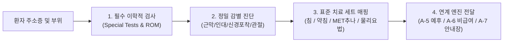

---
project_id: "A-3"
title: "임상 진료 프로토콜 엔진 (14대 부위별 표준 치료 세트)"
category: "Project A (Medical Core)"
status: "진행전"
priority: "High"
created: 2026-08-30
updated: 2026-08-31
target_date: "2026-09-30"
tags:
  - ai-project
  - protocol-engine
  - physical-exam
  - acupuncture-chuna-set
  - status/pending
---

# [[A-3_Clinic_Protocol_Engine]]

> 개요: 전신 14개 부위별 이학적 특수 검사(Special Tests), 감별 진단 흐름도, 그리고 침·약침·추나 표준 치료 세트를 정형화하여 진료실 내 초고속·고품질 치료 결정을 보조하는 임상 프로토콜 엔진.

---

## 🎯 1. 프로젝트 핵심 목표
* **최종 결과물**:
  1. 14대 부위별 표준 진료 프로토콜 지식셋 (마크다운 & Frontmatter)
  2. 부위별 필수 이학적 검사 및 가동범위(ROM) 판정 가이드
  3. [근육-경혈-약침점-추나수기법] 연계 표준 치료 세트(Treatment Set)
* **주요 성공 기준 (KPI)**:
  - [ ] 14대 부위별 [주소증 $\to$ 필수검사 $\to$ 감별진단 $\to$ 침/약침/추나 세트] 마크다운 완성
  - [ ] SOAP 차트의 부위/진단 입력 시 즉시 3단계 표준 치료 플랜(급성기/아급성기/만성기) 매핑
  - [ ] A-5(예후 엔진), A-6(비급여 트리거), A-7(안내장)과의 완벽한 데이터 연동
* **연동 인프라**: Obsidian Vault (LLM Wiki), A-1 지식그래프, C-4 Vault Graph MCP

---

## 🩺 2. 14개 부위별 표준 치료 프로토콜 구조

### 📌 14대 부위별 표준 치료 세트 대상
1. **경추부 (Cervical)**: 경추 추간판 탈출증, 후두하근 포착증후군, 경추 염좌 (경판상근/사각근 침구, C-spine 견인/MET 추나, 중성어혈약침)
2. **견관절 (Shoulder)**: 회전근개 건염/파열, 오십견(유착성 관절낭염), 석회성 건염 (극상근/견갑하근 TP 자침, 관절가동추나, 소염/봉약침)
3. **주관절 (Elbow)**: 외측상과염(테니스 엘보), 내측상과염(골퍼 엘보) (단요측수근신근/척측수근굴근 침, 건부착부 약침)
4. **완관절/수부 (Wrist/Hand)**: 수근관 증후군, 드퀘르벵 건초염 (횡수근인대 이완침, 단무지신근 약침)
5. **흉배부 (Thoracic)**: 능형근 증후군, 늑간신경통 (흉추 신전 MET 추나, 늑골각 침치료)
6. **요추부 (Lumbar)**: 요추 추간판 탈출증, 요추 염좌, 척추관 협착증 (장요근/요방형근 MET 추나, 척추기립근 심부자침, 신바로/중성어혈약침)
7. **골반/둔부 (Pelvis/Gluteal)**: 이상근 증후군, 천장관절 증후군, 중둔근 건염 (둔근 심부침, 골반 교정 추나)
8. **고관절 (Hip)**: 대퇴비구 충돌 증후군, 고관절 활액낭염 (대퇴근막장근/장요근 이완)
9. **슬관절 (Knee)**: 퇴행성 슬관절염, 반월상 연골판 손상, 슬개건염 (대퇴사두근/슬건근 TP, 관절강내/주위 약침)
10. **족관절/족부 (Ankle/Foot)**: 발목 염좌, 족저근막염, 아킬레스 건염 (전거비인대/비골근 자침, 족궁 교정)
11. **악관절/두경부 (TMJ/Head)**: 턱관절 장애, 긴장성/경추성 두통 (익상근/교근 구강내 자침, 경흉추 연계 추나)
12. **안면신경 (Facial)**: 구안와사(벨마비) 급성기 및 후유증 (안면 표정근 미세침, 봉약침)
13. **소화기/내과 (GI/Internal)**: 기능성 소화불량, 역류성 식도염, 과민대장증후군 (복모혈 침구, 배수혈 자율신경 조절)
14. **자율신경/심신 (Autonomic/Mind)**: 화병, 불면증, 만성 피로 (사관혈, 전중/백회 자침, 온담탕/귀비탕 연계)

---

## 💬 3. Grill Me & 아키텍처 의사결정 기록

> [!abstract]- 📌 질의응답 아카이브 (클릭하여 열기)
> **Q1. 치료 프로토콜과 환자 안내문(티칭)의 역할 분담**
> - **결정**: A-3은 원장의 '임상 치료 결정(이학검사 및 치료 세트 매핑)'에 전념하고, 환자에게 전달되는 시각적 안내문 및 홈케어 티칭은 독립 서브 프로젝트인 [[A-7_Patient_Handout_Builder]]에서 전담 처리.

---

## ✅ 4. 세부 Task & 체크리스트

### 🏗️ Phase 1. 14대 부위 프로토콜 표준 지식셋 구축
- [ ] 14개 부위별 이학적 검사 마크다운 템플릿 표준화
- [ ] 부위별 3대 치료 세트(침구 경혈, 약침 주입점, 추나 기법) 정의
- [ ] [[A-1_Clinical_Knowledge_DB]]의 근육 및 질환 노드와 100% 양방향 위키링크 연결

### 💻 Phase 2. SOAP 차트 연동 치료 세트 자동 추천기
- [ ] SOAP Assessment 상병명 감지 시 표준 치료 세트 즉각 팝업/추천 로직
- [ ] 환자 증상 중등도별(급성/만성) 치료 세트 가감 로직 구현

---

## 🔗 5. 관련 리소스 및 백링크
* **마스터 로드맵**: [[00_Project_A_Master_Roadmap]]
* **대시보드**: [[00_Master_Dashboard]]
* **연계 엔진**: [[A-1_Clinical_Knowledge_DB]], [[A-5_Clinical_Prognosis_Timeline_Engine]], [[A-6_Treatment_Trigger_Engine]], [[A-7_Patient_Handout_Builder]]
