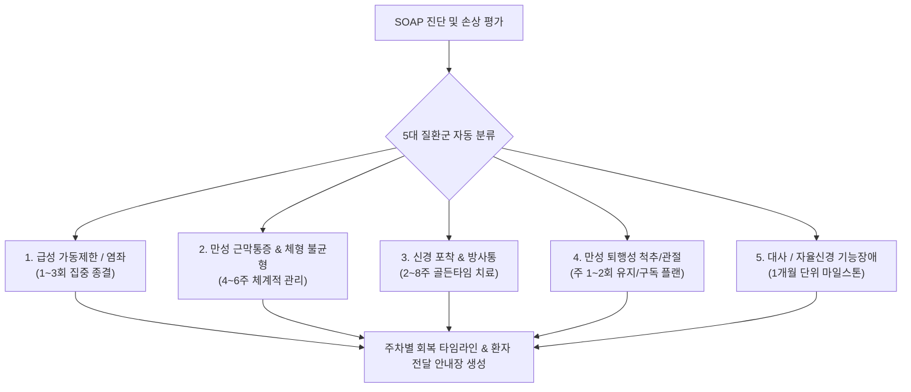

# [[A-5_Clinical_Prognosis_Timeline_Engine]]

> 개요: 한의원 진료 현장에 최적화된 5대 질환군을 분류하고, 각 군별 골든타임 치료 곡선과 주차별 회복 타임라인을 자동 산출하여 환자 순응도와 치료 완주율을 극대화하는 예후 예측 엔진.

---

## 🎯 1. 프로젝트 핵심 목표
* **최종 결과물**:
  1. 5대 질환군별 표준 치료 회차, 예상 기간, 주차별 호전도 곡선 데이터 모델
  2. SOAP 차팅 진단명 및 환자 연령/병력 기반 맞춤 회복 타임라인 산출기
  3. A-7(안내장) 및 A-6(비급여 트리거) 연동 타임라인 마크다운 렌더러
* **주요 성공 기준 (KPI)**:
  - [ ] 5대 질환군별 표준 예후 데이터셋(급성기/전이/안정기 회복 곡선) 정립
  - [ ] 진단 즉시 환자별 예상 치료 회차(예: 1~3회 종결 vs 4~6주 플랜) 1초 내 자동 도출
  - [ ] 주차별(1주차: 염증제어 $\to$ 2주차: 가동성회복 $\to$ 4주차: 재발방지) 마일스톤 생성
* **연동 인프라**: Obsidian Vault (LLM Wiki), A-3 프로토콜 엔진, A-7 환자 안내장 렌더러

---

## 📈 2. 한의원 5대 질환군 분류 및 표준 예후 타임라인

### 📌 5대 질환군 상세 스펙

| 번호 | 질환군 | 대표 질환 | 권장 치료 주기 | 주차별 마일스톤 |
| :---: | :--- | :--- | :--- | :--- |
| **1** | **급성 가동제한 / 단순 염좌** | 낙침, 급성 요추염좌, 발목 염좌 | 1~3회 (1주일 이내 집중) | 1~2일: 통증 50% 이상 감소 및 기본 ROM 확보 $\to$ 종결 |
| **2** | **만성 근막통증 & 체형 불균형** | 거북목, 둥근어깨, 만성 등통증, 골반 비대칭 | 4~6주 (주 2회, 총 8~12회) | 1~2주: Trigger Point 비활성화 $\to$ 3~4주: 자세/ROM 정상화 $\to$ 5~6주: 코어 강화 |
| **3** | **신경 포착 & 방사통** | 경추/요추 디스크, 흉곽출구증후군, 좌골신경통 | 2~8주 (주 2~3회 집중) | 1~2주: 신경부종/염증 완화 $\to$ 3~4주: 방사통 중심화(Centralization) $\to$ 5~8주: 신경재생 |
| **4** | **만성 퇴행성 척추/관절** | 무릎 퇴행성관절염, 척추관 협착증, 오십견 | 장기 관리 (주 1~2회 지속) | 1개월: 일상보행 통증 제어 $\to$ 2~3개월: 관절 가동성 유지 및 관절강 윤활 관리 |
| **5** | **대사 / 자율신경 기능장애** | 만성 소화불량, 불면, 화병, 만성피로 | 1개월 단위 마일스톤 (한약+침구) | 2주: 수면/소화 개선 $\to$ 4주: 자율신경 균형 및 대사 회복 $\to$ 2~3개월: 체질 개선 |

---

## 💬 3. Grill Me & 아키텍처 의사결정 기록

> [!abstract]- 📌 질의응답 아카이브 (클릭하여 열기)
> **Q1. 예후 타임라인이 진료실에서 가지는 실제 가치**
> - **결정**: 환자가 자신의 치료 종료 시점과 단계별 호전 과정을 명확히 인지하게 함으로써 중간 이탈률을 70% 이상 줄이고, 적정 시점에 비급여(추나/약침/한약) 치료의 필요성을 자연스럽게 납득시키는 핵심 도구로 작동함.

---

## ✅ 4. 세부 Task & 체크리스트

### 🏗️ Phase 1. 5대 질환군 데이터 모델링
- [ ] 5대 질환군별 주차별 호전도 곡선 및 예상 치료 회차 데이터베이스 구축
- [ ] 질환별 회복 지연 요인(고령, 당뇨, 흡연, 반복 작업 등) 가중치 정의

### 💻 Phase 2. 타임라인 자동 산출 알고리즘 구현
- [ ] SOAP Assessment 기반 5대 질환군 자동 매핑 로직 작성
- [ ] 주차별 단계(염증기 $\to$ 재생기 $\to$ 재형성기) 텍스트 및 시각화 생성기 개발

### 🧪 Phase 3. A-7(안내장) 및 A-6(비급여) 연계 테스트
- [ ] 진료 후 1-Page 환자 안내장에 타임라인 섹션 자동 삽입 테스트
- [ ] 골든타임 구간 내 비급여 트리거 정상 작동 검증

---

## 🔗 5. 관련 리소스 및 백링크
* **마스터 로드맵**: [[00_Project_A_Master_Roadmap]]
* **대시보드**: [[00_Master_Dashboard]]
* **연계 프로젝트**: [[A-3_Clinic_Protocol_Engine]], [[A-6_Treatment_Trigger_Engine]], [[A-7_Patient_Handout_Builder]]
