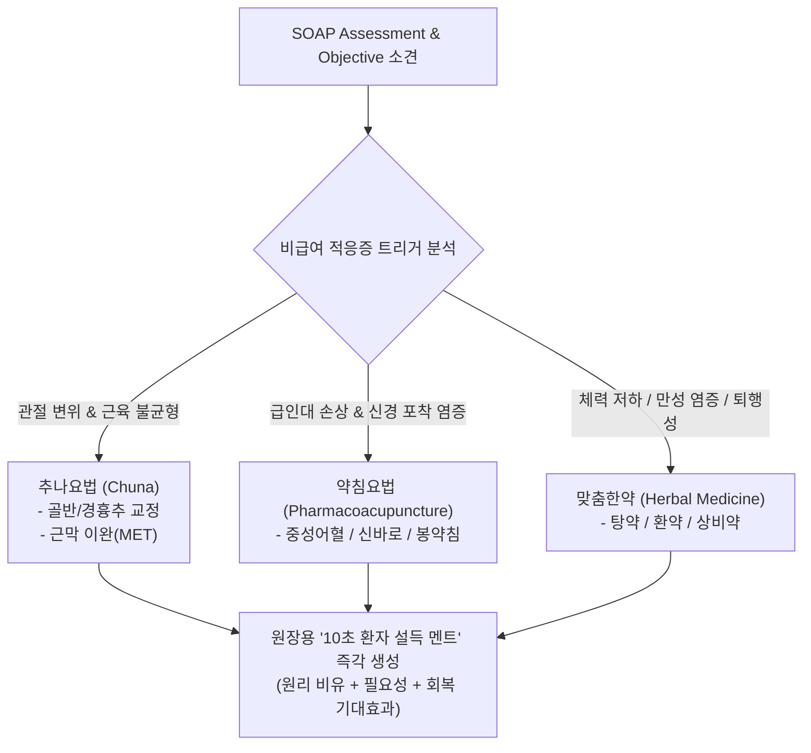

# [[A-6_Treatment_Trigger_Engine]]

> 개요: 환자의 증상, 병력, 손상 부위에 따라 비급여 항목(추나요법, 약침치료, 맞춤한약)의 적응증을 자동 판정하고, 진료실에서 원장이 즉각 활용할 수 있는 '10초 환자 설득 멘트(비유·원리 중심)' 템플릿을 생성하는 엔진.

---

## 🎯 1. 프로젝트 핵심 목표
* **최종 결과물**:
  1. 비급여 3대 항목(추나, 약침, 맞춤한약) 적응증 자동 판정 룰셋
  2. 환자 심리 및 질환 기전 기반의 '10초 원장 설득 멘트' 생성기
  3. 실시간 차팅 UI 내 비급여 추천 팝업/배너 인터페이스
* **주요 성공 기준 (KPI)**:
  - [ ] 추나(체형 불균형/관절 가동제한), 약침(급성 신경염증/건염), 한약(대사/기혈허/재발방지) 판정 정확도 95% 이상
  - [ ] 전문 의학 용어를 일반인이 10초 만에 이해하는 직관적 비유(예: "경추 디스크는 찌그러진 햄버거 패티...")로 변환
  - [ ] 비급여 권유에 대한 환자 저항감 최소화 및 진료실 설득 시간 80% 단축
* **연동 인프라**: Obsidian Vault (LLM Wiki), A-2 SOAP 차팅, A-5 예후 타임라인

---

## 💡 2. 비급여 적응증 판정 룰셋 및 10초 멘트 구조

### 📌 비급여 3대 항목별 '10초 멘트' 템플릿 예시

| 비급여 항목 | 적응증 트리거 | 10초 환자 설득 멘트 템플릿 (비유 & 핵심) |
| :--- | :--- | :--- |
| **추나요법** | 경요추 부정렬, 골반 비대칭, 흉추 가동제한 | "환자분, 지금 건물 기둥(척추)이 한쪽으로 기울어져서 주변 전선(근육과 신경)이 팽팽하게 당겨져 통증이 오는 겁니다. 침으로 굳은 근육을 풀어도 뼈대가 틀어져 있으면 금방 다시 아픕니다. 오늘 틀어진 기둥을 바로잡는 추나 치료를 함께 진행하겠습니다." |
| **약침치료** | 급성 신경근 부종, 회전근개 건염, 족저근막염 | "지금 염증이 생긴 부위는 깊은 관절 안쪽이라 일반 침으로는 약효가 닿기 어렵습니다. 천연 한약재에서 염증을 가라앉히는 핵심 성분만 정제한 약침을 통증 부위에 직접 주입해 소염 진통과 신경 회복을 빠르게 유도하겠습니다." |
| **맞춤한약** | 만성 피로 동반 디스크, 체력 저하성 관절통, 산후풍 | "지금 통증은 밭(몸의 기혈과 면역력)이 메말라 있어서 싹(손상된 근육과 인대)이 스스로 아물지 못하는 상태입니다. 침과 추나로 물길을 트고, 맞춤 한약으로 뼈와 인대에 영양을 공급해야 재발 없이 완치될 수 있습니다." |

---

## 💬 3. Grill Me & 아키텍처 의사결정 기록

> [!abstract]- 📌 질의응답 아카이브 (클릭하여 열기)
> **Q1. 비급여 제안 시 환자가 상업적이라고 느끼지 않게 하는 핵심 요소**
> - **결정**: 가격이나 상품을 강조하는 것이 아니라, **A-5(예후 타임라인) 상에서 왜 지금 이 비급여 치료가 개입해야 골든타임을 놓치지 않는지** '의학적 필연성'을 명확한 비유로 설명하는 데 집중함.

---

## ✅ 4. 세부 Task & 체크리스트

### 🏗️ Phase 1. 비급여 적응증 분류 알고리즘 수립
- [ ] 질환-부위-중등도 매트릭스 기반 추나/약침/한약 판정 로직 정립
- [ ] 각 항목별 금기증(골다공증 심한 환자 추나 금기, 봉약침 알러지 등) 필터 구현

### 💻 Phase 2. 10초 설득 멘트 생성 프롬프트 엔진
- [ ] 부위별·연령별(청년층/중장년층/노년층) 맞춤 비유 라이브러리 구축
- [ ] SOAP 차팅 연동 실시간 멘트 제안 모듈 작성

---

## 🔗 5. 관련 리소스 및 백링크
* **마스터 로드맵**: [[00_Project_A_Master_Roadmap]]
* **대시보드**: [[00_Master_Dashboard]]
* **연계 프로젝트**: [[A-2_Clinic_Workflow_Automation]], [[A-3_Clinic_Protocol_Engine]], [[A-5_Clinical_Prognosis_Timeline_Engine]], [[A-7_Patient_Handout_Builder]]
