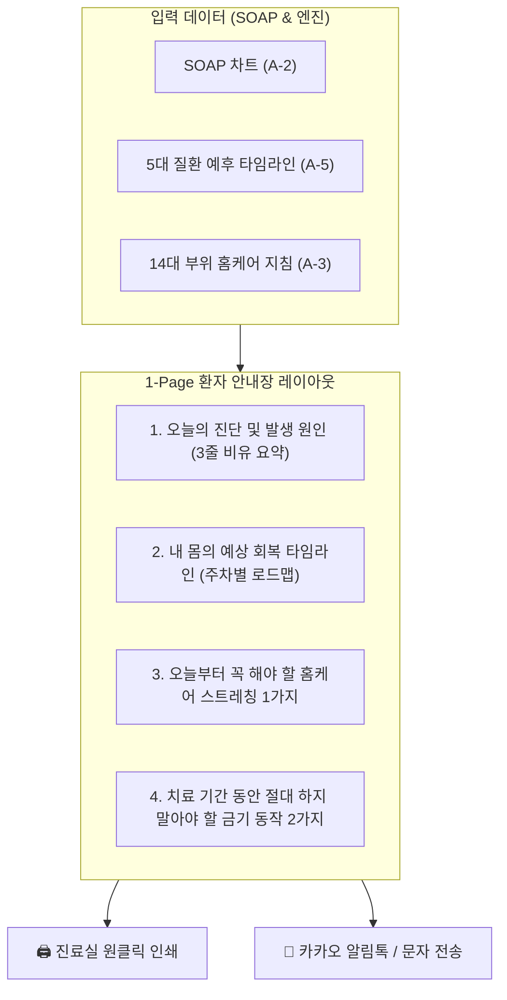

# [[A-7_Patient_Handout_Builder]]

> 개요: 진료가 끝나는 즉시 원클릭으로 출력 또는 카카오 알림톡/문자로 발송할 수 있는 1-Page 환자 맞춤 안내장(발생 원인 + 5대 질환 기반 회복 타임라인 + 오늘의 홈케어 1개 + 절대 금기 2개) 렌더러.

---

## 🎯 1. 프로젝트 핵심 목표
* **최종 결과물**:
  1. 진료실 프린트용 1-Page 깔끔한 PDF/HTML 안내장 렌더러
  2. 모바일 전송용 알림톡/문자 마크다운 템플릿
  3. SOAP 차트 기반 자동 텍스트 주입 파이프라인
* **주요 성공 기준 (KPI)**:
  - [ ] SOAP 차트 확정 후 1초 이내에 1-Page 규격 안내장 자동 완성
  - [ ] 필수 4대 구성(①원인 요약, ②5대 질환 회복 타임라인, ③스트레칭 1개, ④금기 2개) 100% 반영
  - [ ] 환자가 집에 가져가서 냉장고에 붙여놓고 볼 수 있는 깔끔한 타이포그래피/레이아웃 UI
* **연동 인프라**: Obsidian Markdown, HTML/CSS 템플릿 엔진, A-2 차팅 엔진, A-5 예후 엔진

---

## 📄 2. 1-Page 맞춤 안내장 표준 포맷 명세



### 📌 안내장 실제 출력 템플릿 예시 (경추 디스크 & 승모근 긴장 환자)

```markdown
# 🏥 심비오 한의원 맞춤 회복 안내장
**환자명**: 홍길동 님 | **진료일**: 2026-09-01 | **담당원장**: 심비오

---

### 1. 🔍 오늘의 진단과 원인
- **진단명**: 경추 추간판 탈출증(목 디스크 초기) 및 [[승모근]]·[[사각근]] 긴장
- **발생 원인**: 장시간 스마트폰/모니터 사용으로 목의 C자 커브가 무너지며 디스크에 비정상적인 압력이 가해졌고, 이를 버티려던 어깨 근육이 단단하게 뭉쳐 신경을 누르고 있습니다.

### 2. 📈 나의 예상 회복 로드맵 (골든타임 4주 플랜)
- **1주차 (염증 제어기)**: 침·약침 치료로 신경 주변의 급성 염증과 찌릿한 통증을 50% 이상 완화합니다.
- **2~3주차 (가동성 회복기)**: 추나 치료를 통해 틀어진 목뼈 정렬을 바로잡고 목의 회전 범위를 정상화합니다.
- **4주차 (안정 및 재발방지)**: 경추 심부 근육을 강화하여 일상 복귀 및 재발을 방지합니다.

### 3. 🧘 오늘부터 집에서 할 스트레칭 (1가지)
* **[친턱(Chin-Tuck) 목 당기기 운동]**: 허리를 펴고 앉아 턱을 목 쪽으로 가볍게 밀어 넣고 5초간 유지합니다. (하루 3회, 10회씩 반복)

### 4. 🚫 치료 기간 절대 금기사항 (2가지)
1. ❌ **고개 푹 숙이고 스마트폰 보기 금지** (목에 20kg 이상의 하중이 실립니다.)
2. ❌ **목을 꺾으며 뚝뚝 소리 내는 습관 금지** (디스크 손상을 가속합니다.)
```

---

## 💬 3. Grill Me & 아키텍처 의사결정 기록

> [!abstract]- 📌 질의응답 아카이브 (클릭하여 열기)
> **Q1. 안내장 출력 및 전송 속도의 중요성**
> - **결정**: 환자가 수납을 마치는 10~20초 사이에 데스크에서 바로 종이로 출력되거나 카카오톡으로 발송되어야 하므로, 사전 정의된 템플릿 컴포넌트에 변수만 즉각 주입하는 초경량 렌더링 방식 채택.

---

## ✅ 4. 세부 Task & 체크리스트

### 🏗️ Phase 1. 1-Page HTML/CSS 인쇄 템플릿 디자인
- [ ] A4 1페이지 규격 반응형 인쇄 CSS 템플릿 구축 (Glassmorphism & 모던 타이포그래피)
- [ ] 카카오 알림톡 규격 텍스트 포맷 설계

### 💻 Phase 2. 데이터 바인딩 렌더러 개발
- [ ] SOAP 및 A-5 예후 데이터 자동 파싱 & 템플릿 바인딩 스크립트 작성
- [ ] 홈케어 스트레칭 삽화(도해) 연동 지원 모듈 구현

---

## 🔗 5. 관련 리소스 및 백링크
* **마스터 로드맵**: [[00_Project_A_Master_Roadmap]]
* **대시보드**: [[00_Master_Dashboard]]
* **연계 엔진**: [[A-2_Clinic_Workflow_Automation]], [[A-3_Clinic_Protocol_Engine]], [[A-5_Clinical_Prognosis_Timeline_Engine]]
