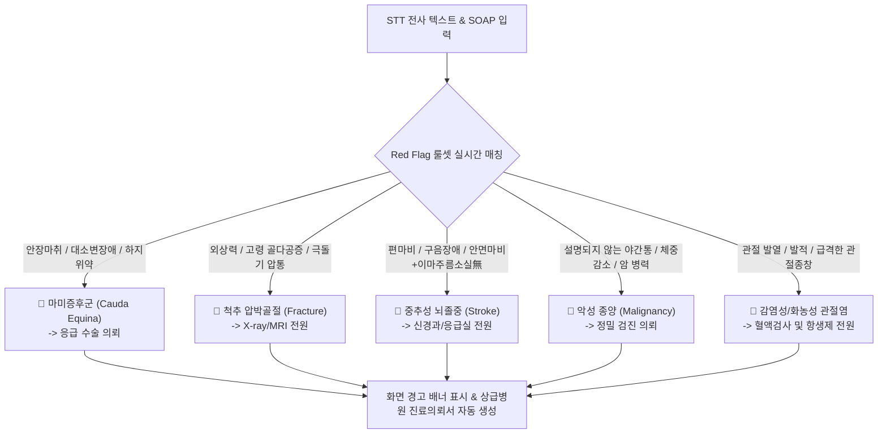

# [[A-8_Clinical_RedFlag_Alert]]

> 개요: 진료 음성 전사 및 SOAP 차팅 과정에서 마미증후군, 급성 골절, 뇌졸중/중추신경계 이상, 악성 종양 의심 소견 등 한의원 내 처치 금기 및 상급병원 즉시 응급 전원이 필요한 Red Flag를 실시간 감지하여 경고 배너를 띄우는 임상 안전 엔진.

---

## 🎯 1. 프로젝트 핵심 목표
* **최종 결과물**:
  1. 부위별·질환별 임상 위험 징후(Red Flag) 룰셋 및 키워드 사전
  2. 실시간 SOAP 차팅 및 STT 텍스트 스트림 감시 Red Flag 감지 엔진
  3. UI 상의 즉각 팝업/경고 배너 및 전원 의뢰서(Referral Letter) 초안 생성기
* **주요 성공 기준 (KPI)**:
  - [ ] 주요 10대 응급/전원 질환(마미증후군, 척추골절, 뇌경색, 심근경색, 감염성 관절염 등) 감지 정확도 100% (위음성 0%)
  - [ ] 위험 키워드 감지 시 0.5초 이내 화면 상단에 붉은색 경고 배너 출력
  - [ ] 전원 필요 시 상급병원 제출용 '소견서/진료의뢰서' 표준 양식 자동 작성
* **연동 인프라**: Obsidian Vault (LLM Wiki), A-2 SOAP 파서, A-3 프로토콜 엔진

---

## 🚨 2. 주요 10대 Red Flag 질환 및 감지 키워드 매트릭스

### 📌 부위별 핵심 Red Flag 감별 체크리스트

| 부위 / 계통 | 주요 질환 | 핵심 감지 증상 (Red Flag) | 긴급 조치 |
| :--- | :--- | :--- | :--- |
| **요추부** | 마미증후군 | 회음부 안장마취(Saddle Anesthesia), 대소변 실금/배뇨장애, 양하지 진행성 근력 약화 | 48시간 내 응급 감압술 의뢰 |
| **요추/흉추부** | 척추 압박골절 | 낙상/외상 후 급격한 통증, 극돌기 타진통(Percussion tenderness), 고령자 체위변경 불가 | X-ray/CT 촬영 의뢰 |
| **두경부/안면** | 중추성 뇌졸중 | 안면마비 시 이마 주름 잡힘(중추성), 구음장애, 편측 상하지 위약, 보행실조 | 즉시 119/응급실 전원 |
| **전신/척추** | 척추 종양/전이 | 50세 이상, 원인 불명의 급격한 체중 감소, 휴식 시에도 지속되는 심한 야간통 | MRI 및 종양내과 의뢰 |
| **관절부** | 화농성 관절염 | 단일 관절의 극심한 열감, 부종, 발적, 전신 발열(Chills/Fever), 능·수동 가동 불가 | 관절액 천자 및 항생제 전원 |

---

## 💬 3. Grill Me & 아키텍처 의사결정 기록

> [!abstract]- 📌 질의응답 아카이브 (클릭하여 열기)
> **Q1. Red Flag 감지 엔진의 최우선 가치**
> - **결정**: 한의원 개원 시 의료사고 예방과 환자 안전이 1순위이므로, AI는 조금이라도 의심되는 소견이 감지되면 보수적으로 원장에게 경고를 띄우고 즉각 전원 프로세스를 지원하도록 설계함.

---

## ✅ 4. 세부 Task & 체크리스트

### 🏗️ Phase 1. Red Flag 룰셋 및 의학 온톨로지 정의
- [ ] 10대 응급 전원 질환별 필수 감별 증상 및 키워드 사전 구축
- [ ] 침구/추나/약침 금기증 매트릭스 작성

### 💻 Phase 2. 실시간 감지 알고리즘 및 UI 배너 연동
- [ ] SOAP 파싱 스트림 내 Red Flag 트리거 감지 로직 구현
- [ ] 경고 발생 시 전원 의뢰서(소견서) 자동 생성 템플릿 연동

---

## 🔗 5. 관련 리소스 및 백링크
* **마스터 로드맵**: [[00_Project_A_Master_Roadmap]]
* **대시보드**: [[00_Master_Dashboard]]
* **연계 엔진**: [[A-2_Clinic_Workflow_Automation]], [[A-3_Clinic_Protocol_Engine]], [[A-9_Prescription_Safety_Interaction_Engine]]
