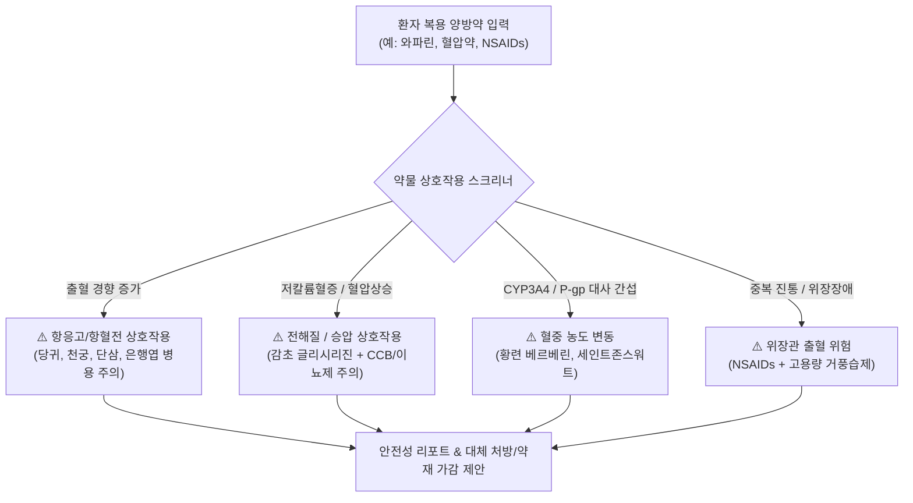

---
project_id: "A-9"
title: "한·양방 약물 상호작용 및 안전성 스크리닝 엔진"
category: "Project A (Medical Core)"
status: "진행전"
priority: "High"
created: 2026-08-31
updated: 2026-08-31
target_date: "2026-10-30"
tags:
  - ai-project
  - herb-drug-interaction
  - safety-screening
  - cyp450
  - status/pending
---

# [[A-9_Prescription_Safety_Interaction_Engine]]

> 개요: 환자가 복용 중인 양방 의약품(혈압약, 당뇨약, 항응고제, 소염진통제, 항우울제 등)과 한약재/처방 간의 CYP450 대사 효소 간섭, 상가적 출혈 위험, 전해질 불균형, 간/신독성 상호작용을 사전 스크리닝하여 안전한 처방을 보장하는 임상 안전 엔진.

---

## 🎯 1. 프로젝트 핵심 목표
* **최종 결과물**:
  1. 다빈도 100대 양방약 ↔ 주요 한약재/처방 간 상호작용 지식 매트릭스
  2. 간독성(DILI) / 신독성 고위험군 환자 감별 및 안전 용량 산출 룰셋
  3. 처방 발행 시 실시간 안전성 점검 팝업/경고 엔진
* **주요 성공 기준 (KPI)**:
  - [ ] 항응고제(와파린/NOAC), 혈압약, 혈당강하제 등 고위험 약물 상호작용 감지율 100%
  - [ ] CYP1A2, CYP2C9, CYP2D6, CYP3A4 효소 억제/유도 기반 약동학적(PK) 충돌 정밀 분석
  - [ ] 복용 약물 입력 시 0.5초 이내에 병용 주의/금기 한약재 및 대체 가능 처방 즉시 제안
* **연동 인프라**: Obsidian Vault (LLM Wiki), A-1 지식 DB ([[_MOC_WesternDrugs]]), A-2 SOAP 차팅

---

## 🔬 2. 핵심 약물 상호작용(Herb-Drug Interaction) 매트릭스

### 📌 다빈도 고위험 한·양방 상호작용 대표 사례

| 양방 약물군 | 대표 약물 | 병용 주의 한약재 | 상호작용 메커니즘 및 임상 리스크 | 안전 조치 / 가감 대안 |
| :--- | :--- | :--- | :--- | :--- |
| **항응고제 / 항혈소판제** | 와파린, 아스피린, 클로피도그렐, NOAC | [[당귀]], [[천궁]], [[단삼]], [[홍화]], [[은행엽]] | 혈소판 응집 억제 및 항응고 시너지로 인한 출혈 위험(비출혈, 피하출혈, 위장출혈) 증가 | 활혈거어약 용량 감량(50% 이하) 또는 보기양혈제(황기, 백출) 중심 배오 |
| **혈압약 (CCB / 이뇨제)** | 아믈로디핀, 히드로클로로티아지드 | [[감초]] (글리시리진 고용량) | 글리시리진의 11β-HSD2 억제로 코르티솔 분해 저해 $\to$ 저칼륨혈증, 체액 저류, 혈압 상승 | 감초 일일 4g 이하 제한 또는 자감초 대체, 장기 투여 시 칼륨 수치 모니터링 |
| **당뇨약 (경구 혈당강하제)** | 메트포르민, 설포닐우레아 | [[인삼]], [[황련]], [[지황]], [[갈근]] | 인슐린 감수성 개선 및 AMPK 활성화로 인한 급격한 저혈당(Hypoglycemia) 위험 | 복용 초기 자가 혈당 측정 빈도 증대 권고, 한약 투여 시간 2시간 격차 유지 |
| **스타틴 (고지혈증약)** | 아토르바스타틴, 로수바스타틴 | [[홍국]] (모나콜린 K) | 스타틴과 동일 성분(모나콜린 K = 로바스타틴) 중복으로 횡문근융해증/간수치 상승 위험 | 홍국 단독 사용 금지 및 처방 배제 |

---

## 💬 3. Grill Me & 아키텍처 의사결정 기록

> [!abstract]- 📌 질의응답 아카이브 (클릭하여 열기)
> **Q1. 고령 환자 다제약물 복용(Polypharmacy) 대응 전략**
> - **결정**: 65세 이상 환자의 경우 양약 복용 개수가 5개 이상인 경우가 많으므로, 한약 처방 시 간/신장 배설 부담을 줄이기 위해 전탕 첩약 외에 정제/엑스제 분할 복용 및 상호작용 검사를 기본 디폴트로 적용.

---

## ✅ 4. 세부 Task & 체크리스트

### 🏗️ Phase 1. 약물 상호작용 온톨로지 DB 구축
- [ ] 다빈도 10대 양방 약물군별 한약재 병용 주의 매트릭스 정립
- [ ] CYP450 효소(1A2, 2C9, 2D6, 3A4) 억제/유도 한약재 리스트 구축

### 💻 Phase 2. 처방 안전성 스크리너 엔진 개발
- [ ] SOAP Plan 처방과 환자 기저 복용약 대조 알고리즘 작성
- [ ] 위험 발생 시 대체 처방 및 가감법(약재 제외/대체) 자동 추천 로직 구현

---

## 🔗 5. 관련 리소스 및 백링크
* **마스터 로드맵**: [[00_Project_A_Master_Roadmap]]
* **대시보드**: [[00_Master_Dashboard]]
* **연계 지식**: [[A-1_Clinical_Knowledge_DB]], [[A-8_Clinical_RedFlag_Alert]]
