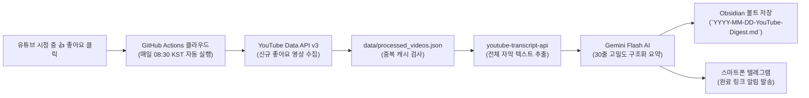

---
project_id: "B-1"
title: "나이트 백그라운드 파이프라인 (유튜브 요약기 & 클리퍼 분류)"
category: "Project B (Agent & Automation)"
status: "완료" # [진행전, 심문중, 진행중, 완료]
priority: "High"
created: 2026-08-30
updated: 2026-08-31
target_date: "2026-08-31"
tags:
  - ai-project
  - youtube-digest
  - automation
  - cloud-scheduling
  - status/completed
---

# [[B-1_Overnight_Youtube_Worker]]

> 개요: 사용자가 모바일/PC에서 시청 중 **좋아요(Like)**를 누른 지식 영상을 매일 아침(08:30 KST) GitHub Actions 클라우드에서 자동 수집하고, Google GenAI(Gemini)를 통해 30줄 이상의 고밀도 구조화 마크다운 요약본을 생성하여 옵시디언 볼트(`5. 독서, 노트/유튜브_일일_브리핑/`)에 저장하고 텔레그램으로 링크 알림을 발송하는 100% 무인 자동화 파이프라인.

> ✅ **실가동 재확인 (2026-09-02)**: `2026-08-31`, `09-01`, `09-02` 다이제스트 연속 생성 확인 (마스터_브리핑_모음) — 3일째 가동 중. (현재 저장 위치: `00. 봇 운영 시스템/보고서/유튜브 브리핑/`)

---

## 🎯 1. 프로젝트 핵심 개요 (Project Overview)
* **최종 결과물**:
  1. Google Cloud OAuth 2.0 (`Refresh Token`) 기반 YouTube Data API v3 무인 수집기
  2. Gemini Flash AI 기반 30줄 고밀도 3단계 요약 엔진 (카르파시 LLM Wiki 스키마)
  3. GitHub Actions 클라우드 무중단 일일 Cron (매일 08:30 KST 자동 실행)
  4. 옵시디언 볼트 자동 저장 (`YYYY-MM-DD-YouTube-Digest.md`) & 텔레그램 링크 알림
* **핵심 성공 지표 (KPI - 100% 달성 🏆)**:
  - [x] 쿠키 만료 없는 영구 OAuth 2.0 토큰 갱신 체계 구축
  - [x] '좋아요' 영상 타깃팅 및 중복 수집 방지 캐시(`processed_videos.json`) 완비
  - [x] 일일 5편 영상 대상 30줄 고밀도 구조화 마크다운 브리핑 1호 발행 완료 (2026-08-31)
  - [x] 스마트폰 텔레그램 알림 및 옵시디언 볼트 자동 커밋/푸시 검증 완료
* **기술 스택 (Tech Stack)**:
  - **언어 & 런타임**: Python 3.11 / 3.12
  - **인증 & API**: Google Cloud OAuth 2.0, YouTube Data API v3, `google-auth-oauthlib`
  - **AI 요약 엔진**: Google GenAI SDK (`gemini-flash-latest`, `gemini-3.7-flash`)
  - **자막 추출**: `youtube-transcript-api`
  - **클라우드 스케줄링**: GitHub Actions (Cron: 매일 08:30 KST)
  - **저장소 & 알림**: Obsidian Markdown, Telegram Bot API

---

## 🔄 2. 요구사항 진화 및 의사결정 발자취 (Evolution & Pivot)

| 단계 | 초기 기획 | 문제점 및 한계 | 최종 채택 솔루션 (Pivot) |
| :--- | :--- | :--- | :--- |
| **수집 방식** | `yt-dlp` + `cookies.txt` (시청기록 전체) | 구글의 보안 정책으로 쿠키가 주기적으로 만료되어 수동 개입 필요 | **Google 공식 OAuth 2.0 (`Refresh Token`) 전환** ➔ 쿠키 0%, 평생 영구 무인 자동화 |
| **수집 대상** | 24시간 시청 기록 전체 | 예능/오락/쇼츠 등 불필요한 영상까지 섞여 요약 품질 저하 | **유튜브 '좋아요(Like)' 영상 타깃팅** ➔ 사용자가 직접 엄선한 지식 영상만 100% 요약 |
| **시간 필터** | 24시간 시간 윈도우 제한 | 시점 차이 또는 주말에 몰아본 영상의 누락 가능성 존재 | **시간 제한 해제 + 스마트 중복 방지 캐시(`processed_videos.json`)** ➔ 이미 처리된 영상 건너뛰고 신규 영상 전수 요약 |
| **저장 위치** | 로컬 프로젝트 output 폴더 | 실제 지식 작업 공간(Obsidian)과 분리됨 | **옵시디언 볼트(`C:\Simbio\5. 독서, 노트\유튜브_일일_브리핑`) 직접 적재** |

---

## 🏗️ 3. 시스템 아키텍처 및 파이프라인 (Architecture)



---

## 🛠️ 4. 주요 트러블슈팅 로그 (Troubleshooting Log)

### ① 유튜브 쿠키 만료(Cookie Rotation) 이슈 해결
* **문제**: `cookies.txt`를 클라우드에 올려도 며칠 만에 `cookies are no longer valid` 에러 발생.
* **원인**: 구글의 IP 기반 세션 보안 강화로 인해 로컬 추출 쿠키가 클라우드 환경에서 즉각 차단됨.
* **해결**: 구글 클라우드 콘솔에서 OAuth 데스크톱 클라이언트를 생성하고, `auth_youtube.py` 원클릭 헬퍼를 통해 **영구 `Refresh Token`을 획득**하여 쿠키 없이 공식 API로 영구 자동화 달성.

### ② Gemini API 모델 엔드포인트 변경 대응
* **문제**: `gemini-2.5-pro` 호출 시 구글 API 서버에서 `404 NOT_FOUND` 반환.
* **원인**: Google GenAI SDK v1alpha 엔드포인트에서 지원 모델 명칭 변경.
* **해결**: 최신 API 엔드포인트(`v1alpha`)와 항상 최신 모델을 가리키는 `gemini-flash-latest` 및 `gemini-3.7-flash` 다중 폴백 아키텍처 적용.

### ③ GitHub Actions 환경변수 Override 버그 수정
* **문제**: 로컬 `.env`의 빈 값이 GitHub Secrets의 텔레그램 토큰을 덮어씌워 알림이 전송되지 않음.
* **원인**: `python-dotenv`의 기본 동작이 환경변수를 덮어쓰는 구조였음.
* **해결**: `load_dotenv(override=False)`로 변경하여 클라우드 Secret 환경변수가 최우선 적용되도록 수정.

### ④ GitHub Actions 권한(Exit code 128) 해결
* **문제**: Actions가 생성된 마크다운을 저장소에 커밋/푸시할 때 권한 부족으로 실패.
* **원인**: GitHub 저장소의 기본 GITHUB_TOKEN 권한이 Read-only로 설정됨.
* **해결**: 저장소 `Workflow permissions`를 **Read and write**로 활성화하고 `git-auto-commit-action` 적용.

---

## 📊 5. 최종 산출물 및 요약 품질 (Deliverables)

### 📄 요약 마크다운 표준 규격 (카르파시 LLM Wiki 스키마)
```markdown
## 📌 [{영상 제목}]({영상 URL})
- **채널명**: {채널명} | **분류**: #{주요태그}

> [!abstract] 핵심 요약 (Executive Summary)
> - 3대 핵심 결론 및 압축 요약

### 📑 세부 주제별 심층 정리 (Detailed Breakdown)
#### 1. [도입 및 배경 / 주요 문제 제기]
#### 2. [핵심 기술 분석 / 심층 분석 / 본론]
#### 3. [시사점 및 실천 적용점]

> [!tip] 🔍 주요 키워드 & 데이터 사전
```

### 📱 실제 생성 완료된 1호 브리핑 결과 ([[2026-08-31-YouTube-Digest]])
* **생성 일자**: 2026-08-31 (08:11:06 KST)
* **요약 영상**: 총 5편
  1. `LLM Wiki 입문 가이드` (카르파시의 지식 관리)
  2. `2030 계좌가 녹는 과정` (주식/자산배분 투자 전략)
  3. `옵시디언 + Claude + VS Code 폴더 3개로 끝내기` (개인 RAG 지식베이스)
  4. `헤르메스 에이전트 모르면 매일 시간 낭비하는겁니다` (업무 자동화)
  5. `뇌과학으로 100% 검증된 최고의 책 1권 (박문호 박사)` (일류의 학습법)

---

## 🎯 6. 사용자 관점의 일상 루틴 (Daily Workflow)
1. **평소 (언제 어디서든)**: 스마트폰이나 PC에서 유튜브를 보다가 유익한 영상에 **[좋아요 👍]** 클릭
2. **매일 아침 08:30**: 컴퓨터가 꺼져 있어도 클라우드가 알아서 신규 좋아요 영상 요약본 생성
3. **아침 루틴**: 스마트폰 텔레그램으로 도착한 알림 링크를 확인하거나, 옵시디언의 `5. 독서, 노트/유튜브_일일_브리핑/` 폴더를 열어 고밀도 지식 브리핑 정독!

---

## 🔗 7. 관련 리소스 및 백링크
* **마스터 로드맵**: [[00_Project_A_Master_Roadmap]]
* **대시보드**: [[00_Master_Dashboard]]
* **스프린트 일지**: [[2026-W35_Project_B-1_Sprint]]
* **실제 산출물**: [[2026-08-31-YouTube-Digest]]
* **연계 프로젝트**: [[B-2_Morning_Intelligence_Briefing]], [[B-4_Vault_Gardener_Agent]]
