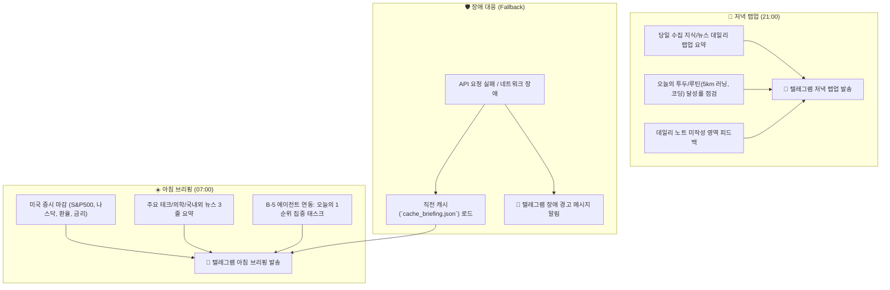

# [[B-2_Morning_Intelligence_Briefing]]

> 개요: 매일 아침(07:00) 미국장 마감/매크로 경제 지표 + 핵심 뉴스 3줄 요약 + 당일 1순위 액션을 브리핑하고, 매일 저녁(21:00) 수집된 뉴스 랩업 및 데일리 노트를 점검하며, API 장애 시 직전 캐시로 안전하게 대체하는 텔레그램 인텔리전스 브리핑 시스템.

> ✅ **실가동 확인 (2026-09-02)**: 이 프로젝트의 핵심(매크로+뉴스 데일리 브리핑)은 **비비 크론으로 운영 중** — 주식 브리핑(평일 09:00) + 미장 프리뷰(평일 22:30) + 유튜브 브리핑(매일). 아침 07:00/저녁 21:00 → 09:00/22:30으로 시간 조정, 텔레그램 → 디스코드 전송. (관련: `00. 봇 운영 시스템/_봇_전용/봇_운영_규칙.md` 7번 크론 현황)

---

## 🎯 1. 프로젝트 핵심 목표
* **최종 결과물**:
  1. 아침(07:00) 모닝 인텔리전스 리포트 자동 발송 데몬
  2. 저녁(21:00) 이브닝 랩업 & 회고 피드백 리포트 자동 발송 데몬
  3. 외부 API(야후 파이낸스, 네이버 뉴스 등) 장애 시 직전 캐시 데이터 기반 Fallback 방어 모듈
* **주요 성공 기준 (KPI)**:
  - [ ] 07:00 / 21:00 정각 텔레그램 채널로 오차 없이 100% 발송
  - [ ] S&P500, 나스닥, 환율, 국채금리 등 핵심 매크로 지표 파싱 정확도 100%
  - [ ] 주요 뉴스 노이즈 필터링 및 3줄 핵심 요약 정확도 확보
  - [ ] 외부 API 타임아웃/오류 발생 시 텔레그램 오류 알림 및 로컬 직전 캐시 즉시 대체
* **연동 인프라**: LG 그램 Cron, Python (yfinance, BeautifulSoup), Telegram Bot API, Local Cache JSON

---

## ⏰ 2. 2-Track 브리핑 워크플로우 명세

---

## 💬 3. Grill Me & 아키텍처 의사결정 기록

> [!abstract]- 📌 질의응답 아카이브 (클릭하여 열기)
> **Q1. 정보 과부하 방지 및 메시지 가독성 원칙**
> - **결정**: 스크롤 압박이 없는 1화면 이내 분량 원칙. 뉴스는 무조건 3줄 불릿 요약(`- 원인/팩트`, `- 시장/업계 영향`, `- 시사점`)으로 고정하고, 당일 1순위 태스크는 단 1개만 강조 출력.

---

## ✅ 4. 세부 Task & 체크리스트

### 🏗️ Phase 1. 매크로 & 뉴스 데이터 수집기 구현
- [ ] 야후 파이낸스 / 환율 API 연동 및 데이터 추출 스크립트 작성
- [ ] 네이버/구글 뉴스 RSS 크롤러 및 불필요한 광고 기사 필터링
- [ ] `cache_briefing.json` 로컬 캐싱 및 Fallback 예외 처리 로직 작성

### 💻 Phase 2. 브리핑 포맷터 및 저녁 랩업 엔진
- [ ] 07:00 아침 브리핑 템플릿 마크다운 렌더러 개발
- [ ] 21:00 저녁 랩업 및 데일리 루틴 연동 파이프라인 구축
- [ ] B-5(프로젝트 네비게이터) 연동 당일 1순위 액션 주입 모듈

### 🧪 Phase 3. LG 그램 배포 및 스케줄러 등록
- [ ] Linux Crontab에 07:00 및 21:00 스케줄 등록
- [ ] 3일간 실시간 발송 및 네트워크 단절 시나리오 Fallback 테스트

---

## 🔗 5. 관련 리소스 및 백링크
* **마스터 로드맵**: [[00_Project_A_Master_Roadmap]]
* **대시보드**: [[00_Master_Dashboard]]
* **연계 프로젝트**: [[B-1_Overnight_Youtube_Worker]], [[B-3_Telegram_Interaction_Bot]], [[B-5_Project_Navigator_Agent]]
