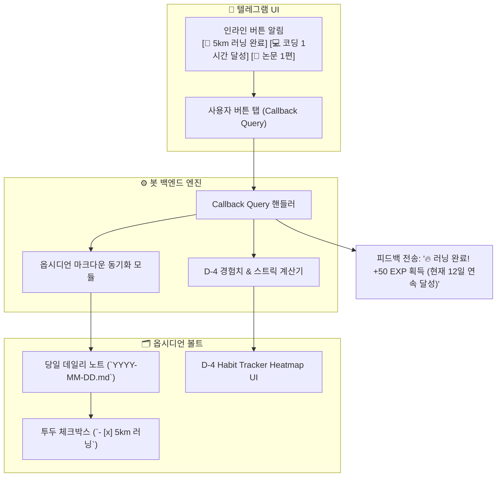

# [[B-3_Telegram_Interaction_Bot]]

> 개요: 텔레그램 인라인 버튼(Inline Keyboard)을 통해 매일 핵심 루틴(5km 러닝, 코딩/학습 등)을 터치 한 번으로 체크하고, 이를 옵시디언 데일리 노트의 투두 및 D-4 게이미피케이션 경험치 시스템과 양방향 실시간 동기화하는 대화형 비서 봇.

---

## 🎯 1. 프로젝트 핵심 목표
* **최종 결과물**:
  1. python-telegram-bot 기반 상시 인터랙션 봇 데몬
  2. 인라인 버튼 기반 원터치 데일리 루틴 체크 인터페이스
  3. 옵시디언 데일리 노트 투두(`- [x]`) 양방향 동기화 엔진
* **주요 성공 기준 (KPI)**:
  - [ ] 텔레그램 버튼 클릭 시 1초 이내 옵시디언 데일리 노트 해당 체크박스 상태 갱신
  - [ ] 5km 러닝, 코딩 완료 등 핵심 루틴 달성 시 즉각 칭찬 피드백 및 D-4 경험치 부여
  - [ ] 모바일에서 텍스트/음성으로 빠른 메모 전송 시 옵시디언 `Inbox`에 자동 적재
* **연동 인프라**: LG 그램 Docker Daemon, Python (python-telegram-bot), Obsidian Vault Local Sync, D-4 게이미피케이션

---

## 🤖 2. 인터랙션 및 양방향 동기화 흐름도

---

## 💬 3. Grill Me & 아키텍처 의사결정 기록

> [!abstract]- 📌 질의응답 아카이브 (클릭하여 열기)
> **Q1. 옵시디언 파일 동기화 시 충돌 방지**
> - **결정**: 파일 전체 덮어쓰기 대신 특정 섹션(`## ✅ 오늘의 루틴`)의 정규식 타겟 치환 방식을 사용하여 다른 동기화 플러그인과의 충돌을 원천 차단함.

---

## ✅ 4. 세부 Task & 체크리스트

### 🏗️ Phase 1. 텔레그램 봇 인프라 및 인라인 키보드 구현
- [ ] 텔레그램 봇 토큰 발급 및 데몬 스켈레톤 코드 작성
- [ ] 루틴 체크용 인라인 키보드 UI 레이아웃 설계

### 💻 Phase 2. 옵시디언 데일리 노트 양방향 파서 개발
- [ ] 데일리 노트 내 루틴 체크박스 검색 및 토글(`- [ ]` $\leftrightarrow$ `- [x]`) 스크립트 작성
- [ ] 텔레그램 메모 $\to$ `Inbox.md` 추가 핸들러 구현
- [ ] D-4 Habit Tracker 경험치 연동 모듈 연결

### 🧪 Phase 3. LG 그램 배포 및 실시간 인터랙션 테스트
- [ ] LG 그램 Docker 상시 컨테이너로 봇 가동
- [ ] 모바일 텔레그램에서 버튼 클릭 테스트 및 옵시디언 즉각 반영 검증

---

## 🔗 5. 관련 리소스 및 백링크
* **마스터 로드맵**: [[00_Project_A_Master_Roadmap]]
* **대시보드**: [[00_Master_Dashboard]]
* **연계 프로젝트**: [[B-2_Morning_Intelligence_Briefing]], [[D-4_Gamified_Habit_Tracker]]
