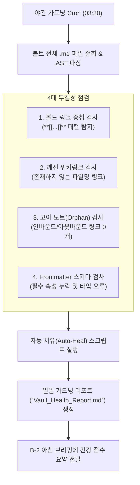

---
project_id: "B-4"
title: "볼트 가드너 에이전트 (무결성 검사 & 링크 자동 치유)"
category: "Project B (Agent & Automation)"
status: "진행중" # [진행전, 심문중, 진행중, 완료]
priority: "High"
created: 2026-08-31
updated: 2026-09-02
target_date: "2026-09-28"
tags:
  - ai-project
  - vault-gardener
  - linter
  - link-integrity
  - status/pending
---

# [[B-4_Vault_Gardener_Agent]]

> 개요: 카르파시 LLM Wiki 아키텍처의 핵심 액션인 `Lint`를 수행하는 볼트 정원사 에이전트로, 매일 야간 Cron으로 볼트 전체를 순회하여 고아 노트(Orphan), 깨진 링크, 프론트매터 결측치, 볼드-링크 중첩 버그(`**[[...]]**`)를 자동 감지하고 치유하는 무결성 관리 에이전트.

> ✅ **실가동 확인 (2026-09-02)**: 볼트 관리의 일부가 **카이 크론으로 운영 중** — 매일 22:00 일일 기록 + 인박스 정리 (분류 이동·비오님 질문), 볼트 재구성·대시보드 관리. 다만 고아 노트 감지·볼드-링크 자동 치유 등 B-4 고유 린터 기능은 아직 미구현 (진행중).

---

## 🎯 1. 프로젝트 핵심 목표
* **최종 결과물**:
  1. 옵시디언 볼트 무결성 린터(Linter) & 자동 치유 스크립트
  2. 일일 볼트 건강 점수(Vault Health Score) 산출 및 리포트
  3. 볼드-링크 중첩 버그 및 미연결 고아 노트 자동 연계 파이프라인
* **주요 성공 기준 (KPI)**:
  - [ ] 볼트 내 940+ 전체 마크다운 파일에 대한 순회 점검을 10초 이내 완료
  - [ ] `**[[단어]]**` 형태의 파싱 버그 100% 자동 평탄화 ([[단어]])
  - [ ] 연결 링크가 0개인 고아 노트를 감지하여 상위 MOC에 자동 편입
  - [ ] YAML Frontmatter 필수 속성 누락 시 템플릿 기본값 자동 보정
* **연동 인프라**: LG 그램 Cron, Python Markdown Parser, Obsidian Vault, C-4 Vault Graph MCP

---

## 🌿 2. 볼트 가드닝 4대 무결성 검사 파이프라인

---

## 💬 3. Grill Me & 아키텍처 의사결정 기록

> [!abstract]- 📌 질의응답 아카이브 (클릭하여 열기)
> **Q1. 자동 치유 시 원본 손상 방지 대책**
> - **결정**: 파일 수정 전 Git 커밋 또는 백업 스냅샷을 자동 생성하고, 단순 문법 오류(볼드-링크 중첩 등)는 즉시 수정하되 내용 변경이 수반되는 항목은 제안 리포트로 분리하여 안전성 확보.

---

## ✅ 4. 세부 Task & 체크리스트

### 🏗️ Phase 1. 볼트 AST 파서 및 린터 구축
- [ ] 정규식 및 마크다운 파서 기반 4대 점검 규칙 작성
- [ ] `**[[...]] 중첩 파싱 버그 자동 제거 정규식 모듈 완성

### 💻 Phase 2. MOC 연계 및 프론트매터 보정 엔진
- [ ] 고아 노트 발견 시 적정 MOC 인덱스 표에 자동 삽입하는 로직 구현
- [ ] 6대 임상 지식 템플릿 프론트매터 스키마 유효성 검사기 작성

### 🧪 Phase 3. LG 그램 스케줄러 배치
- [ ] 야간 정기 실행 등록 및 텔레그램 상태 리포트 연동
- [ ] 볼트 건강 점수(0~100점) 대시보드 뱃지 위젯 렌더링

---

## 🔗 5. 관련 리소스 및 백링크
* **마스터 로드맵**: [[00_Project_A_Master_Roadmap]]
* **대시보드**: [[00_Master_Dashboard]]
* **연계 프로젝트**: [[A-1_Clinical_Knowledge_DB]], [[B-1_Overnight_Youtube_Worker]], [[C-4_Vault_Graph_MCP]]
