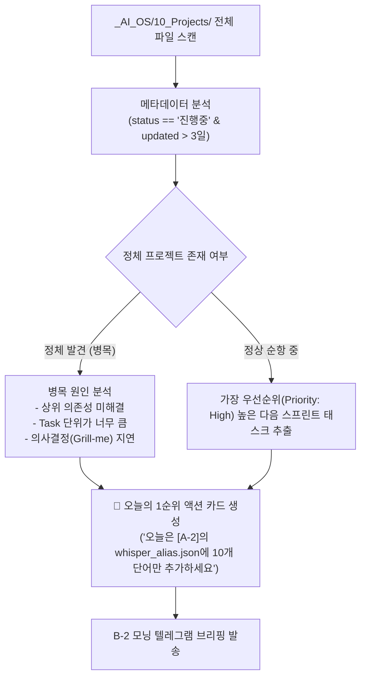

# [[B-5_Project_Navigator_Agent]]

> 개요: `_AI_OS/10_Projects/` 내의 전체 27개 프로젝트 계획서와 `30_Sprint_Logs/`를 실시간 파싱하여 3일 이상 진행이 멈춘 병목 프로젝트를 감지하고, 매일 아침(07:00) 심비오가 집중해야 할 '단 1개의 구체적 실행 액션'을 강제 발행하는 길잡이 에이전트.

---

## 🎯 1. 프로젝트 핵심 목표
* **최종 결과물**:
  1. 전체 프로젝트 Frontmatter(`status`, `updated`, `priority`) 분석 엔진
  2. 3일 이상 정체된 프로젝트 감지 및 병목 원인 진단기
  3. B-2 아침 브리핑에 주입되는 '오늘의 1순위 실행 카드' 생성기
* **주요 성공 기준 (KPI)**:
  - [ ] 전체 프로젝트의 진행 상태와 마일스톤 달성률을 매일 아침 자동 스캔
  - [ ] 진행중 상태이나 3일 이상 업데이트가 없는 '방치된 태스크' 100% 포착
  - [ ] 추상적인 지시가 아닌 '15분 안에 완료 가능한 구체적 첫 단계(Micro-step)' 액션 발행
* **연동 인프라**: Obsidian Vault (Dataview/Python), B-2 모닝 브리핑, 00_Master_Dashboard

---

## 🧭 2. 병목 감지 및 1순위 액션 도출 알고리즘

---

## 💬 3. Grill Me & 아키텍처 의사결정 기록

> [!abstract]- 📌 질의응답 아카이브 (클릭하여 열기)
> **Q1. 과도한 태스크 나열로 인한 실행 마비(Analysis Paralysis) 방지**
> - **결정**: 에이전트는 절대 오늘 할 일 목록을 3개 이상 길게 나열하지 않는다. 오직 **'오늘 무조건 끝내야 할 1순위 마이크로 액션 1개'**만 단도직입적으로 제시하여 실행력을 극대화함.

---

## ✅ 4. 세부 Task & 체크리스트

### 🏗️ Phase 1. 프로젝트 메타데이터 파서 구축
- [ ] `10_Projects/` 내 마크다운 Frontmatter 파서 작성
- [ ] 프로젝트별 마지막 커밋/수정일 계산 및 정체 판정 로직 구현

### 💻 Phase 2. 1순위 액션 생성 프롬프트 엔지니어링
- [ ] 미완료 체크리스트 중 가장 단위가 작고 영향력이 큰 태스크 추출 규칙 작성
- [ ] B-2 모닝 브리핑 연동 API 인터페이스 완성

---

## 🔗 5. 관련 리소스 및 백링크
* **마스터 로드맵**: [[00_Project_A_Master_Roadmap]]
* **대시보드**: [[00_Master_Dashboard]]
* **연계 프로젝트**: [[B-2_Morning_Intelligence_Briefing]], [[00_Simbio_프로젝트_대시보드]]
