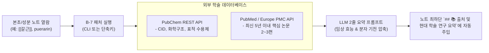

# [[B-7_Paper_Digest_Ingester]]

> 개요: 본초(`2. 약리 공부/본초/`) 및 약리성분(`2. 약리 공부/성분/`) 노트를 열람하거나 작성할 때, PubChem API에서 분자 기전(MoA)과 화학적 속성을 긁어오고 PubMed/EuropePMC에서 최신 핵심 논문 2~3편의 초록을 온디맨드(On-demand)로 패치하여 노트 하단에 주입하는 경량 스크립트.

> ✅ **실가동 확인 (2026-09-02)**: 학술 논문 digest의 일부가 **닥터허 크론으로 운영 중** — 매일 15:00 일일 임상 의학 논문 심층 브리핑 (요일별 테마 → `5. 독서, 노트/논문 리뷰/`). 다만 PubChem MoA 자동 패처·노트 하단 온디맨드 주입은 아직 미구현 (진행중).

---

## 🎯 1. 프로젝트 핵심 목표
* **핵심 철학 및 고도화 방향**: 
  - 단순 크롤링을 넘어, 비오님의 임상/약리 노트(본초·처방·성분)에 기록된 전통적 지견을 **현대 분자약리학(PubChem MoA) 및 최신 임상 논문(PubMed Top-cited)**으로 뒷받침하고 강력한 학술적 근거(Evidence-based)를 보충한다.
  - 기존 비오님의 수기 기록이나 핵심 통찰을 절대 훼손하지 않는 **Non-destructive Append (안전한 덧붙이기)** 원칙을 엄수한다.
* **최종 결과물**:
  1. PubChem PUG REST API 기반 분자 구조/표적 단백질/MoA 자동 패처
  2. PubMed/NCBI E-utilities 기반 최신 임상/약리 논문 초록 수집기
  3. 옵시디언 노트 최하단 `## 📚 출처 및 현대 학술 연구 요약` 섹션 자동 갱신 모듈
* **주요 성공 기준 (KPI)**:
  - [ ] 본초명/성분명 입력 시 3초 이내에 PubChem CID 및 주요 분자 타깃 매핑
  - [ ] 해당 성분/본초 관련 상위 인용(Top-cited) 최신 논문 2~3편의 핵심 요약(`[연구 요약]`) 100% 자동 생성
  - [ ] 기존 노트의 사용자 작성 내용을 1byte도 훼손하지 않는 Non-destructive 덧붙이기 원칙 준수
* **연동 인프라**: Python (requests / BioPython), PubChem API, PubMed API, Obsidian Vault

---

## 🔬 2. 온디맨드 학술 패치 파이프라인

---

## 💬 3. Grill Me & 아키텍처 의사결정 기록

> [!abstract]- 📌 질의응답 아카이브 (클릭하여 열기)
> **Q1. 전체 노트 일괄 크롤링 vs 온디맨드(필요할 때) 패치**
> - **결정**: 전체 노트를 무지성으로 긁어오면 불필요한 토큰 낭비 및 네트워크 차단(Rate Limit) 위험이 발생하므로, 사용자가 해당 노트를 작업하거나 열람할 때 호출하는 **온디맨드(On-demand) 방식**을 기본으로 채택.

---

## ✅ 4. 세부 Task & 체크리스트

### 🏗️ Phase 1. PubChem & PubMed API 클라이언트 작성
- [ ] PubChem PUG REST API 연동 스크립트 작성
- [ ] PubMed E-utilities 초록 및 DOI 추출 파이프라인 개발

### 💻 Phase 2. 옵시디언 마크다운 주입 엔진 개발
- [ ] `## 📚 출처 및 현대 학술 연구 요약` 헤더 탐색 및 안전한 Append 로직 작성
- [ ] 논문별 `[연구 요약]` 1~2줄 불릿 생성 프롬프트 정립

---

## 🔗 5. 관련 리소스 및 백링크
* **마스터 로드맵**: [[00_Project_A_Master_Roadmap]]
* **대시보드**: [[00_Master_Dashboard]]
* **연계 지식**: [[A-1_Clinical_Knowledge_DB]], [[C-4_Vault_Graph_MCP]]
