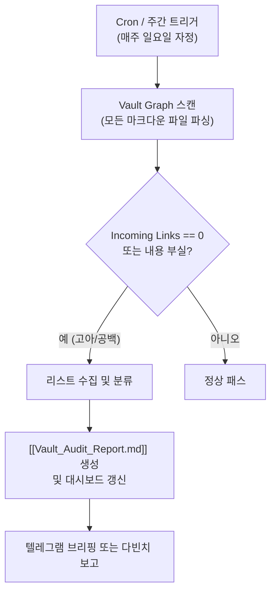

# [[B-8_Vault_Knowledge_Gap_Detector]]

> 개요: `C:\Simbio` 전체 옵시디언 볼트를 주말마다 백그라운드로 순회하여, 백링크가 끊긴 '고아 노트(Orphan Notes)'와 본문이 극도로 부실한 '지식 공백(Knowledge Gaps)' 노트를 자동 스캔하고, `00_Master_Dashboard`에 큐레이션 리포트를 갱신하는 지능형 볼트 가디언 에이전트.

---

## 🎯 1. 프로젝트 핵심 목표
* **최종 결과물**:
  1. 볼트 내 모든 `.md` 파일의 위키링크 및 백링크 네트워크 무결성 검사 스크립트 (`vault_audit.py`)
  2. 내용이 50줄 미만이거나 핵심 섹션이 비어 있는 공백 노트를 분류하는 랭킹 대시보드
  3. 매주 자동 생성되는 주간 정원사(Gardener) 리포트 노트 (`30_Sprint_Logs/Vault_Audit_Report.md`)
* **주요 성공 기준 (KPI)**:
  - [ ] 볼트 전체 고아 노트 탐지율 100% 달성 및 마스터 대시보드 연동
  - [ ] 지식 공백 노트 자동 분류기 구현 완료
  - [ ] 다빈치 봇과의 연동을 통한 주간 큐레이션 알림 자동화

---

## 🏗️ 2. 작동 흐름 (Workflow)

