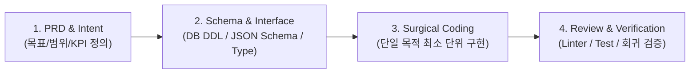

---
project_id: "C-1"
title: "Antigravity 전용 AI 코딩 환경 & Harness Engineering 표준"
category: "Project C (Agentic Tools & Architecture)"
status: "진행중"
priority: "High"
created: 2026-08-30
updated: 2026-08-31
target_date: "2026-09-15"
tags:
  - ai-project
  - antigravity-ide
  - harness-engineering
  - coding-standards
  - status/in-progress
---

# [[C-1_AI_Coding_Environment]]

> 개요: Cursor, OpenClaw 등 타 도구를 전면 배제하고 Antigravity IDE 단일 체제 하에서 일관된 개발 생산성을 유지하기 위한 시스템 규칙(Rules), 스킬(Skills), MCP 환경 및 Harness Engineering(PRD $\to$ Schema $\to$ Code $\to$ Review) 표준 구축.

---

## 🎯 1. 프로젝트 핵심 목표
* **최종 결과물**:
  1. `.agents/rules/` 및 `.agents/skills/` 기반의 Antigravity 전용 커스터마이징 체계
  2. Harness Engineering 4단계(요구사항 $\to$ 스키마 $\to$ 코드 $\to$ 검증) 실행 프로토콜
  3. 볼트 내 모든 자동화 스크립트의 무결점 실행 환경
* **주요 성공 기준 (KPI)**:
  - [x] 옵시디언 노트 표준 지침(`obsidian-note-standards.md`) 규칙 확립 및 100% 적용
  - [ ] Antigravity Custom Tools 및 MCP 인터페이스 표준화
  - [ ] 코드 작성 전 스키마/PRD 승인 단계를 거치는 하네스 규율 100% 준수
* **연동 인프라**: Antigravity IDE, Python Virtualenv, Git, C-4 Vault Graph MCP

---

## 🛡️ 2. Harness Engineering 4대 표준 프로토콜

### 📌 Antigravity 운영 원칙 (Rules of Engagement)
1. **단일 IDE 체제**: Cursor, Ollama, OpenClaw 등의 외부 도구 의존성을 제거하고 Antigravity IDE 단일 환경으로 워크플로우를 통일한다.
2. **비파괴적 확장 (Non-Destructive Expansion)**: 기존 사용자가 작성한 필기/고찰은 1byte도 임의 삭제하지 않고 점진적으로 학술 데이터를 덧붙인다.
3. **위키링크 무결성**: 모든 근육명 및 볼트 내 파일명은 반드시 [[단어]] 링크로 감싸고, 볼드(`**`)와 중첩하지 않는다.

---

## 💬 3. Grill Me & 아키텍처 의사결정 기록

> [!abstract]- 📌 질의응답 아카이브 (클릭하여 열기)
> **Q1. 다중 AI 코딩 도구 사용 시 발생하던 컨텍스트 파편화 해결**
> - **결정**: Cursor와 Antigravity 간의 Rules/플러그인 불일치를 방지하기 위해 Antigravity 단일 툴로 통합하고, `.agents/` 디렉토리를 SSOT(단일 진실 공급원)로 운영함.

---

## ✅ 4. 세부 Task & 체크리스트

### 🏗️ Phase 1. Antigravity 커스터마이징 셋업 (완료 🏆)
- [x] `obsidian-note-standards.md` 전사 지침 확립
- [x] `book-digitization` 스킬 구축

### 💻 Phase 2. Harness 템플릿 및 자동화 도구 체인
- [ ] 신규 프로젝트 생성용 하네스 스크립트 작성
- [ ] Git 커밋 전 자동 Linting(볼드-링크 중첩 검사) 훅 연동

---

## 🔗 5. 관련 리소스 및 백링크
* **마스터 로드맵**: [[00_Project_A_Master_Roadmap]]
* **대시보드**: [[00_Master_Dashboard]]
* **연계 프로젝트**: [[C-3_Security_and_Isolation]], [[C-4_Vault_Graph_MCP]], [[C-6_Prompt_Registry_Harness]]
