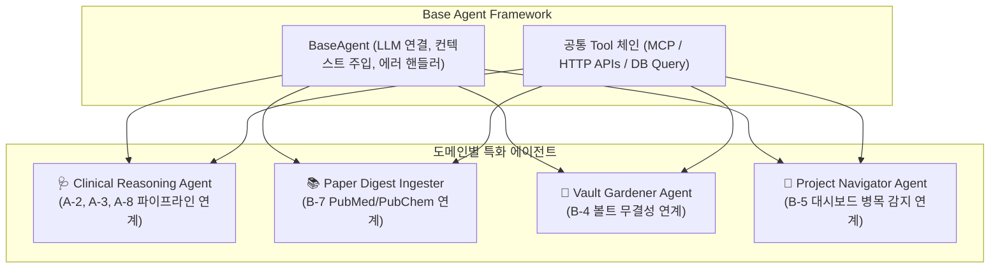

# [[C-2_Custom_Agent_Framework]]

> 개요: 의학 임상 추론, 약리 논문 분석, 매크로 금융 분석, 볼트 가드닝 등 도메인별 특화 에이전트의 시스템 프롬프트와 Tool 체인을 모듈화하여 Antigravity 환경에서 재사용 가능하게 캡슐화하는 프레임워크.

---

## 🎯 1. 프로젝트 핵심 목표
* **최종 결과물**:
  1. 도메인별 에이전트 인터페이스(BaseAgent 클래스 및 실행 러너)
  2. 공통 도구 체인(Tool Chain: Web Search, PubMed, PubChem, Vault Traversal)
  3. 에이전트 간 협업 및 데이터 파이프라인 프로토콜
* **주요 성공 기준 (KPI)**:
  - [ ] 도메인별 에이전트를 단일 파이썬 모듈로 손쉽게 인스턴스화 가능하도록 설계
  - [ ] 도구 호출(Tool Calling) 실패 시 자동 재시도(Retry) 및 에러 복구 핸들러 탑재
  - [ ] 각 에이전트의 실행 로그를 JSONL 형식으로 구조화하여 관제 지원
* **연동 인프라**: Antigravity IDE, Python 3.11+, MCP Servers

---

## ⚙️ 2. 도메인별 특화 에이전트 아키텍처

---

## 💬 3. Grill Me & 아키텍처 의사결정 기록

> [!abstract]- 📌 질의응답 아카이브 (클릭하여 열기)
> **Q1. LangChain / CrewAI 등 무거운 외부 프레임워크 사용 여부**
> - **결정**: 불필요한 추상화와 의존성 충돌을 피하기 위해, Antigravity 네이티브 MCP와 경량 파이썬 스크립트 기반의 미니멀 프레임워크를 직접 구축함.

---

## ✅ 4. 세부 Task & 체크리스트

### 🏗️ Phase 1. BaseAgent 인터페이스 설계
- [ ] 프롬프트 템플릿 로더 및 LLM API 어댑터 작성
- [ ] 도구 호출 및 결과 파싱 표준 함수 정립

### 💻 Phase 2. 도메인별 에이전트 모듈 패키징
- [ ] 의학/약리 에이전트 모듈 구현
- [ ] 볼트 관리 에이전트 모듈 구현

---

## 🔗 5. 관련 리소스 및 백링크
* **마스터 로드맵**: [[00_Project_A_Master_Roadmap]]
* **대시보드**: [[00_Master_Dashboard]]
* **연계 프로젝트**: [[C-1_AI_Coding_Environment]], [[C-6_Prompt_Registry_Harness]]
