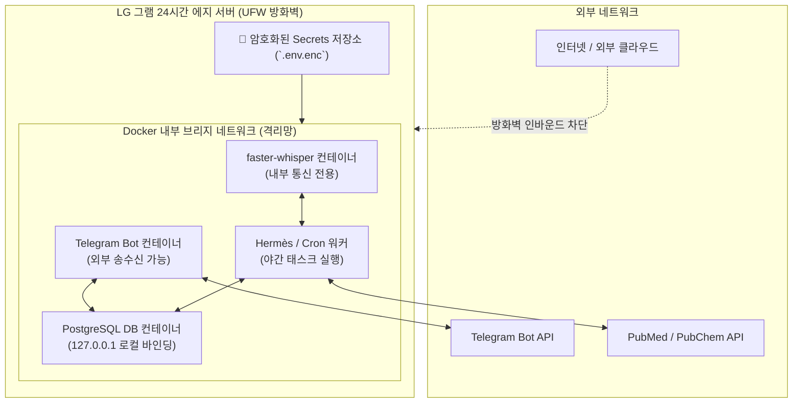

# [[C-3_Security_and_Isolation]]

> 개요: LG 그램 24시간 에지 서버에서 구동되는 모든 백그라운드 데몬(faster-whisper, PostgreSQL, Telegram Bot, Cron 워커)을 Docker 컨테이너로 격리하고, API 키 및 환경변수를 암호화 관리하며, 환자 데이터와 외부 네트워크를 엄격히 분리하는 보안 아키텍처.

---

## 🎯 1. 프로젝트 핵심 목표
* **최종 결과물**:
  1. LG 그램 상시 에지 서버용 Docker Compose 멀티 컨테이너 환경
  2. 환경변수(`*.env`) 암호화 및 비대칭키 기반 Secrets 관리 시스템
  3. 로컬 방화벽(UFW) 및 비인가 외부 접근 차단 프로토콜
* **주요 성공 기준 (KPI)**:
  - [ ] 각 서비스(PostgreSQL, Whisper, Bot)의 Docker 권한 분리(Non-root User) 완료
  - [ ] GitHub에 `.env` 및 API 토큰 1byte도 노출되지 않도록 사전 차단 훅 적용
  - [ ] 환자 차트 데이터베이스 포트를 오직 Localhost(127.0.0.1)에만 바인딩
* **연동 인프라**: LG 그램 (Ubuntu/Debian Linux), Docker / Docker Compose, UFW Firewall

---

## 🛡️ 2. 컨테이너 격리 및 보안 네트워크 토폴로지

---

## 💬 3. Grill Me & 아키텍처 의사결정 기록

> [!abstract]- 📌 질의응답 아카이브 (클릭하여 열기)
> **Q1. 의료 데이터 유출 방지를 위한 원칙**
> - **결정**: 환자 식별 정보(PII)가 담긴 차트는 오직 LG 그램 로컬 디스크의 암호화 볼륨에만 저장하며, GitHub 동기화 대상에서 `.gitignore`로 완전 배제함 ([[C-7_Clinic_Gram_Sync_Protocol]] 준수).

---

## ✅ 4. 세부 Task & 체크리스트

### 🏗️ Phase 1. Docker 환경 구성 및 네트워크 격리
- [ ] `docker-compose.yml` 멀티 컨테이너 정의서 작성
- [ ] PostgreSQL 포트 5432의 로컬 전용 바인딩 설정
- [ ] UFW 방화벽 규칙 적용 (SSH 내부망 허용, 외부 포트 차단)

### 💻 Phase 2. 환경변수 암호화 관리 파이프라인
- [ ] `python-dotenv` 및 비대칭 키(GPG/Age) 기반 Secrets 복호화 스크립트 작성
- [ ] Git Pre-commit 훅으로 API 키 유출 검사 자동화

---

## 🔗 5. 관련 리소스 및 백링크
* **마스터 로드맵**: [[00_Project_A_Master_Roadmap]]
* **대시보드**: [[00_Master_Dashboard]]
* **연계 프로젝트**: [[C-5_Hermes_Daemon_Orchestrator]], [[C-7_Clinic_Gram_Sync_Protocol]]
