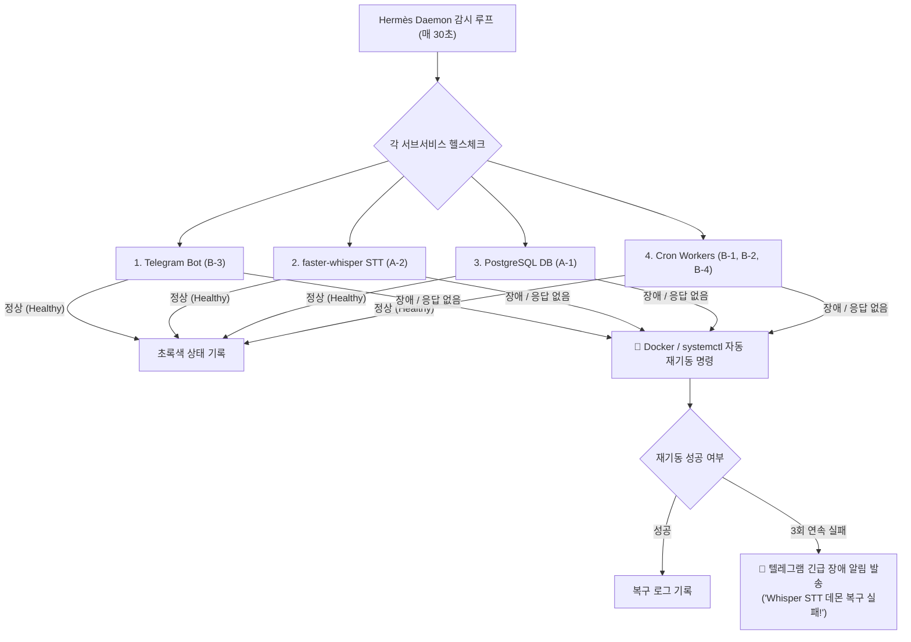

# [[C-5_Hermes_Daemon_Orchestrator]]

> 개요: LG 그램 24시간 에지 서버에서 상시 구동되는 모든 백그라운드 태스크(유튜브 요약 Cron, 텔레그램 봇, STT 서버, 볼트 가드너)의 프로세스 헬스체크, 리소스 사용량 모니터링, 프로세스 다운 시 자동 재기동(Auto-restart) 및 텔레그램 긴급 장애 알림을 총괄하는 경량 오케스트레이터 데몬.

---

## 🎯 1. 프로젝트 핵심 목표
* **최종 결과물**:
  1. systemd / Docker Healthcheck 기반 상시 서비스 감시 데몬
  2. 비정상 종료 감지 시 프로세스 자동 재기동(Self-Healing) 엔진
  3. 에지 서버 CPU/메모리/디스크 과열 방지 및 텔레그램 상태 리포트 모듈
* **주요 성공 기준 (KPI)**:
  - [ ] 봇 또는 Whisper 데몬 다운 시 5초 이내 자동 재시작 성공률 99.9%
  - [ ] 3회 이상 연속 재기동 실패 시 텔레그램으로 긴급 Alert 및 에러 로그 즉시 발송
  - [ ] 그램 노트북 배터리/온도 이상 감지 시 저전력 안전 모드 자동 전환
* **연동 인프라**: LG 그램 Linux Systemd / Docker, Python psutil, Telegram Bot API

---

## ⚙️ 2. 시스템 오케스트레이션 및 자동 복구 파이프라인

---

## 💬 3. Grill Me & 아키텍처 의사결정 기록

> [!abstract]- 📌 질의응답 아카이브 (클릭하여 열기)
> **Q1. 쿠버네티스 등 무거운 오케스트레이션 도구 배제 이유**
> - **결정**: LG 그램 단일 노트북 에지 환경에 쿠버네티스는 오버엔지니어링이므로, 리소스 소모가 거의 없는 Linux `systemd` + `docker-compose restart: unless-stopped` + 경량 파이썬 모니터링 데몬으로 구축함.

---

## ✅ 4. 세부 Task & 체크리스트

### 🏗️ Phase 1. 서비스 정의서 및 Systemd 유닛 등록
- [ ] 各 서비스별 systemd 서비스 유닛 파일(`*.service`) 작성
- [ ] Docker Compose 내 `healthcheck` 지시문 추가

### 💻 Phase 2. Hermès 모니터링 스크립트 작성
- [ ] Python `psutil` 기반 CPU, RAM, GPU 사용량 로깅 모듈 개발
- [ ] 텔레그램 봇 연동 시스템 장애 Alert 핸들러 구현

---

## 🔗 5. 관련 리소스 및 백링크
* **마스터 로드맵**: [[00_Project_A_Master_Roadmap]]
* **대시보드**: [[00_Master_Dashboard]]
* **연계 프로젝트**: [[C-3_Security_and_Isolation]], [[B-3_Telegram_Interaction_Bot]]
