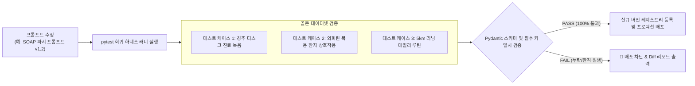

# [[C-6_Prompt_Registry_Harness]]

> 개요: SOAP 차팅, 유튜브 요약, 논문 분석, 10초 환자 설득 멘트 등 시스템 내 모든 LLM 프롬프트를 Python 모듈/스킬로 버전 관리하고, 프롬프트 수정 시 기존 출력 품질이 깨지지 않는지 회귀 테스트(Regression Test)를 수행하는 프롬프트 레지스트리 하네스.

---

## 🎯 1. 프로젝트 핵심 목표
* **최종 결과물**:
  1. 도메인별 프롬프트 버전 관리 레지스트리 (`.agents/prompts/` 및 Python 패키지)
  2. 프롬프트 변경 시 골든 데이터셋(Golden Dataset) 기반 자동 회귀 평가 러너
  3. 프롬프트 성능 벤치마크 및 토큰 사용량 모니터링 대시보드
* **주요 성공 기준 (KPI)**:
  - [ ] 모든 시스템 프롬프트를 하드코딩 없이 중앙 레지스트리에서 버전별(`v1.0`, `v1.1` 등)로 호출
  - [ ] 프롬프트 수정 시 10개 표준 테스트 케이스 대상 구조화 JSON/마크다운 일치율 100% 검증
  - [ ] LLM 모델 교체 시에도 동일한 입출력 스키마 규격 유지
* **연동 인프라**: Antigravity IDE, pytest, Python JSONSchema / Pydantic

---

## 🧪 2. 프롬프트 하네스 및 회귀 테스트 파이프라인

---

## 💬 3. Grill Me & 아키텍처 의사결정 기록

> [!abstract]- 📌 질의응답 아카이브 (클릭하여 열기)
> **Q1. 프롬프트를 코드로 관리(Prompt as Code)하는 이유**
> - **결정**: 프롬프트는 단순한 텍스트가 아니라 시스템의 비즈니스 로직이므로, Git을 통한 버전 관리와 자동화된 테스트 없이는 의학적 안전성과 일관성을 담보할 수 없음.

---

## ✅ 4. 세부 Task & 체크리스트

### 🏗️ Phase 1. 프롬프트 레지스트리 구조 정립
- [ ] 프롬프트 템플릿 디렉토리 구조 및 Jinja2/Pydantic 바인딩 체계 구축
- [ ] 6대 주요 도메인 프롬프트 v1.0 등록

### 💻 Phase 2. 회귀 테스트 러너 개발
- [ ] 도메인별 골든 테스트 케이스(입력 $\to$ 기대 출력) 데이터셋 작성
- [ ] pytest 기반 자동 평가 스크립트 작성

---

## 🔗 5. 관련 리소스 및 백링크
* **마스터 로드맵**: [[00_Project_A_Master_Roadmap]]
* **대시보드**: [[00_Master_Dashboard]]
* **연계 프로젝트**: [[C-1_AI_Coding_Environment]], [[C-2_Custom_Agent_Framework]]
