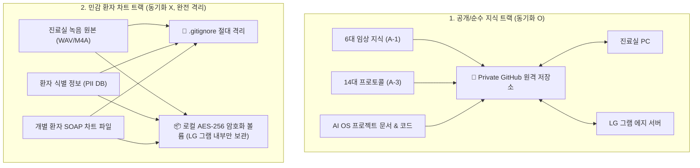

# [[C-7_Clinic_Gram_Sync_Protocol]]

> 개요: 환자의 개인식별정보(PII)와 실제 진료 차트 데이터는 `.gitignore`로 LG 그램 로컬 디스크에만 암호화 격리하고, 순수 임상 지식 베이스(6대 지식, 프로토콜, 코드베이스)만 프라이빗 GitHub을 통해 진료실 PC $\leftrightarrow$ LG 그램 간 안전하게 양방향 동기화하는 보안 프로토콜.

---

## 🎯 1. 프로젝트 핵심 목표
* **최종 결과물**:
  1. 민감 의료 데이터 원천 차단 `.gitignore` 및 보안 동기화 스크립트
  2. 진료실 PC $\leftrightarrow$ LG 그램 간 지식 베이스 프라이빗 Git 자동 동기화 데몬
  3. 로컬 환자 차트 증분 백업(Incremental Backup) 암호화 스크립트
* **주요 성공 기준 (KPI)**:
  - [ ] GitHub 원격 저장소에 환자 이름, 연락처, 차트 파일이 단 1건도 커밋되지 않음을 100% 보장
  - [ ] 순수 의학 지식 노트(본초, 처방, 근육 등) 수정 시 5분 이내 진료실-그램 간 자동 동기화
  - [ ] 로컬 차트 데이터는 AES-256 암호화되어 매일 외장/로컬 스토리지에 증분 백업
* **연동 인프라**: Git / GitHub Private Repo, LG 그램 에지 서버, 진료실 PC, RSync / BorgBackup

---

## 🔒 2. 지식 데이터 vs 환자 데이터 2-Track 동기화 프로토콜

---

## 💬 3. Grill Me & 아키텍처 의사결정 기록

> [!abstract]- 📌 질의응답 아카이브 (클릭하여 열기)
> **Q1. 클라우드 기반 환자 데이터 저장의 법적/보안적 리스크**
> - **결정**: 대한민국 의료법 및 개인정보보호법 준수를 위해 어떠한 환자 식별 정보도 공용 클라우드나 깃허브에 올리지 않고, 오직 원내 및 LG 그램 로컬 암호화 스토리지에서만 처리하는 Zero-Trust 로컬 원칙을 고수함.

---

## ✅ 4. 세부 Task & 체크리스트

### 🏗️ Phase 1. `.gitignore` 및 Git Hook 보안 강화
- [ ] `4. 임상/환자차트/`, `*.m4a`, `*.wav`, `.env` 등을 포함하는 완벽한 `.gitignore` 작성
- [ ] Git Pre-commit Hook으로 환자명/전화번호 정규식 탐지 시 커밋 자동 차단

### 💻 Phase 2. 지식 베이스 자동 Git 동기화 스케줄러
- [ ] 백그라운드 자동 `git pull --rebase` 및 변경분 자동 커밋/푸시 스크립트 작성
- [ ] 충돌 발생 시 알림 및 안전 백업 생성 로직 구현

---

## 🔗 5. 관련 리소스 및 백링크
* **마스터 로드맵**: [[00_Project_A_Master_Roadmap]]
* **대시보드**: [[00_Master_Dashboard]]
* **연계 프로젝트**: [[C-3_Security_and_Isolation]], [[A-2_Clinic_Workflow_Automation]]
