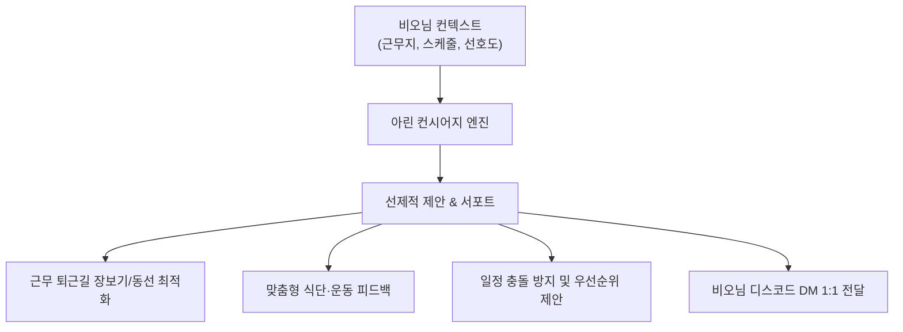

# [[D-10_AI_Routine_And_Errand_Concierge]]

> 개요: 메인 비서 아린(Arin)의 크론 프롬프트와 비서 스킬을 전면 고도화하여, 단순한 시간 알림을 넘어 비오님의 보건지소 근무 일정, 동선, 식단, 운동, 그리고 사소한 일상 결정(맛집 탐색, 동선 최적화, 일정 조정 등)을 선제적으로 제안하고 서포트하는 지능형 컨시어지 서비스.

---

## 🎯 1. 프로젝트 핵심 목표
* **최종 결과물**:
  1. 아린의 크론 프롬프트에 '컨시어지 모드(Concierge Persona & Proactive Suggestion)' 전면 이식
  2. 서천군 근무지 환경 및 비오님 개인 선호(아침 공복, 저녁 운동 등)에 맞춘 맞춤형 동선/생활 제안 룰셋
  3. 사소한 결정 피로도를 낮추는 원클릭 의사결정 서포트 플로우
* **주요 성공 기준 (KPI)**:
  - [ ] 아침/저녁 브리핑 및 리마인드 시 단순 알림을 넘어선 실질적인 생활 제안 포함
  - [ ] 반복되는 일상 심부름(식단 체크, 일정 조율 등)의 제로 인터벤션 달성

---

## 🛎️ 2. 컨시어지 고도화 아키텍처

---
