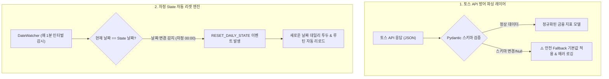

# [[D-1_Life_Manager_Bugfixes]]

> 개요: 토스 증권/금융 API의 비정형 응답에 대한 방어 로직(Defensive Parsing)을 구축하여 파싱 에러를 근절하고, 자정(00:00) 날짜 변경 시 클라이언트 State 및 일일 투두 리스트가 갱신되지 않던 상태 관리 버그를 완벽히 해결하는 안정화 프로젝트.

---

## 🎯 1. 프로젝트 핵심 목표
* **최종 결과물**:
  1. 토스 API 스키마 변경 및 이상치 발생 시 안전하게 캡처하는 Pydantic 방어 레이어
  2. 자정(00:00) 자동 State 갱신 및 캘린더 일일 리셋 인터벌 타이머
  3. 키보드 단축키 및 모바일 터치에 최적화된 캘린더 UI/UX 개선
* **주요 성공 기준 (KPI)**:
  - [ ] 토스 API 지표 파싱 실패율 0% (Null/Format 오류 시 Fallback 기본값 렌더링)
  - [ ] 날짜가 변경될 때 브라우저 새로고침 없이도 당일 투두/일정 100% 자동 리렌더링
  - [ ] UI 반응 속도 100ms 이내 최적화
* **연동 인프라**: Vanilla JS / Python FastAPI, Toss Financial API, Local Storage

---

## 🛠️ 2. 파싱 방어 및 자정 State 갱신 아키텍처

---

## 💬 3. Grill Me & 아키텍처 의사결정 기록

> [!abstract]- 📌 질의응답 아카이브 (클릭하여 열기)
> **Q1. 날짜 변경 감지 방식의 최적화**
> - **결정**: `setInterval`을 초 단위로 돌리는 대신, 다음 자정까지의 남은 밀리초(`msToMidnight`)를 계산하여 `setTimeout`으로 단 1회 정확하게 트리거한 뒤 24시간 간격으로 갱신하여 CPU 소모를 제로화함.

---

## ✅ 4. 세부 Task & 체크리스트

### 🏗️ Phase 1. 토스 API 방어 파서 개발
- [ ] 주식/자산 지표 모델 Pydantic 스키마 정의 (Optional 필드 기본값 보강)
- [ ] 응답 누락 시 이전 캐시값을 표기하는 Graceful Degradation 로직 구현

### 💻 Phase 2. 자정 State 갱신 및 캘린더 UI 수정
- [ ] `msToMidnight` 기반 자정 자동 리로드 이벤트 리스너 추가
- [ ] 캘린더 UI 날짜 전환 시 메모리 릭(Memory Leak) 방지 클린업 함수 작성

---

## 🔗 5. 관련 리소스 및 백링크
* **마스터 로드맵**: [[00_Project_A_Master_Roadmap]]
* **대시보드**: [[00_Master_Dashboard]]
* **연계 프로젝트**: [[D-3_Sports_News_Feed_Module]], [[D-4_Gamified_Habit_Tracker]]
