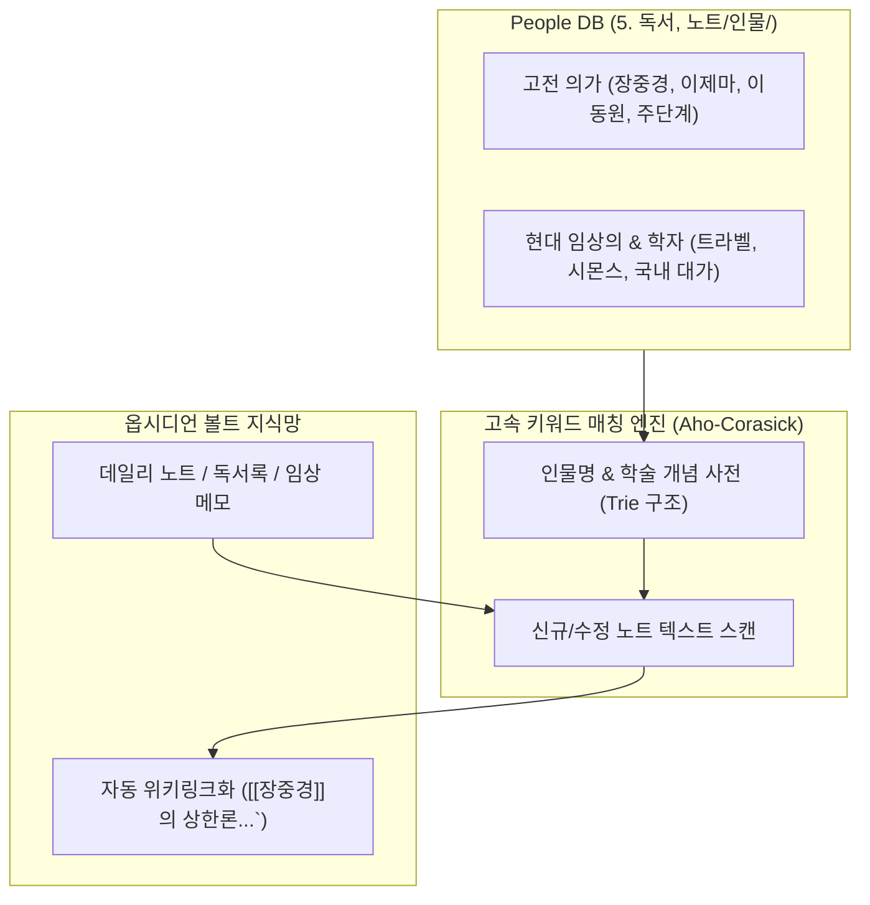

---
project_id: "D-2"
title: "옵시디언 지식 허브 (인물 사전 & 학술 개념 자동 위키링크 파이프라인)"
category: "Project D (Personal OS)"
status: "진행전"
priority: "Medium"
created: 2026-08-30
updated: 2026-08-31
target_date: "2026-09-25"
tags:
  - ai-project
  - knowledge-hub
  - people-db
  - auto-wikilink
  - status/pending
---

# [[D-2_Obsidian_Knowledge_Hub]]

> 개요: 역사적 의가(장중경, 이제마 등), 현대 임상 대가, 동료 한의사 및 연구자를 체계적으로 관리하는 인물 사전(People DB)을 구축하고, 볼트 내 작성되는 모든 독서록/일반 노트에서 주요 학술 개념 및 인물명을 자동으로 감지하여 [[인물명]]으로 위키링크를 연결해주는 지식 연결 파이프라인.

---

## 🎯 1. 프로젝트 핵심 목표
* **최종 결과물**:
  1. `5. 독서, 노트/인물/` 표준 People DB 템플릿 및 인덱스 MOC
  2. 신규 노트 작성 시 인물 및 학술 키워드 자동 위키링크화 스크립트
  3. 인물별 저서, 주요 학설, 연관 처방/본초 역방향 백링크 인덱싱
* **주요 성공 기준 (KPI)**:
  - [ ] 주요 한의학 의가 100인 및 현대 임상가 프로필 카드 표준화
  - [ ] 텍스트 내 인물명 등장 시 오인식 없이 100% 순수 [[인물명]]으로 자동 치환
  - [ ] 인물 카드 내에서 해당 인물이 언급된 모든 볼트 내 노트 목록 Dataview 렌더링
* **연동 인프라**: Obsidian Vault (LLM Wiki), Python Aho-Corasick 고속 키워드 매칭 엔진

---

## 👥 2. People DB 및 키워드 자동 링크 아키텍처

---

## 💬 3. Grill Me & 아키텍처 의사결정 기록

> [!abstract]- 📌 질의응답 아카이브 (클릭하여 열기)
> **Q1. 일반 단어와 인물명 충돌 방지 (False Positive 최소화)**
> - **결정**: 일반 명사(예: '동원', '단계')와 겹치는 인물명은 반드시 전체 성명([[이동원]], [[주단계]]) 또는 전후 맥락(의학/학술 문맥)을 판별하는 화이트리스트 사전으로 관리함.

---

## ✅ 4. 세부 Task & 체크리스트

### 🏗️ Phase 1. People DB 표준 템플릿 및 시딩
- [ ] `Template_People.md` Frontmatter 및 레이아웃 정의
- [ ] 상한론/사상의학 주요 고전 의가 30인 프로필 노트 작성

### 💻 Phase 2. 자동 위키링크 패처 개발
- [ ] Aho-Corasick 알고리즘 기반 고속 다중 키워드 치환 파이썬 스크립트 작성
- [ ] 볼드 중첩 방지 규칙(`**` 내부 링크화 차단) 내장

---

## 🔗 5. 관련 리소스 및 백링크
* **마스터 로드맵**: [[00_Project_A_Master_Roadmap]]
* **대시보드**: [[00_Master_Dashboard]]
* **연계 프로젝트**: [[B-4_Vault_Gardener_Agent]], [[C-4_Vault_Graph_MCP]]
