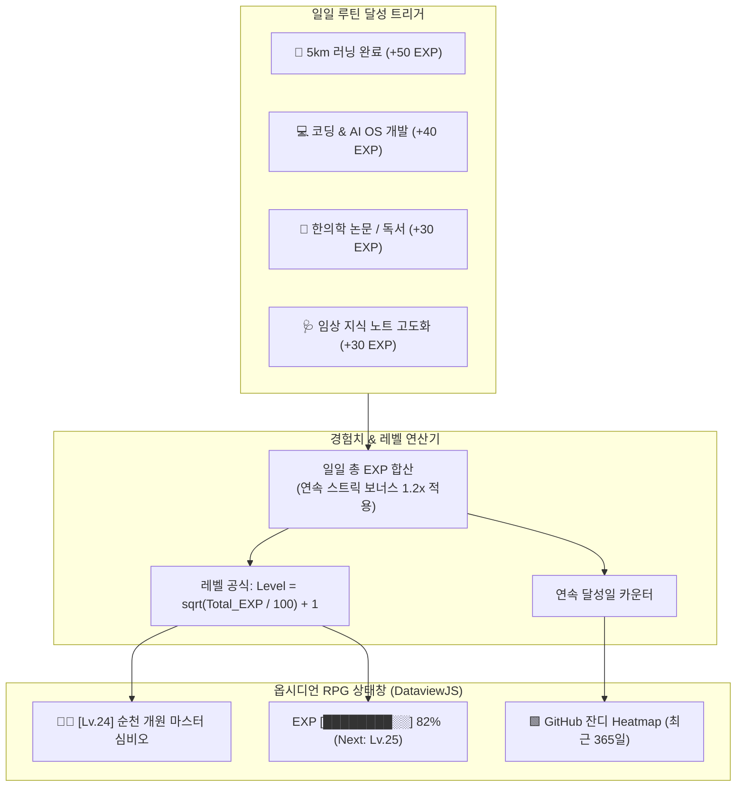

# [[D-4_Gamified_Habit_Tracker]]

> 개요: 5km 러닝, 코딩/개발, 한의학 임상 공부, 업무 완료 등 일일 활동 달성도를 경험치(EXP)로 환산하고, 연속 달성 스트릭(Streak), 레벨업 시스템, 그리고 옵시디언 DataviewJS / Heatmap Calendar 기반의 게이미피케이션 대시보드로 시각화하여 일상 동기부여를 극대화하는 라이프 OS 엔진.

---

## 🎯 1. 프로젝트 핵심 목표
* **최종 결과물**:
  1. 데일리 루틴별 경험치 산출 알고리즘 및 레벨 테이블 (Lv 1 ~ Lv 99)
  2. B-3 텔레그램 봇 및 데일리 노트 연동 경험치 누적 엔진
  3. 옵시디언 대시보드 상의 GitHub 잔디 스타일 Heatmap 및 RPG 스타일 상태창 UI
* **주요 성공 기준 (KPI)**:
  - [ ] 5km 러닝(+50 EXP), 코딩 1시간(+40 EXP), 논문 1편(+30 EXP) 등 정량적 EXP 모델 수립
  - [ ] 데일리 노트 체크 시 실시간 누적 EXP 및 현재 레벨 프로그레스 바 자동 렌더링
  - [ ] 30일/100일 연속 달성 스트릭(Streak) 시 특별 업적 뱃지 해금 시스템 탑재
* **연동 인프라**: Obsidian Vault (DataviewJS, Heatmap Calendar Plugin), B-3 Telegram Bot

---

## 🎮 2. 게이미피케이션 아키텍처 및 상태창 UI 설계

### 📌 경험치 획득 룰셋 및 업적 시스템

| 활동 분류 | 태스크 명 | 기본 EXP | 스트릭 보너스 |
| :--- | :--- | :---: | :---: |
| **운동/체력** | 5km 야외/트레드밀 러닝 | **+50 EXP** | 7일 연속 시 +20% 추가 |
| **개발/코딩** | Antigravity AI OS 개발 & 커밋 | **+40 EXP** | 14일 연속 시 +30% 추가 |
| **임상/학술** | 6대 지식 노트 고도화 / 논문 분석 | **+30 EXP** | 30일 연속 시 +50% 추가 |
| **독서/루틴** | 독서 30분 & 유튜브 다이제스트 정독 | **+20 EXP** | 상시 적용 |

---

## 💬 3. Grill Me & 아키텍처 의사결정 기록

> [!abstract]- 📌 질의응답 아카이브 (클릭하여 열기)
> **Q1. 습관 트래커의 지속성을 담보하는 핵심 장치**
> - **결정**: 수동 기록의 번거로움을 없애기 위해 B-3 텔레그램 봇에서 버튼 한 번으로 EXP가 즉시 가산되고 텔레그램으로 "레벨업까지 40 EXP 남았습니다!"라는 피드백을 실시간 제공함.

---

## ✅ 4. 세부 Task & 체크리스트

### 🏗️ Phase 1. EXP 및 레벨 시스템 데이터 모델링
- [ ] 레벨별 필요 경험치 곡선 및 업적(뱃지) 리스트 정의
- [ ] 데일리 노트 Frontmatter 메타데이터(`exp: 120`, `running_km: 5`) 표준화

### 💻 Phase 2. DataviewJS 상태창 및 Heatmap UI 구현
- [ ] 옵시디언 메인 대시보드용 RPG 프로필 및 프로그레스 바 위젯 코드 작성
- [ ] Obsidian Heatmap Calendar 플러그인 연동 잔디 뷰 렌더링

---

## 🔗 5. 관련 리소스 및 백링크
* **마스터 로드맵**: [[00_Project_A_Master_Roadmap]]
* **대시보드**: [[00_Master_Dashboard]]
* **연계 프로젝트**: [[B-3_Telegram_Interaction_Bot]], [[D-1_Life_Manager_Bugfixes]]
