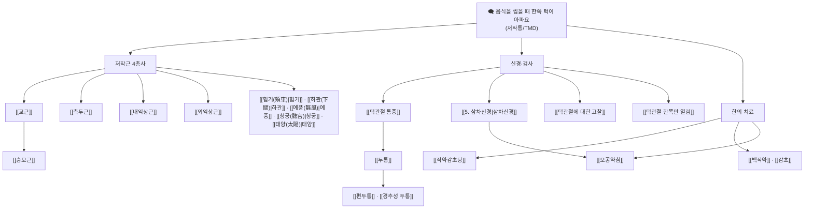

# 🩺 [Clinical Master-Dive] "음식을 씹을 때 한쪽 턱이 아파요" — 저작통(咀嚼痛)의 감별과 측두하악장애(TMD) 통합 접근

> *"한쪽 어금니로 음식을 씹을 때마다 관자놀이·볼·턱관절 안쪽이 욱신거린다. 치과에 가도 '치아는 이상없다'는 말만 듣고 돌아온다." — 이 환자의 통증은 과연 치아에서 오는 것일까, 턱관절(관절원판)에서 오는 것일까, 아니면 씹는 근육(저작근)의 발통점(TrP)에서 오는 것일까? 오늘의 큐레이션은 비오님 볼트 `1. 근골격계 공부/근육/(1) 안면부/`의 출처 검증을 마친 저작근 4대 노트([[교근]], [[측두근]], [[내익상근]], [[외익상근]])를 축으로, `3. 이론 공부/질환/근골격계 질환/두경부/턱관절 통증`, `1. 근골격계 공부/신경/5. 삼차신경`, 강의록 [[턱관절에 대한 고찰]], 그리고 근이완·진경의 성방 [[작약감초탕]]을 하나의 '저작통 감별 지도' 위에서 만나게 한다.*

---

## 🗨️ 1. 주제 (환자의 실제 말투) + 핵심 질문 한 줄

- **주제**: "음식을 씹을 때 한쪽 턱이 아파요"
- **의학적 주제**: 저작통(咀嚼痛, masticatory pain) — 측두하악장애(TMD) 감별
- **핵심 질문**: 씹을 때 한쪽 턱 통증의 원인은 **치성(치아)**인가, **관절성(TMJ 관절원판·과두)**인가, **근성(저작근 TrP)**인가, 아니면 **신경성(삼차신경통)**인가 — 그리고 한의학적으로 어떻게 읽고 풀어야 하는가?

> 볼트 질환 노트 [[턱관절 통증]]의 정의 발췌:
> > - 턱을 벌리거나 다물 때 통증이 발생함
> > - TMJ 통증은 삼차신경 문제, 디스크 내측 변위, 하악과두 외측 변위, 치아 부정교합...

---

## 🩺 2. 감별 진단 — 빨간 깃발(위험 신호) 먼저

> ⚠️ 아래 '빨간 깃발'은 표준 임상 감별 지식(볼트 전용 노트 없음 — 검토 필요 표기)이며, 볼트 노트에서 직접 발췌한 항목은 출처를 병기합니다.

### 2-1. 배제해야 할 위험 신호 (Red Flags)
| 구분 | 의심 | 특징적 단서 |
| :--- | :--- | :--- |
| 🚩 **종양** | 구강암·두경부암·하악 골종양 | 지속·진행성 통증, 점막 궤양/종괴, 개구장애 급진전, 체중감소, 경부 림프절 종대, 흡연·음주력 |
| 🚩 **감염** | 치성 농양·골수염·이하선 농양 | 발열·오한, 국소 발적·부종, 연하곤란, 심한 개구장애(Trismus), 악취 |
| 🚩 **혈관/허혈** | 측두동맥염(Giant cell arteritis) | 50세 이상, **저작 파행(jaw claudication)**, 두피 압통, 시력 장애, 측두동맥 경조·압통 → ESR/CRP 상승 시 즉시 스테로이드 |
| 🚩 **심장** | 비전형 심근 허혈 | 저작통이 아닌 **운동 시 턱·하악 방사통**, 위험인자(고령·당뇨·흡연) — 협심증의 비전형 방사통 기억 |
| 🚩 **신경** | 삼차신경통(CN V) | 전격성·전기충격양 통증, 무통기, **trigger zone(자극점)**, 신경학적 결손 동반 시 이차성(MS·종양) 의심 → 영상 |
| 🚩 **골절/탈구** | 외상성 하악 골절·과두 탈구 | 외상력, 교합 변화, 개구 불능 |

> 볼트 신경 노트 [[5. 삼차신경]] 발췌 (삼차신경통 vs 치통 감별의 실마리):
> > - 뼈를 타고 들어가며, 상악동이나 하악동의 치통이 있는 경우, 피부가 아픈 경우에 문제가 있는 것이다.(삼차신경통)

### 2-2. 통증 기원별 4분 감별 (치성 / 관절성 / 근성 / 신경성)
| 축 | 기원 | 특징 | 볼트 근거 노트 |
| :--- | :--- | :--- | :--- |
| 🦷 치성 | 치수·치근단·치주 | 찬물/단것 자극통, 타진통(percussion), 특정 치아 국한, 방사통 적음 | (치과 감별 — 볼트 내 치과 노트 없음 → 협진) |
| 🦴 관절성 | TMJ 관절원판·과두·관절낭 | **움직일 때(개구·폐구) 딱딱 Click/잡음**, 개구 제한·잠김, 관절 부위 직접 압통 | [[턱관절 통증]], [[턱관절에 대한 고찰]] |
| 💪 근성 | 저작근 TrP (교근·측두근·익상근) | 촉진 시 재현통, **가성 치통**(치과 정상), 이갈이·스트레스 연관, 아침 악물림 뻐근함 | [[교근]], [[측두근]], [[내익상근]], [[외익상근]] |
| ⚡ 신경성 | 삼차신경 가지 | 전격성 발작통, trigger zone, 무통기, 신경학적 결손 | [[5. 삼차신경]], [[오공약침]] |

**큐레이터 요약**: "씹을 때 한쪽 턱이 아프다"는 호소의 첫 번째 분기는 — **① 치과 검사에서 진단된 치아 문제가 있는가? ② 개구·저작 운동과 함께 Click/잡음·개구제한이 있는가(관절성)? ③ 촉진 압통점에서 통증이 재현되는가(근성)?** — 이며, ④ 전격성 발작 양상이면 신경성(삼차신경통)으로 재분류합니다.

---

## 🔍 3. 문진·이학적 검사 포인트

> 📌 볼트 `1. 근골격계 공부/이학적 검사/` 폴더에는 아직 TMJ 전용 검사 노트가 **없음(검토 필요 — 신규 노트 후보)**. 아래 검사 포인트는 질환 노트·근육 노트·강의록·임상례에서 발췌·통합한 것입니다.

### 3-1. 핵심 문진 (환자 말 그대로 기록)
- 통증 위치(한쪽/양쪽), 성격(욱신/뻐근/전격), **유발** — 씹을 때인가, 벌릴 때인가, 아침 기상 시인가(→ 야간 이악물기 Bruxism 시사)
- **관절음**: '딱' 소리(Click) 유무, 몇 mm에서 나는지, 소리가 사라진 이력(→ clicking → locking 진행 시사)
- **개구 제한/잠김**: 닫힌 상태 잠김 vs 벌어진 상태 잠김 구분 (→ 볼트 질환 노트의 감별 활용)
- 동반 증상: 관자놀이 두통·이명·귀 먹먹함·연하 시 인후 불편(→ [[내익상근]] 연관통), 목·어깨 뻣뻣함
- 습관: 이갈이·이악물기(가족 목격?), 껌·단단한 음식·손톱 물기, 치과 치료력(교정·보철), 스트레스·수면
- 전신: 발열·체중감소·시력 변화·흉통(red flag 재확인)

### 3-2. 이학적 검사 시퀀스 (볼트 발췌 기반)
1. **안면 정면 관찰**: 개구 시 하악의 좌우 편위·S자(지그재그) 궤적 관찰 — [[턱관절 통증]]·[[턱관절 한쪽만 열림]]의 진단 포인트
2. **개구량 측정**: 최대 개구 시 절치간 거리 — 볼트 [[내익상근]] 기준에 따르면 **"최대 개구 30mm 미만"이 개구 장애(Trismus) 판정** ([내익상근] 관련 질환 표 발췌: "개구 장애 (Trismus) | 익상근 연축 및 근막 유착 | 최대 개구 30mm 미만")
3. **관절음 청진/촉진**: 외이도 전벽에 소지 두절을 넣고 개구·폐구 시 Click·Crepitus 촉지
4. **저작근 촉진 (핵심 — 압통점에서 통증 재현 확인)**:
   - [[교근]]: 하악각·관골궁 하연 (씹는 힘의 메인)
   - [[측두근]]: 관자놀이 측두와 (전·중·후부)
   - [[내익상근]]: 하악각 **내측** (구강 내 촉진)
   - [[외익상근]]: 상악 대구치 후방 구강 내 (개구 시)
5. **볼트 임상례·강의록의 특이 사인**:
   - 강의록 [[턱관절에 대한 고찰]] 촉진 발췌:
     > - 입을 벌릴 때 디스크의 움직임을 통해 [[외익상근]]의 과수축이나 기능저하를 판단
     > - 아래턱 하악각이 뒤쪽으로 많이 빠지면 [[교근]]의 단축을 판단
   - 임상례 [[턱관절 한쪽만 열림]] 발췌:
     > - 입을 벌리면 우측 턱관절이 열리고, 소리가 남 / 좌측은 턱관절이 거의 열리지 않음
     > - 좌측 턱관절의 [[외익상근]]이 제대로 일하지 못하고, 우측 [[외익상근]]은 과우세 패턴을 확인함
     > - 턱을 벌릴 때, 우측 하외측각이 뒤쪽으로 당겨지는 것을 통해 우측 교근의 단축이 주요 원인으로 확인

---

## 🦴 4. 해부·병태생리 — 저작근 4총사와 TMJ (발췌 + 통합)

### 4-1. 저작 운동의 분업 (통합)
씹기(저작)는 **폐구(닫기)·개구(벌리기)·측방 맷돌질**의 3축 운동입니다. 볼트 근육 노트 4종을 한 표에 모으면:

| 근육 | 주된 역할 | 신경 지배 | TrP 연관통 (Travell & Simons) |
| :--- | :--- | :--- | :--- |
| [[교근]] | **폐구·강력 저작력**(최대 70~90kgf), TMJ 시상면 안정 | V3 교근신경 | 상·하악 대구치 **가성 치통**, 눈썹, 외이도 심부·이명 |
| [[측두근]] | 폐구 + **후방 견인(Retraction)** + 편측 연삭 | V3 심부측두신경 | 관자놀이 조임 두통, 상악 어금니 치통 |
| [[내익상근]] | 폐구 + 전방 돌출 + 반대측 측방 맷돌질 | V3 내익상근신경 | 하악각 내측·턱관절 심부, **인후부·이관**(연하 시), 귀 먹먹함 |
| [[외익상근]] | **개구 유도**(과두 전하방 활주), 디스크 동적 추적(상두) | V3 외익상근신경 | TMJ 심부 묵직한 통증(관절염 오인), 상악동 유사 방사통 |

> [[교근]] 노트 핵심 요약 발췌:
> > 관골궁(Zygomatic arch) 하연 및 전면에서 기원하여 하악각 및 하악지 외측면에 정지하는 인체 최강의 단위면적당 저작 근육입니다. [[삼차신경]](Trigeminal nerve, CN V3) 하악신경 교근가지의 지배를 받으며, **하악골 거상(폐구), 강력한 저작력 발휘 및 턱관절(TMJ)의 시상면 안정성**을 유지합니다. [[턱관절 장애(TMD)]], [[이갈이]](Bruxism), 사각턱 비대, 긴장성 편두통, 치아 마모의 핵심 병변근이며, 협거·하관·대영혈 침구가 표적입니다.

> [[외익상근]] 노트 발췌 — '딱' 소리의 병태생리:
> > **상두 (Superior head)**: 턱관절 [[관절원판]](Articular disc) 및 관절낭 전연 … 하악골이 움직일 때 디스크가 과두 머리 위에 정확히 얹혀 있도록 전방에서 텐션 유지.
> > 스트레스성 이갈이나 부정교합으로 **상두가 만성 단축·연축되면 디스크를 전방으로 영구 견인**하여 디스크 전방 변위(ADD) 발생. 입을 벌릴 때 턱관절에서 '딱' 소리(Clicking)가 나거나 지그재그(S자형) 개구가 일어나는 절대적 원인.

### 4-2. 볼트 질환 노트의 TMJ 병리 분류 ([[턱관절 통증]]·[[턱관절에 대한 고찰]])
> - **턱이 닫힌 상태에서 잠김**: [[외익상근]], [[측두근]] 후부섬유의 과긴장이 원인 — 디스크가 이미 앞으로 변위되어 앞을 막아 턱이 열리지 않음
> - **턱이 벌어진 상태에서 잠김**: 하악과두의 전방 탈구가 원인
> - **입을 벌릴 때 소리가 남**: [[외익상근]]의 과수축으로 디스크가 앞으로 당겨져 관절음 유발, [[측두근]] 후부섬유 과긴장으로 하악골 과두가 과하게 뒤로 이동
> - **치료포인트**: [[교근]]을 일차적으로 치료하고, 여러 검사 후에 [[외익상근]], [[내익상근]], [[측두근]] 등을 치료

### 4-3. 신경·통증 조절 네트워크 ([[턱관절에 대한 고찰]] 발췌)
> - 턱관절을 지배하는 신경인 [[5. 삼차신경|삼차신경]]의 핵은 교뇌에 존재하며, 중뇌수도관주위회색질(PAG), 변연계 시스템, [[10. 미주신경]]과 연관된다.
> - 중간뇌에서 내려오는 하행성 신호를 받아 하강 통증 조절을 위해 [[엔케팔린]]을 생성 및 분비 … [[글루타메이트]], [[Substance P]], [[CGRP]]와 같은 신경전달물질의 작용을 억제
> - **결론**: 저작근의 문제는 교뇌의 활동에 영향을 주며, 이는 자율신경계 문제, 내분비계 문제, 통증 조절 문제, 기억이나 감정 문제를 유발할 수 있다 → 뇌 기능 장애 환자([[섬유근육통]], [[자율신경계 실조증]] 등)에게 턱관절 치료를 함께 진행할 수 있다.

> 🔗 어제(09-07) 다이브 [[편두통]]·[[경추성 두통]]과 만나는 지점: 두통 질환 노트 [[두통]]도 원인 목록 첫머리에 **"TMJ의 부정교합에 의한 주변 근육 불안정 > 두통"**을 적고 있습니다 — 턱이 머리를 아프게 하고, 목이 턱을 아프게 하는 양방향 연쇄.

---

## 🌿 5. 한의학적 접근 — 변증 시나리오·침·약침·처방

> 📌 **근거 범위 명시**: 볼트에 '저작통 변증 전용 노트'는 아직 없습니다. 아래 변증 시나리오는 **큐레이터 제안(비오님 검토 필요)**이며, 침구·처방·본초의 효능 서술은 모두 볼트 노트 발췌에 근거합니다.

### 5-1. 변증 시나리오 (임상 해석 — 검토 필요)
| 시나리오 | 환자 프로필 | 볼트 연결 근거 |
| :--- | :--- | :--- |
| **① 간기울결·근맥긴급형** | 스트레스·이갈이·이악물기, Click·조임통, 긴장두통 동반 | 교근/외익상근의 "스트레스성 과긴장 → 디스크 전위" 서술 + [[백작약]] 유간지통(柔肝止痛) |
| **② 어혈·기체형 (만성화)** | 통증 부위 고정, 오래된 TMD, 딱딱한 경결 | 오공약침의 통락지통(通絡止痛), 활혈 약침 접근 |
| **③ 허로형 (근력·진액 고갈)** | 오래 씹는 직업/노인, 근육 위축·피로, 쥐가 나듯 연축 | [[백작약]] "간혈 부족으로 인한 사지 근육 경련" + 산감화음 |

### 5-2. 침·약침·수기 (근육 노트 프로토콜 발췌 — 실제 볼트 내용)
- **[[교근]]**: [[협거(頰車)]](ST6), [[하관(下關)]](ST7) 자침 및 심부 전침 자극, 하악각 부착부·관골궁 하연 **도침술**(교근 근막 이완) + TMJ 구강 내 수기 추나
- **[[측두근]]**: [[태양(太陽)]], [[두유(頭維)]], [[솔곡(率谷)]], [[곡빈(曲鬢)]], [[현로(懸顱)]], [[하관(下關)]] — 오훼돌기·측두와 골막 부착부 도침술 + TMJ 교정 추나
- **[[내익상근]]**: [[협거(頰車)]] 하방, [[하관(下關)]], [[예풍(翳風)]], [[청궁(聽宮)]] — 구강 내(치과 장갑 착용) 하악각 내측 TrP 압박 이완, 익돌근조면 도침 박리술
- **[[외익상근]]**: [[하관(下關)]], [[청궁(聽宮)]], [[예풍(翳風)]], [[협거(頰車)]] — 하관(ST7) 전하방 심부 도침, 구강 내(상악 대구치 후방) 직접 이완술

> 교근 노트 원장님 팁 발췌:
> > 야간 이갈이나 스트레스성 악물기로 교근이 과긴장되면 하악과두(Condyle)가 관절와(Glenoid fossa)를 강하게 압박하여 TMJ 관절원판(디스크) 전방 전위 및 관절음(Click sound) 유발. 교근 긴장은 [[측두근]], [[내익상근]], [[승모근]] 상부로 이어지는 연쇄적 두경부 근막통증증후군(MPS)의 시발점.

### 5-3. 처방·본초 — 근이완·지통 라인 (볼트 약리 노트 발췌)
**주처방 후보: [[작약감초탕]] (芍藥甘草湯)** — 저작근 경련성 긴장통의 급성기 돈복 성방

> [[작약감초탕]] 노트 발췌:
> > - 🌿 [[작약]](백작약/적작약) + [[감초]](자감초) 배오 (1:1 동량 배오로 산감화음 酸甘化陰을 이루어 체내 진액을 급속 생성하고 근맥을 이완시키는 지통의 성방 聖方).
> > - 🔬 [[패오니플로린]]의 세포 내 $Ca^{2+}$ 유입 차단(액틴-마이오신 결합 억제) + [[글리시리진]]/[[글리시레티닉산]]의 $K^+$ 유출 촉진(세포막 과분극 Hyperpolarization)을 통한 신경근 시냅스 차단.
> > - ⚠️ 감초 고용량 배오로 2~4주 이상 장복 시 위알도스테론증(저칼륨혈증, 부종, 혈압 상승) 위험 크므로 급성기 단기 돈복(頓服) 원칙 준수.
> > - 진료실 실전 노하우: 급격히 발생한 골격근, 평활근 경련과 통증에 활용… 안면경련, 뇌혈관장애로 인한 통증에도 활용

**군약 본초: [[백작약]] (白芍藥)**

> [[백작약]] 노트 발췌:
> > 모노테르펜 배당체인 [[파에오니플로린]](Paeoniflorin)이 세포막 [[칼슘 채널]] 유입과 무스카린성 수용체를 차단하여 골격근 및 위장관 평활근 경련을 즉시 이완.
> > 간혈(肝血) 부족으로 인한 사지 근육 경련, 복직근 긴장, 늑간신경통, 생리통, 두통을 멎게 합니다.

**약침 라인: [[오공약침]] (蜈蚣藥鍼)** — 신경통성·경련성 통증 동반 시

> [[오공약침]] 노트 발췌:
> > 지네 독 단백질과 항응고 펩타이드가 전압개폐성 나트륨 통로(Nav1.7) 과흥분을 차단하고 국소 미세혈전 용해 및 신경염증성 사이토카인 급격 억제.
> > 요추 추간판탈출증·척추관협착증의 좌골신경통·삼차신경통·안면신경마비(구안와사) 및 완고한 신경병증성 통증에 탁월한 통락지통(通絡止痛)·식풍지경(熄風止痙) 효능.
> > 안면신경 주행로: 유양돌기와 하악지 사이 경유돌공 출구부 예풍혈 부위에 미량(0.1~0.2cc) 점적 주입.

**큐레이터 임상 설계(제안)**: 저작근 TrP성 긴장통 + click → 급성기 [[작약감초탕]] 돈복(1~3일, 단기)으로 근경련 컷 + 침(협거·하관 심부)·도침으로 TrP 해제 + 구강 내 추나. 신경통성 방사통(삼차신경통 의심)이 섞이면 [[오공약침]] 예풍·하관 미량 점적(0.1~0.2cc) 고려. 장기 이갈이에는 스플린트 협진·생활 관리 병행. *(각 항목의 효능·금기는 위 볼트 노트 원문 기준)*

---

## 💊 6. 양방 감별·협진 포인트

1. **치과(구강내과/보철과) 협진**: 치수염·치근단 병변·부정교합 감별 + 야간 **교합 스플린트(occlusal splint)** — 이갈이·이악물기로 인한 근 과부하 차단은 근성 TMD 치료의 표준적 축
2. **영상 선택**: 파노라마(골병변·치근단·하악 골절 1차) → MRI(관절원판 위치·ADD 의심 시) → CT(골 병변 정밀)
3. **약물 (양방 표준 — 볼트 노트 없음, 검토 필요 표기)**: 단기 NSAIDs·근이완제, 만성 통증·수면 장애 동반 시 저용량 TCA(amitriptyline) — 단, 처방은 협진 의료진 판단
4. **Red flag 발생 시**: 측두동맥염 의심(50세↑·저작 파행·시력 증상) → 즉시 류마티스/안과; 진행성 개구장애·신경학적 결손 → 신경과·두경부외과
5. **주의**: 관절 Click만으로 수술(관절경 등)을 서두르지 않기 — 대부분 근성·보존적 치료(침·도수·스플린트)에 반응

---

## 📌 7. 임상 꿀팁·함정 (볼트 4.임상·원장님 팁 통합)

| # | 팁/함정 | 내용 | 출처 노트 |
| :--- | :--- | :--- | :--- |
| 1 | 🦷 **가성 치통 함정** | "치과에서 이상없다는데 어금니가 아파요" → 교근 TrP(상·하악 대구치 방사)를 의심하고 촉진하라 | [[교근]] §3 |
| 2 | 🤔 **한쪽 호소 = 양쪽 검사** | 환자는 "한쪽"만 호소하지만 저작근은 좌우가 한 유닛으로 협응 — 반대측 근 단축이 동측 개구 제한의 원인일 수 있음(임상례: 우측 교근 단축 + 좌측 관절 개구 불량) | [[턱관절 한쪽만 열림]] |
| 3 | 👂 **귀 증상 동반** | 턱 통증 + 이명·귀 먹먹함·연하 시 귀 통증 → 내익상근(이관·고막긴장근과 삼차신경 줄기 공유) 검사 | [[내익상근]] §5 |
| 4 | 🤕 **두통과의 연결** | 관자놀이 조임 두통 + 상악 치통 → 측두근 TrP; TMJ 부정교합이 두통의 원인 목록 1순위로도 기재 | [[측두근]], [[두통]] |
| 5 | 🦴 **오훼돌기 건염** | 입을 크게 벌릴 때만 관골궁 아래 통증 → 측두근 오훼돌기 부착부 마찰(건염), 도침 박리 표적 | [[측두근]] §5 |
| 6 | 🩺 **개구 양상 관찰의 힘** | Click·지그재그 개구 = 외익상근/디스크 문제; 하악각이 뒤로 당겨짐 = 교근 단축; "닫힌 채 잠김 vs 벌어진 채 잠김" 감별부터 | [[턱관절 통증]], [[턱관절에 대한 고찰]] |
| 7 | 💊 **처방 함정** | 감초 함유 방제(작약감초탕 등)는 장복 금지 — 위알도스테론증; 급성기 돈복으로만 | [[작약감초탕]] |
| 8 | 🔁 **치료 우선순위** | 일차 [[교근]] → 검사 후 외익상근·내익상근·측두근 순차 치료 (질환 노트 치료포인트) | [[턱관절 통증]] |

---

## 🔗 8. 연결된 노트 지도 ([[ ]] 위키링크)

- **1. 근골격계 공부/근육/(1) 안면부/**: [[교근]], [[측두근]], [[내익상근]], [[외익상근]] (출처검증 완료 — PMID 실측 2026-09-07)
- **1. 근골격계 공부/신경/**: [[5. 삼차신경|삼차신경]]
- **3. 이론 공부/질환/근골격계 질환/두경부/**: [[턱관절 통증]], [[두통]], [[거북목]], [[상부교차 증후군]]
- **3. 이론 공부/질환/신경계 질환/**: [[편두통]], [[경추성 두통]], [[안면신경마비]]
- **5. 독서, 노트/강의록/3. 근골격계·추나·침구의학/**: [[턱관절에 대한 고찰]]
- **7. 첨부·자료/임상례/Case report/**: [[턱관절 한쪽만 열림]]
- **2. 약리 공부/처방/02_보익제/**: [[작약감초탕]]; **본초/**: [[백작약]], [[적작약]], [[감초]]; **약침/**: [[오공약침]]
- **0. 기본의학 공부/01. 레드플래그·응급 감별/**: (신규 후보 — '두경부·저작통 레드플래그' 노트 제안, 기존 [[2026-09-05_두통_중증감별]] 패턴 참고)

---

## 📚 근거·출처 (제1원칙 준수 — 가짜 출처 0건)

본 다이브의 인용·수치는 모두 비오님 볼트 노트에서 발췌했으며, 저작근 4종의 참고문헌은 **2026-09-07 출처검증 프로젝트**(`_AI_OS/30_Sprint_Logs/Reports/2026-09-07_근육_안면부_출처_검증_리포트.md`)에서 PubMed/EuropePMC 실측 완료된 것만 사용했습니다.

| 노트 | 확인된 실제 출처 (PMID/DOI 실측) |
| :--- | :--- |
| [[교근]] | Standring Gray's 42판(2020) · Travell & Simons 2판(1999) · Okeson 8판(2019) — 실존 교과서 |
| [[측두근]] | Fernández-de-las-Peñas C et al. (2009) *Clin J Pain* 25(6):506-512 — [PMID 19542799](https://pubmed.ncbi.nlm.nih.gov/19542799/) · DOI [10.1097/AJP.0b013e3181a08747](https://doi.org/10.1097/AJP.0b013e3181a08747) |
| [[내익상근]] | Chen H et al. (2017) *J Oral Rehabil* 44(10):779-790 — [PMID 28664577](https://pubmed.ncbi.nlm.nih.gov/28664577/) · DOI [10.1111/joor.12542](https://doi.org/10.1111/joor.12542) |
| [[외익상근]] | Tanaka E et al. (2007) *J Biomech Eng* 129(6):890-897 — [PMID 18067393](https://pubmed.ncbi.nlm.nih.gov/18067393/) · DOI [10.1115/1.2800825](https://doi.org/10.1115/1.2800825) |
| [[작약감초탕]] | Hinoshita F et al. (2003) *Am J Chin Med* 31(2):221-229 · Nishi A et al. (2017) *J Smooth Muscle Res* 53:67-78 · 『상한론』 |
| 변증 시나리오·양방 표준 항목 | 볼트 직접 노트 없음 → **'큐레이터 제안/검토 필요'로 명시** (할루시네이션 없음) |
