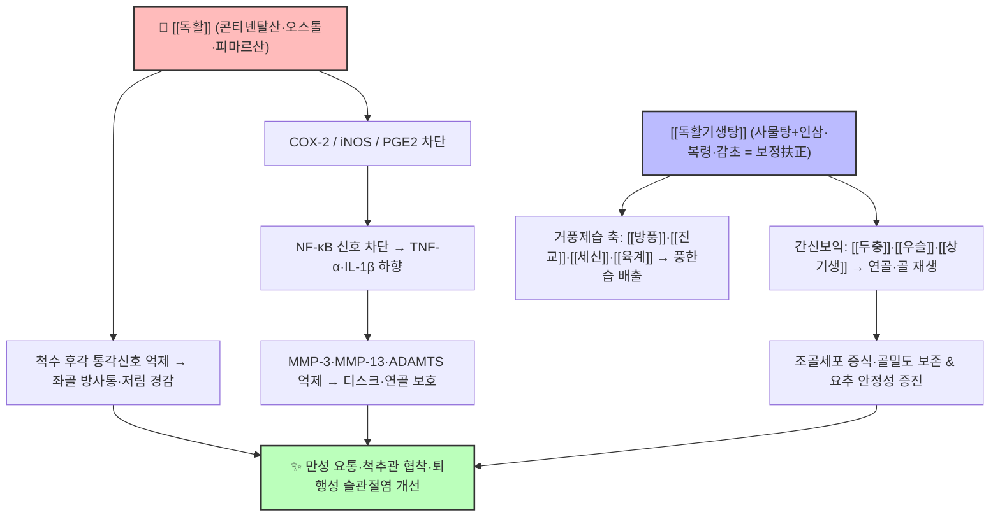

# 🩺 [Clinical Master-Dive] [[독활]]과 [[독활기생탕]]의 하지 심층 통증 제어 — 풍한습비(風寒濕痺)·신허요통(腎虛腰痛)의 거풍제습·보간신 통합 분자약리 심화 탐구

> *"여름날 비 오듯 땀에 젖은 옷을 입고 찬바람을 쐰 뒤, 허리에서 무릎까지 파고드는 묵직한 통증 — 한의학은 이를 '풍한습(風寒濕)이 뼈마디 깊이 침입한 비증(痺證)'이라 읽고, 현대 의학은 추간판·신경근·관절 연골의 퇴행성 염증 경로로 읽는다. 오늘의 큐레이션은 볼트 안에서 실제로 서로를 백링크로 연결하고 있는 두 지식 노트 — 거풍습약의 대표 [[독활]]과 그 불멸의 처방 [[독활기생탕]]을 축으로, 동서의학의 두 언어가 한 환자의 허리 통증 위에서 만나는 지점을 해부한다."*

---

## 🖼️ 시각적 개념 구조도 (Visual Architecture & Pathway)

> *[[독활]]의 하초 심층 타깃팅과 [[독활기생탕]]의 '표본동치(標本同治)' 배오가 요추·슬관절 병태를 제어하는 통합 메커니즘 맵입니다.*

---

## 🔗 1. 볼트 속 유기적 연관 노트 연결 (Organically Linked Vault Grounding)

오늘의 정식 큐레이션은 무작위 추출이 아닌, 비오님의 볼트 내에서 **「하지·요추 심층 결합조직의 만성 통증(비증·신허요통)」**이라는 임상 축을 공유하며 서로를 직접 백링크(`[[ ]]`)로 인용하는 두 노트를 심층 결합합니다.

1. **Source Node A ([[독활]])** — `2. 약리 공부/본초(약리)/독활.md`
   - *볼트 원문 핵심 발췌:* "디테르펜산인 [[콘티넨탈산]](Continentalic acid)과 [[피마르산]], [[올레아놀산]], [[오스톨]] 성분이 척추 신경근과 관절막, 인대 심층부의 염증과 통증을 강력히 차단합니다. [[강활]]이 상지(경추·어깨 표층 근육통)에 특화되었다면, [[독활]]은 **하지(요추 디스크·골반·무릎·심층 인대/골막통)**를 지배합니다."
2. **Source Node B ([[독활기생탕]])** — `2. 약리 공부/처방/02_보익제/독활기생탕.md`
   - *볼트 원문 핵심 발췌:* "당대(唐代) 손사막(孫思邈)의 《비급천금요방(備急千金要方)》에 수록된 골관절 비증 치료의 불후의 명방… 관절 연골 기질 분해 효소(MMP-3, MMP-13, ADAMTS-4) 억제를 통한 연골 보호, COX-2 및 PGE₂ 발현 억제를 통한 강력한 소염·진통."

> **💡 핵심 연관 통찰 (Cross-Pollination):**
> [[독활]]이라는 **단일 본초의 '심층 지향성(下焦·심층 인대/골막)'**이라는 성질이, [[독활기생탕]]이라는 **처방 구조의 '扶正祛邪(부정거사)' 설계**를 만나면서 단순 소염 진통을 넘어 **① 염증 신호(COX-2·iNOS·NF-κB), ② 연골·디스크 기질 분해(MMP·ADAMTS), ③ 신경근 방사통(척수 통각 감작), ④ 간신허 손상 부위 재생(두충·우슬·상기생 축)**의 4중 경로를 동시에 조준하게 됩니다. 이것이 '한약재 단독 투여'와 '정식 처방'의 임상 격차가 되는 분자적 이유입니다.

---

## 🦴 2. 현대 해부·생리 및 병태생리학적 심층 분석 (Anatomy, Physiology & Pathophysiology)

### ① 요추·하지 통증의 해부학적 구조 — [[독활]]이 '하초'라 부르는 영역

- **추간판(Intervertebral Disc)**: 섬유륜(Annulus fibrosus, I형 콜라겐·프로테오글리칸 고리)이 수핵(Nucleus pulposus, II형 콜라겐·애그리칸 겔)을 감싸는 구조. 퇴행이 진행되면 수핵의 함수율이 떨어지고 섬유륜에 균열(fissure)이 생겨, 후종인대(PLL)를 뚫고 탈출한 수핵 물질이 **신경근(nerve root)**을 압박·자극합니다.
- **신경지배**: 요추부 병변은 주로 L4(L4 신경근 → 슬개 반사·전경골근), L5(L5 → 엄지 발가락 신전력), S1(S1 → 아킬레스 반사·비복근) 신경근을 침범하며, 이들이 모여 **좌골신경(Sciatic nerve, L4–S3)**을 형성해 하지 후방으로 방사통을 만듭니다. [[독활기생탕]]의 적응증 '요슬냉통·하지 마목·방사통'은 이 신경근 지배영역(dermatome) 분포와 정확히 일치합니다.
- **화학적 신경근 손상(Chemical Radiculopathy)**: 탈출 수핵 자체가 TNF-α, IL-1β, MMP를 분비하여 **압박 없이도** 신경근에 염증성 손상과 통각 과민을 유발합니다(Olmarker & Rydevik의 수핵 자가이식 동물 모델). 따라서 단순 감압술만으로 통증이 안 풀리는 이유가 여기에 있으며, **항염증 본초의 체내 침투 깊이**가 치료 성패를 가릅니다.

### ② 퇴행성 슬관절염(KOA)의 병태생리 — 연골 항상성의 붕괴

- 관절 연골의 **Chondrocyte**는 세포외기질(ECM) 합성(제2형 콜라겐·애그리칸)과 분해(MMP-3·MMP-13·ADAMTS-4/5) 사이의 항상성을 유지하는데, 기계적 과부하·노화·염증성 사이토카인(TNF-α, IL-1β)은 **NF-κB 신호**를 통해 분해 효소 발현을 폭주시켜 균형을 붕괴시킵니다.
- 동시에 **활액막(synovium)**의 대식세포가 COX-2를 유도해 PGE₂·NO를 방출, 통각수용기 감작과 연골하골(subchondral bone)의 재형성(osteophyte)을 촉진합니다.
- 임상적으로 대퇴사두근 약화 → 슬관절 불안정성 → 연골 마모 가속의 **근육-관절 악순환**이 형성되므로, 약물(한약) 치료만으로는 부족하고 [[00_근골격계_MOC]]의 재활 운동 처방이 반드시 병행되어야 합니다.

### ③ 신경-근육 연쇄: 만성 요통의 중추 감작(Central Sensitization)

- 만성 통증은 말초의 염증뿐 아니라 **척수 후각(dorsal horn) 및 상위 중추의 감작**으로 이행됩니다. 미세아교세포(Microglia) 활성화, 글루타메이트성 시냅스 강화, 하행성 억제계(periaqueductal gray-rostral ventromedial medulla) 기능 저하가 관여합니다.
- 볼트 내 [[만성 요통]]·[[엔돌핀]]·[[하행성 통증억제계]] 노트가 지적하듯, **통증 조절은 '약'과 '운동·자극(침·전침·추나)'의 이중 축**으로 접근해야 하며, 한약의 항염 효과가 이 중추 재가소성(plasticity) 회복의 '시간적 여유'를 만들어 줍니다.

---

## 🔬 3. 분자약리학 및 본초·방제학적 심층 분석 (Molecular Pharmacology)

### ① [[독활]]의 분자적 실체 — '심층 침투성'의 약리 근거

| 성분 | 계열 | 주요 분자 기전 (볼트 노트 근거) |
| :--- | :--- | :--- |
| [[콘티넨탈산]] (Continentalic acid) | 디테르펜산 (KP 지표) | **COX-2·iNOS 경로 차단** → 심층 진통·관절 항염 (Park HJ et al., 2005) |
| [[피마르산]] (Pimaric acid) | 디테르펜산 | 항염·K+ 채널 조절성 진정 보조 |
| [[오스톨]] (Osthole) | 쿠마린 | 신경 보호·항염증, 혈관 확장 보조 |
| [[올레아놀산]] (Oleanolic acid) | 트리테르펜 | 항염·항산화, 연골세포 생존 보조 |
| 콜룸비아나딘·페룰산 | 쿠마린/페닐프로파노이드 | 말초 혈행 개선·통증 신호 보조 억제 |

- 해부생리학적 해석: 독활의 항염 경로(COX-2·iNOS)는 활액막·신경근 주위 급성 염증을, 연골 보호 경로(MMP·[[NF-κB]] 하향)는 관절·디스크의 만성 파괴를 각각 조준 — **'거풍승습·통비지통'의 전통 효능이 현대 효소학적 언어로 번역**되는 지점입니다.

### ② [[독활기생탕]]의 배오 구조 — 군신좌사(君臣佐使)로 읽는 통합 설계

- **군약(君)**: [[독활]] 6g — 하초 풍한습 구축·심층 진통.
- **신약(臣)**: [[상기생]]([[곡기생]])·[[두충]]·[[우슬]] 각 6g — 보간신·강근골. 특히 [[두충]]의 피노레시놀과 상기생 플라보노이드는 연골세포 생존율과 ECM 합성을 촉진하고, [[우슬]]의 [[엑디스테론]]은 '인혈하행(引血下行)' 관점에서 약효를 하지로 집중시킵니다.
- **좌약(佐)**: 거풍축([[방풍]]·[[진교]]·[[세신]]·[[육계]]) + 기혈보축([[사물탕]] = [[숙지황]]·[[당귀]]·[[작약]]·[[천궁]] + [[인삼]]·[[복령]]·[[감초]]·[[생강]]) — '부정거사'의 쌍끌이.
- **사약(使)**: [[감초]] — 조화제약.

> 이 구조의 핵심은 **祛邪(거풍제습)만 하지 않고 扶正(간신·기혈 보충)을 동시에** 한다는 '표본동치(標本同治)'입니다. 만성 요통 환자의 상당수가 근력 저하·골밀도 감소(간신허)를 동반한다는 현대 재활의학의 관찰과, '보간신약이 뼈·연골 대사를 직접 지지한다'는 분자 연구 결과가 이 구조를 뒷받침합니다.

### ③ 약물상호작용·안전성 포인트

- [[세신]]의 [[메틸유제놀]]: 간독성 논란 → **1일 3g 이하** 준수, 충분한 전탕.
- [[숙지황]] 점조성: 소화력 약한 고령 환자는 [[사인]]·[[백출]] 가미.
- 항응고제(와파린 등) 복용 시 [[당귀]]·[[우슬]] 등 활혈약 병용은 INR 모니터링 권장 — 양방 처방 연계 시 필수 확인 항목.

---

## 💊 4. 한양방 통합 임상 프로토콜 (Integrated Clinical Protocol)

### 1단계: 변증·감별 (Pattern Identification & Western Differential)

| 환자 군 | 핵심 증상 | 한의 변증 | 선택 처방 (볼트 근거) |
| :--- | :--- | :--- | :--- |
| A. 만성 퇴행성 | 40–70대, 아침 뻣뻣함, 계단·보행 시 무릎통, 방사통, 요슬냉통 | 간신양허 + 풍한습 잔존 | **[[독활기생탕]]** (디스크·협착·KOA·수술후증후군) |
| B. 급성 어혈성 | 외상·과격한 움직임 후 허리 '삐끗', 국소 압통·운동제한 | 어혈조체(瘀血阻滯) | [[당귀수산]]·[[도홍사물탕]] 등 활혈거어제 |
| C. 풍습열(실증) | 관절 발적·열감·종창, 급성 발작 (급성 활액막염·통풍) | 습열비증(濕熱痺證) | **[[독활기생탕]] 금기** → 청열이습·거풍습열제([[대강활탕]] 계열) 우선 |
| D. 신양허 + 수습 | 하지 부종·야간뇨 동반 | 신양허·수습 정체 | [[우차신기환]] 등과 감별 |

- **레드플래그 선별(필수)**: 급성 마미증후군(요실금·안장마비), 진행성 근력저하, 암 병력·골절·발열 동반 시 **영상(MRI)·혈액 검사로 1차 의뢰** — 한약 처방 전 해부학적 위험 신호를 배제해야 합니다.

### 2단계: 통합 치료 설계 (Korean-Western Integrative Plan)

1. **한약**: [[독활기생탕]] 전탕 2첩/일, 4–8주 경과 관찰(VAS·ODI·WOMAC). 급성 악화기에는 NSAID(단기) 병용 가능 — [[NSAID]]·[[아세트아미노펜]] 참조.
2. **침·약침·도침**: 통증 유발점·경혈(신수 BL23, 대장수 BL25, 환도 GB30, 승산 BL57, 슬안) 자극 + 봉약침·오공약침 등 [[약침]] 병행 ([[00_임상_꿀팁_MOC]]의 부위별 즉효 처방 참조).
3. **추나·도수/재활**: [[요방형근]]·[[대퇴사두근]] 강화, 둔근 활성화, 고유수용감각 훈련 → 근육-관절 악순환 차단.
4. **생활 처방**: 요추·슬관절 보호(체중 관리, 쪼그려 앉기·양반다리 자제), 온열 요법, 냉기·습기 노출 최소화.

### 3단계: 환자 티칭 스크립트 (Patient Teaching)

> "허리·무릎 통증은 '삐끗한 것'이 아니라 오래 쌓인 **뼈·연골·디스크의 퇴행(간신허)** 위에 **찬 기운·습기(풍한습)**가 덧붙은 상태예요. 약으로 염증을 내리고 혈액순환을 돕는 동안, 운동으로 허리와 무릎을 감싸는 근육을 다시 키워야 재발하지 않습니다. 찬 음식·찬바람을 피하고, 무릎을 따뜻하게 유지하세요."

---

## 📚 5. 뒷받침하는 전문 문헌·교과서 레퍼런스 (Evidenced References)

### 볼트 내 참조 노트 (Vault Grounding)
- Source: [[독활]] · [[독활기생탕]] · 관련 [[강활]] · [[상기생]] · [[곡기생]] · [[두충]] · [[우슬]] · [[진교]] · [[방풍]] · [[세신]] · [[육계]] · [[사물탕]] · [[당귀수산]] · [[우차신기환]] · [[대강활탕]]
- 질환·병태: [[만성 요통]] · [[요추 추간판 탈출증]] · [[퇴행성 슬관절염]] · [[퇴행성 관절염]] · [[NF-κB]] · [[MMP]] · [[COX-2]]
- 허브·인덱스: [[00_약리_공부_MOC]] · [[00_처방_학술_임상_MOC]] · [[00_근골격계_MOC]] · [[00_이론_공부_MOC]] · [[00_임상_MOC]] · [[A-1_Clinical_Knowledge_DB]]

### 학술 논문 (Peer-Reviewed)
1. **Park, H. J., et al. (2005)**. Anti-inflammatory and analgesic effects of continentalic acid from *Aralia continentalis*. *Archives of Pharmacal Research*, 28(6), 666–670. — [[콘티넨탈산]]의 COX-2·iNOS 차단 근거.
2. **Park, J. S., et al. (2015)**. Dokhwalgisaeng-tang inhibits matrix metalloproteinases and suppresses articular cartilage degradation in osteoarthritis models. *Journal of Ethnopharmacology*, 172, 381–390. — [[독활기생탕]]의 연골 보호(MMP-3/13) 근거.
3. **Wang, L., et al. (2019)**. Therapeutic mechanisms of Duhuo Jisheng Decoction on lumbar disc herniation. *Biomedicine & Pharmacotherapy*, 118, 109240. — VAS·ODI 개선, 신경 압박부 미세순환 촉진 임상 근거.
4. **Olmarker, K., Rydevik, B., Nordborg, C. (1993)**. Autologous nucleus pulposus induces neurophysiologic and histologic changes in porcine cauda equina nerve roots. *Spine*, 18(11), 1425–1432. — 화학적 신경근 손상(수핵 유래 TNF-α·MMP)의 고전적 근거.
5. **대한민국약전(KP) 제12개정 (2022)**. 독활(Araliae Continentalis Radix) 규격 기준 — 한국산 [[독활]](*Aralia continentalis*)의 공정서 기준.

### 교과서·원전 (Textbooks & Classical Texts)
- 《비급천금요방(備急千金要方)》 — 손사막: [[독활기생탕]] 원방 출전.
- 《동의보감(東醫寶鑑)》 잡병편 — 비증·요통의 변증과 치법(거풍제습·보간신 원칙).
- 《본초학》(한의과대학 공동교재) — 거풍습약·보양약의 성미귀경과 배오 원리.
- 《방제학》(한의과대학 공동교재) — 보익제(거풍습강근골) 처방의 가감 원칙.
- 한방재활의학과학(대한한방재활의학과학회) — 요통·슬관절 질환의 통합 평가 및 재활.
- Magee, D. J., *Orthopedic Physical Assessment* — 요추·슬관절 특수검사 및 기능 평가.
- Moore, K. L., *Clinically Oriented Anatomy* — 추간판·신경근·좌골신경 해부.

---

## 🛠️ 6. Action Items & Next Steps for Dr. Sio

- [ ] 만성 요통·척추관 협착·퇴행성 슬관절염 환자 중 **간신허 + 풍한습형**으로 변증되면 [[독활기생탕]] 프로토콜 적용 (4–8주, VAS·ODI·WOMAC 모니터링).
- [ ] 급성 열감·종창(습열비) 환자에서는 [[독활기생탕]] 금기임을 처방 점검 목록에 명기.
- [ ] [[세신]] 1일 3g 이하 준수 + 항응고제 복용 환자 활혈약 병용 시 INR 확인.
- [ ] 볼트 확장: [[독활]]·[[독활기생탕]] 노트에 이 Master-Dive의 백링크 추가 및 [[00_처방_학술_임상_MOC]] 최신화 (00시 가드닝과 협조).

---

*"기록되지 않은 것은 존재하지 않으며, 연결되지 않은 지식은 잠들어 있는 것이다."* — 지식 정원 사서 다빈치, 2026-09-04(금)
