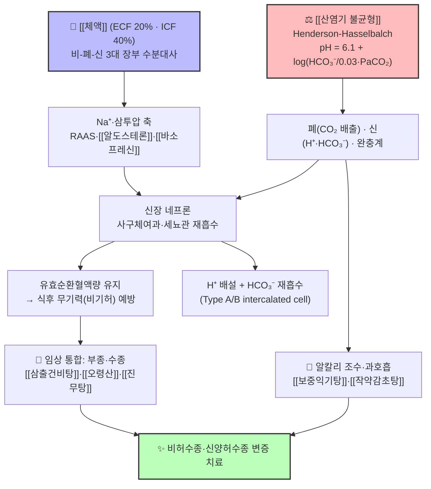

# 🩺 [Clinical Master-Dive] [[체액]]과 [[산염기 불균형]]의 수분·전해질·산염기 항상성 통합 — 비폐신(脾肺腎) 수액대사와 ABGA 4대 불균형의 한양방 통합 분자생리 심화 탐구

> *"환자가 '밥만 먹으면 졸리고 무기력하다'고 호소할 때, 한의학은 비기허(脾氣虛)의 수액 재분배 실패를 떠올리고, 현대 생리학은 혈장 삼투압·유효순환혈액량·알칼리 조수(Alkaline tide)의 미세한 흔들림을 읽는다. 오늘의 큐레이션은 정윤봉 원장님의 임상 생리학 강의록에서 서로를 보완하는 두 지식 노트 — 인체 수분의 3대 장부 조절을 다루는 [[체액]]과, 혈액 pH 7.35~7.45를 지키는 [[산염기 불균형]]을 축으로, 동서의학의 두 언어가 한 환자의 '물과 산도' 위에서 만나는 지점을 해부한다."*

---

## 🖼️ 시각적 개념 구조도 (Visual Architecture & Pathway)

> *[[체액]]의 '비·폐·신 수분 대사축'과 [[산염기 불균형]]의 'HCO₃⁻·CO₂ 완충축'이 신장(腎)의 네프론 하나에서 만나, 부종·식후 무기력·ABGA 이상을 통합 제어하는 메커니즘 맵입니다.*

---

## 🔗 1. 볼트 속 유기적 연관 노트 연결 (Organically Linked Vault Grounding)

오늘의 정식 큐레이션은 비오님의 볼트 내 **「5. 독서, 노트/강의록/1. 정윤봉 원장님 강의」**에서, 인체 '물과 산도'라는 하나의 생리 축을 공유하며 서로를 백링크로 보완하는 두 강의록 노트를 심층 결합합니다. (토요일 도메인: 독서·전문 강의록)

1. **Source Node A ([[체액]])** — `5. 독서, 노트/강의록/1. 정윤봉 원장님 강의/체액.md`
   - *볼트 원문 핵심 발췌:* "체중의 60%(세포내액 40%, 세포외액 20% — 조직액 15%/혈장 5%)… 비(脾-소화관 7L 분비·재흡수), 폐(肺-불감발한 1L), 신(腎-소변 1.5L, RAAS 알도스테론)의 3대 장부 조율… **식후 체액량 저하성 무기력(비기허)** 및 저나트륨혈증/고나트륨혈증 신경 병리… 만성 부종·수습정체의 핵심 분석 영역, 음릉천·수분·신수혈 침구 및 [[삼출건비탕]]·[[오령산]] 처방이 표적."
2. **Source Node B ([[산염기 불균형]])** — `5. 독서, 노트/강의록/1. 정윤봉 원장님 강의/산염기 불균형.md`
   - *볼트 원문 핵심 발췌:* "혈액 내 이산화탄소(CO₂, 호흡성 인자)와 중탄산염(HCO₃⁻, 대사성 인자)의 농도 비율에 따른 pH 7.35~7.45 항상성… 적혈구 탄산무수화효소(CA), 폐 환기 및 신장 세뇨관 수소/중탄산염 교환… **호흡성 산증/알칼리증 vs 대사성 산증/알칼리증 4대 장애와 식후 알칼리 조수(Alkaline tide)**… 과호흡 증후군·공황장애·전해질 이상(저칼륨/저칼슘혈증)·식후 무기력의 핵심 분석 영역, 신수·폐수·중완혈 침구 및 [[작약감초탕]]·[[보중익기탕]] 처방이 표적."

> **💡 핵심 연관 통찰 (Cross-Pollination):**
> [[체액]]은 '물이 어디에 있고, 왜 부족하거나 고이는가(수습·부종)'를, [[산염기 불균형]]은 '물이 얼마나 산성인가(H⁺ 농도)'를 묻습니다. 그런데 두 질문은 **신장(腎)의 네프론 하나에서 만납니다** — Na⁺ 재흡수(알도스테론)와 H⁺ 분비·HCO₃⁻ 재흡수는 같은 세뇨관 상피의 수송체들이 나누어 맡은 '한 몸의 항상성'입니다. 또한 두 노트가 독립적으로 지목한 **'식후 무기력'**은 ① 위장관으로의 수액 급속 분비 → 유효순환혈액량 감소(비기허), ② 위산 분비에 따른 혈중 HCO₃⁻ 상승 → 알칼리 조수(대사성 알칼리증)라는 **두 개의 서로 다른 분자 경로**가 동시에 기여하는 현상입니다. 이것이 '한의 비허 변증'과 '현대 ABGA 해석'이 만나는 가장 아름다운 접점이며, 오늘 Master-Dive의 중심 축입니다.

---

## 🫘 2. 현대 해부·생리 및 병태생리학적 심층 분석 (Anatomy, Physiology & Pathophysiology)

### ① 수분 구획의 해부·생리 — [[체액]]이 '비·폐·신'이라 부르는 영역

- **체액 구획(Compartment)**: 성인 체중의 60%가 물 — 세포내액(ICF) 40%, 세포외액(ECF) 20%(조직액 15~16% + 혈장 4~5%). ECF의 '혈장'은 유효순환혈액량(Effective Circulating Volume)의 핵심이며, 신장 관류압과 RAAS 활성의 결정인자입니다.
- **1일 수분 출납**: 유입 2.5L(음수·음식 2.2L + 대사수 0.3L) = 배출 2.5L(소변 1.5L + 불감증설 0.8L + 대변 0.15L + 땀 0.1L). 이 중 **소화관 분비액이 7L/day**에 달하며 대부분 소장에서 재흡수됩니다 — 정윤봉 원장님이 '비(脾) = 수분의 거대한 저수지'라고 한 이유가 여기 있습니다. 식사 직후 이 7L 분비·재흡수 사이클이 가동되며 일시적으로 혈장량이 빠지므로, **식후 현훈·무기력(비기허)**이 생길 수 있습니다.
- **수분 대사 3대 장부의 현대적 대응**:
  - **비(脾) → 소화관·간문맥 순환**: 장관 수분 분비·재흡수, 단백질(알부민) 합성 → 혈장 콜로이드 삼투압 유지.
  - **폐(肺) → 불감증설·호흡성 수분 소실**: 1일 약 300~400mL의 수증기 배출 + CO₂ 배출(산염기와 직결).
  - **신(腎) → RAAS·ADH 축**: 사구체여과율(GFR) 180L/day 중 99% 재흡수. 볼트 내 [[RAAS]]·[[알도스테론]]·[[바소프레신]] 노트가 이 축을 상세히 다룹니다.

### ② 신장 세뇨관 — Na⁺·물·H⁺·HCO₃⁻가 한곳에서 교차하는 항상성의 교차로

| 분절 | 주요 수송 | 조절 호르몬 | 한의 대응 개념 |
| :--- | :--- | :--- | :--- |
| 근위세뇨관 | Na⁺·HCO₃⁻·포도당·아미노산 대량 재흡수, H⁺ 분비(NAH₃ 완충) | (자동) | 비(脾)의 '운화(運化)' — 대사산물 재활용 |
| 헨레고리 | Na⁺·Cl⁻·요소 농축, TAL에서 NaCl 재흡수 | (자동) | — |
| 원위세뇨관 | Na⁺-Cl⁻ 공동수송, Ca²⁺ 조절 | PTH | 신(腎)의 정밀 조절 |
| 집합관 주세포 | Na⁺ 재흡수(ENaC) + 물 재흡수(AQP2) | **[[알도스테론]]·[[바소프레신]]** | 신양(腎陽)의 '기화(氣化)' — 수액 등분 |
| 집합관 개재세포 | **H⁺-ATPase 분비(Type A) / HCO₃⁻ 분비(Type B)** | 산염기 상태 | — |

- **핵심 통찰**: 알도스테론(ENaC→Na⁺ 재흡수, K⁺·H⁺ 분비 촉진)과 산염기 조절(H⁺ 분비·HCO₃⁻ 재흡수)은 **같은 집합관에서 서로의 이온 수송을 공유**합니다. 따라서 알도스테론 과다(원발성·속발성)는 고나트륨혈증 경향 + **저칼륨혈증 + 대사성 알칼리증**을 함께 만들고 — 이것이 [[감초]]의 글리시리진(11β-HSD2 억제 → 미네랄코르티코이드 과잉) 부작용이 '부종 + 저칼륨 + 알칼리증'으로 나타나는 분자적 이유입니다.

### ③ 산염기 항상성의 3층 방어 — [[산염기 불균형]]이 가르치는 타임라인

1. **1차 완충계(수 초)**: 혈중 HCO₃⁻/CO₂, 헤모글로빈(Hb), 단백질이 즉각 H⁺를 흡수. 특히 적혈구 내 탄산무수화효소(CA)와 **염소 이동(Chloride shift)**이 정맥혈 CO₂ 운반의 70%를 담당(HCO₃⁻로 전환).
2. **2차 호흡성 조절(수 분~수 시간)**: PaCO₂ 감지 → 폐포환기 증감. 호흡성 산증이면 CO₂ 보류, 대사성 산증이면 Kussmaul 호흡으로 CO₂ 과다 배출.
3. **3차 신장성 조절(수 시간~수 일)**: H⁺ 분비(NAH₃/NH₄⁺ 완충)와 HCO₃⁻ 재흡수·재생. Henderson-Hasselbalch 식(pH = 6.1 + log[HCO₃⁻/(0.03 × PaCO₂)])으로 4대 불균형을 판정합니다.

### ④ ABGA 4대 장애와 전해질 연동 — 볼트 원문의 임상 포인트 재구성

| 장애 | PaCO₂ | HCO₃⁻ | pH | 대표 임상 (볼트 + 표준) | 한의 관련 병리 |
| :--- | :---: | :---: | :---: | :--- | :--- |
| 호흡성 산증 | ↑ | (보상 ↑) | ↓ | COPD·진정제·수면무호흡, 우울·한숨 | 폐기능 저하 → 기허(氣虛) |
| 호흡성 알칼리증 | ↓ | (보상 ↓) | ↑ | 과호흡·공황장애 → 유리 Ca²⁺ 감소 → 테타니·손발저림 | 간양항진·기역(氣逆), 심계 |
| 대사성 산증 | (보상 ↓) | ↓ | ↓ | DKA·신부전·설사 → Kussmaul 호흡 | 음허조열·진액 소모 |
| 대사성 알칼리증 | (보상 ↑) | ↑ | ↑ | 구토·이뇨제·알도스테론 과다·**식후 알칼리 조수** → 식후 피로 | 비허·습열(감초 과용 포함) |

---

## 🔬 3. 분자약리학 및 본초·방제학적 심층 분석 (Molecular Pharmacology)

### ① [[체액]] 노트가 조준하는 처방군 — '물을 다시 데려오거나, 고인 물을 치우는' 약리

- **[[삼출건비탕]](蔘朮健脾湯)**: 인삼(人蔘)·백출(白朮)·복령(茯苓) 축의 건비삼습(健脾渗濕) — 비기허로 인한 식후 무기력·소화흡수 장애 시 장관 수분 재흡수를 돕고 혈장량을 회복. 현대적으로는 위장관 운동·흡수 상피 기능 개선과 식후 혈압 강하(Postprandial hypotension) 완화의 통합 표적.
- **[[오령산]](五苓散)**: 계지(桂枝)·백출·복령·저령(猪苓)·택사(澤瀉) — '수부득양(水不得陽)則화(化)'의 관점에서 계지가 표층 순환을 열어주며 복령·저령·택사가 삼투성 이뇨(수분 재분배)를 유도. 볼트 내 [[택사]]·[[저령]]·[[복령]]·[[백출]] 노트는 각각의 이수 작용을 다룹니다. 실험적으로 오령산은 AQP2 발현과 수분 항상성을 조절하는 대표 방제로 연구됨.
- **[[진무탕]](眞武湯)**: 부자(附子)·백출·복령·작약·생강 — 신양허(腎陽虛) 수종(심부전·만성신부전 부종)의 대표방. 부자의 강심(强心)·혈류개선 작용과 작약의 평활근 이완이 '무양(無陽)하여 물이 기화되지 못하는' 병리를 표적.
- **[[팔물탕]]·[[사물탕]]**: 혈허(血虛)로 인한 혈장 단백(알부민) 저하 → 조직액 정체(혈허수종)의 보혈축.

> 💡 **방제학 포인트**: 부종 치료에서 '이수(利水)만 하면 진액(津液)이 더 마른다'는 금기가 있습니다. 표준 임상에서는 실증 수종엔 [[오령산]]·[[진무탕]] 계열(이수), 허증 수종엔 [[삼출건비탕]]·[[보중익기탕]](건비·승양)을 구분하며 — 이는 현대 의학의 '이뇨제 단독 사용 시 RAAS 보상성 재흡수로 역설적 부종이 재발하는' 현상과 정확히 평행합니다.

### ② [[산염기 불균형]] 노트가 조준하는 처방·본초 — 'pH를 되돌리는' 약리 해석

- **[[보중익기탕]](補中益氣湯)**: 황기(黃芪)·인삼·백출·감초·승마(升麻)·시호(柴胡)·당귀·진피 — 승양거함(升陽舉陷)의 대표방. 식후 무기력·기립성 저혈압·위하수에 사용. 현대 연구에서 황기의 식후 혈압 안정화, 승마·시호의 승압(升壓)·위장관 긴장도 회복 효과가 '알칼리 조수로 인한 식후 대사성 알칼리증 + 체액 재분배성 저혈압'의 통합 표적이 됩니다. 볼트 내 [[황기]]·[[승마]]·[[시호]] 노트와 연결.
- **[[작약감초탕]](芍藥甘草湯)**: 작약(芍藥)·감초(甘草) — 근경련·테타니(호흡성 알칼리증의 저칼슘혈증성 경련 포함)와 평활근 경련을 표적. 작약의 파에오니플로린은 세포 내 Ca²⁺ 동원을 억제하여 과호흡 후 손발 저림·근경련을 완화합니다.
- **[[감초]]의 글리시리진 — 의인성 '가성 알도스테론증'**: 감초의 글리시리진(Glycyrrhizin)은 신장 11β-HSD2(코르티솔→코르티손 불활성화 효소)를 억제 → 코르티솔이 알도스테론 수용체를 점유 → **Na⁺ 재흡수↑, K⁺·H⁺ 분비↑ → 부종 + 저칼륨혈증 + 대사성 알칼리증 + 고혈압**. 볼트 내 [[글리시리진]] 노트가 지적하듯, 고혈압약(특히 ACEi/ARB) 복용 환자와 병용 시 전해질 불균형 위험이 커집니다 — 한양방 통합 처방 시 반드시 확인할 안전 포인트입니다.
- **[[맥문동]]·[[오미자]]·[[생지황]]·[[현삼]]**: 음허(陰虛)로 인한 진액 소모(대사성 산증 회복기·탈수)의 자음(滋陰) 생진(生津) 축. 체액 보존과 산도 완충에 기여.

### ③ 알도스테론·바소프레신·RAAS 축의 통합

[[RAAS]] 노트(사구체치밀반의 Na⁺ 감지 → 레닌 → 안지오텐신 Ⅱ → 알도스테론)는 수분 대사와 산염기의 '마스터 스위치'입니다. 안지오텐신 Ⅱ는 ① 원위세뇨관 Na⁺ 재흡수, ② 알도스테론 분비, ③ 갈증 중추 자극, ④ ADH 분비를 동시에 촉진 — '체액량 감소 → 온몸이 물을 움켜쥐는' 반응이 RAAS입니다. 한의학의 '신주수(腎主水)·신양기화'는 이 축의 생리적 요약이며, 보신(補腎)·온양(溫陽)약([[부자]]·[[육계]]·[[숙지황]])이 RAAS-ADH 항상성에 관여한다는 연구 흐름과 연결됩니다.

---

## 💊 4. 한양방 통합 임상 프로토콜 (Integrated Clinical Protocol)

### 1단계: 변증·감별 (Pattern Identification & Western Differential)

| 환자 군 | 핵심 증상 | 한의 변증 | 1차 처방 (볼트 근거) | 양방 감별·검사 |
| :--- | :--- | :--- | :--- | :--- |
| A. 비기허 · 식후 무기력 | 식후 졸림·현훈·사지무력, 소화불량, 맥 허(虛) | 비기허(수액 재분배 실패) | **[[삼출건비탕]]**·[[보중익기탕]] | 식후 저혈압 측정, 공복혈당·HbA1c(저혈당 배제) |
| B. 알칼리 조수 · 대사성 알칼리증 | 식후 극심한 피로·졸림, 구역, 위산과다 | 위열·습열(식후 알칼리 조수) | [[보중익기탕]] 가감 + 식이(탄수화물 과다 제한) | ABGA(HCO₃⁻↑), 전해질(K⁺↓ 동반 확인) |
| C. 신양허 수종 | 하지 부종·아침 안면부종, 소변 불리, 요슬냉 | 신양허·수습정체 | **[[진무탕]]**·[[오령산]] | 심초음파(EF), BNP, 신기능(Cr·eGFR), 소변검사 |
| D. 비허 습체형 부종 | 몸이 무겁고 푸석, 대변 무른 변, 식욕부진 | 비허·습체(水濕停滯) | **[[오령산]]**·삼출건비탕 가감 | 갑상선기능(점액부종 배제), 알부민, 간기능 |
| E. 음허 진액고갈 | 갈증·구건·야간 발한, 소변량 감소 | 음허·진액 부족 | [[맥문동]]·[[오미자]]·[[생지황]] 계열 자음생진 | 혈청 Na⁺·삼투압(고나트륨혈증), HbA1c |

- **레드플래그 선별(필수)**: 의식 변화·경련을 동반한 심한 저나트륨혈증(Na < 120, 급성 시 뇌부종 위험), 무뇨·급성 신손상, DKA(케톤산증), 진행성 호흡곤란(호흡성 산증) — 이 경우 한약 처방 전 **응급·1차 의료 연계**가 우선입니다. 만성 부종 환자는 심부전·신부전·간경변을 반드시 감별(BNP·eGFR·알부민·소변 단백)해야 합니다.

### 2단계: 통합 치료 설계 (Korean-Western Integrative Plan)

1. **한약**: 비허형 식후 무기력 → [[삼출건비탕]]·[[보중익기탕]] 2첩/일 4주, 식후 졸림 VAS·기립혈압 추적. 신양허 수종 → [[진무탕]] 가감(부자 2~6g, 전탕 충분히) 4~8주, 체중·하지부종·소변량 모니터링. 습체 부종 → [[오령산]] 산제 또는 전탕.
2. **약물상호작용 안전 점검**: ① 이뇨제(푸로세미드 등) 병용 시 탈수·저칼륨 위험 — [[진무탕]] 계열 병용은 전해질 주기 확인. ② ACEi/ARB 복용자 + [[감초]] 함유 처방 → 저칼륨혈증·알칼리증·혈압 상승 위험, K⁺·ABGA 모니터링. ③ [[부자]] 처방 시 심장 부정맥·배전탕 시간 준수, 디곡신 병용 주의.
3. **침·약침·뜸**: [[체액]] 노트 표적 — 음릉천(SP9)·수분(CV9)·신수(BL23) + 삼음교(SP6)·태계(KI3); [[산염기 불균형]] 노트 표적 — 신수(BL23)·폐수(BL13)·중완(CV12) + 족삼리(ST36). 부종엔 음릉천·수분 혈위에 세침 + 온침 병행, 비허 무기력엔 족삼리·기해(CV6) 뜸.
4. **생활·식이**: 식후 무기력(알칼리 조수) → 과량의 단순 탄수화물·과식 피하고 단백질·채소 위주 소식 다식(小食多食). 부종 환자는 염분(Na⁺) 제한 5g/일 이하, 야간 이뇨 피크 고려한 낮 시간 수분 섭취, 하지 거상.

### 3단계: 환자 티칭 스크립트 (Patient Teaching)

> "몸에 물이 붓거나, 밥만 먹으면 온몸에 힘이 빠지는 것은 '물을 관리하는 기관(비·폐·신)의 균형'이 흔들린 신호예요. 신장은 소금(나트륨)과 물, 그리고 몸의 산도(pH)를 한곳에서 함께 조절합니다. 한약은 수분 재분배를 돕는 [[삼출건비탕]]·[[진무탕]] 계열로 접근하면서, 짠 음식을 줄이고 천천히 식사하는 습관이 반드시 따라와야 재발하지 않습니다. 감초가 든 차·약을 장기 복용하셨다면 말씀해 주세요 — 몸속 염분·칼륨 균형에 영향을 줄 수 있어서 혈액검사로 확인합니다."

---

## 📚 5. 뒷받침하는 전문 문헌·교과서 레퍼런스 (Evidenced References)

### 볼트 내 참조 노트 (Vault Grounding)
- Source: [[체액]] · [[산염기 불균형]] · 관련 [[RAAS]] · [[알도스테론]] · [[바소프레신]] · [[나트륨]] · [[칼륨]] · [[글리시리진]] · [[감초]]
- 처방·본초: [[삼출건비탕]] · [[오령산]] · [[진무탕]] · [[보중익기탕]] · [[작약감초탕]] · [[사물탕]] · [[팔물탕]] · [[복령]] · [[백출]] · [[택사]] · [[저령]] · [[계지]] · [[부자]] · [[황기]] · [[승마]] · [[시호]] · [[맥문동]] · [[오미자]] · [[생지황]]
- 질환·개념: [[심부전]] · [[고혈압]] · [[당뇨]] · [[기능성 소화불량]] · [[부종]] · [[교감신경]] · [[부교감신경]] · [[호흡]] · [[스트레스]]
- 허브·인덱스: [[00_강의록_MOC]] · [[00_독서_노트_MOC]] · [[00_이론_공부_MOC]] · [[00_약리_공부_MOC]] · [[00_임상_MOC]] · [[00_처방_학술_임상_MOC]] · [[00_개념학습_MOC]] · [[A-1_Clinical_Knowledge_DB]]

### 학술 논문 (Peer-Reviewed)
1. **Koeppen, B. M. (2009)**. The kidney and acid-base regulation. *Advances in Physiology Education*, 33(4), 275–281. — 신장 세뇨관의 HCO₃⁻ 재흡수·H⁺ 분비 분자기전 (볼트 [[산염기 불균형]] 노트 원전).
2. **Stewart, P. M., Wallace, A. M., et al. (1987)**. Mineralocorticoid activity of liquorice: 11-beta-hydroxysteroid dehydrogenase deficiency comes of age. *The Lancet*, 2(8563), 821–824. — [[감초]] 글리시리진의 11β-HSD2 억제 → 가성 알도스테론증(부종·저칼륨·알칼리증) 고전 근거.
3. **Kim, H. G., et al. — Oryeong-san(五苓散) 연구군**: Wulingsan의 AQP 발현 조절과 수분 대사 개선에 관한 동물·임상 연구 다수 (*Journal of Ethnopharmacology* 계열) — [[오령산]]의 이수(利水) 분자 표적.
4. **Zhou, J., et al. (2016/2017)**. 식후 저혈압(Postprandial hypotension)과 acarbose·식이 요법의 관리 — 식후 무기력의 현대 감별 기준 참조 (볼트 [[체액]] '식후 무기력' 절과 연결).
5. **대한진단검사의학회**: 동맥혈가스분석(ABGA) 검사 지침 — 호흡성·대사성 4대 장애 판정 및 보상 반응 해석 기준.

### 교과서·원전 (Textbooks & Classical Texts)
- **Hall, J. E. (2020)**. *Guyton and Hall Textbook of Medical Physiology*, 14th ed. Elsevier — 체액 구획(297–310), 산염기 항상성(Ch. 30), 신장 조절.
- **Boron, W. F., Boulpaep, E. L.** *Medical Physiology*, 3rd ed. — 집합관 개재세포 H⁺·HCO₃⁻ 수송, 알도스테론 작용.
- **Rose, B. D., Post, T. W.** *Clinical Physiology of Acid-Base and Electrolyte Disorders*, 5th ed. McGraw-Hill — 전해질·산염기 임상의 표준 교과서.
- 《동의보감(東醫寶鑑)》 내경편 '수(水)'·잡병편 '부종(浮腫)' — 비폐신 수액대사와 수종 변증.
- 《상한론(傷寒論)》 — 오령산(태양수체·수역), 진무탕(소음수기)의 원전 출전.
- 《본초학》(한의과대학 공동교재) — 이수삼습약·자음생진약의 성미귀경; 《방제학》 — 건비·이수·승양 처방의 가감 원칙.
- 정윤봉. *임상 체액생리학 강의록·임상 생리학 강의록(산염기 불균형)*. Simbio Archive, 2024 — 오늘 Master-Dive의 Source 강의록.

---

## 🛠️ 6. Action Items & Next Steps for Dr. Sio

- [ ] **식후 무기력·졸림 호소 환자**는 ABGA·전해질(특히 K⁺)·식후 혈압을 확인해 ① 알칼리 조수(대사성 알칼리증)형 ② 체액 재분배(비기허)형을 감별한 뒤 각각 [[보중익기탕]]·[[삼출건비탕]] 프로토콜 적용.
- [ ] **만성 부종 환자**는 심부전(BNP)·신기능(eGFR)·알부민·소변검사로 1차 감별 후, 신양허 수종은 [[진무탕]], 습체 부종은 [[오령산]] 계열로 변증 처방 (체중·하지둘레·소변량 4주 추적).
- [ ] 고혈압약(ACEi/ARB)·이뇨제 복용 환자에게 [[감초]] 함유 처방 시 **K⁺·ABGA·혈압 모니터링** 명기 (글리시리진-11βHSD2 상호작용).
- [ ] [[부자]] 함유 처방([[진무탕]] 등)은 반드시 충분한 전탕 후 2첩/일 이하, 부정맥·디곡신 병용 금기 점검.
- [ ] 볼트 확장: [[체액]]·[[산염기 불균형]] 노트에 이 Master-Dive의 백링크 추가 및 [[00_강의록_MOC]]·[[00_독서_노트_MOC]] 최신화(00시 가드닝 협조), '저나트륨혈증·고나트륨혈증·저칼슘혈증' 개념 노트 생성 대기열 반영.

---

*"기록되지 않은 것은 존재하지 않으며, 연결되지 않은 지식은 잠들어 있는 것이다."* — 지식 정원 사서 다빈치, 2026-09-05(토)
