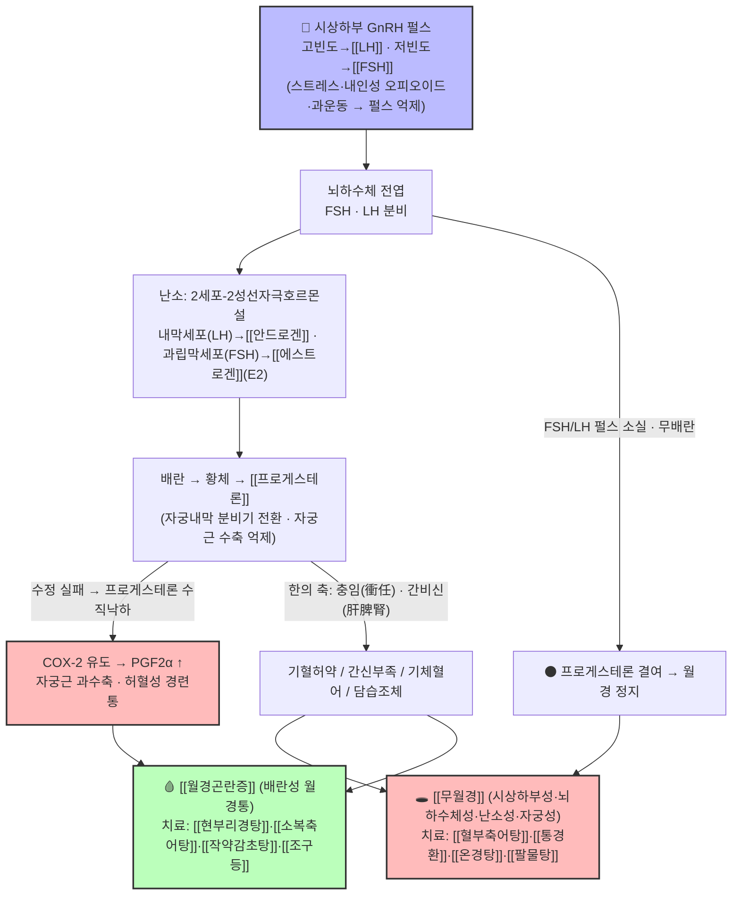

# 🩺 [Clinical Master-Dive] [[무월경]]과 [[월경곤란증]] — HPO 축의 '침묵'과 '고통' 사이: 무배란성 월경정지와 배란성 월경통의 한양방 통합 병리·약리 심화 탐구

> *"어떤 여성은 '생리가 너무 아파서' 찾아오고, 어떤 여성은 '생리가 너무 오지 않아서' 찾아온다. 한의학은 전자에서 [[기체혈어]]·[[한습응체]]의 불통즉통(不通則痛)을 읽고, 후자에서 [[허·한·어·담]](虛寒瘀痰)의 무월경 병인병기를 읽는다. 현대 생식내분비학은 두 증상을 하나의 축 위에 올려놓는다 — 바로 시상하부-뇌하수체-난소축(HPO Axis)이다. 월경통이 '배란된 주기의 증명'이라면, 무월경은 '배란하지 못한 주기의 침묵'이다. 오늘의 큐레이션은 비오님 볼트 `3. 이론 공부/질환/부인과/`에서 서로를 아직 직접 백링크하지 못한 두 지식 노트 — 무배란성 정지의 [[무월경]]과 배란성 통증의 [[월경곤란증]] — 을 하나의 생식내분비 축 위에서 만나게 한다."*

---

## 🖼️ 시각적 개념 구조도 (Visual Architecture & Pathway)

> *[[GnRH]] 펄스에서 출발해 [[에스트로겐]]·[[프로게스테론]]·[[프로스타글란딘]]을 거쳐 '배란성 월경통(월경곤란증)' 또는 '무배란성 무월경'으로 갈라지는 HPO 축의 메커니즘 맵입니다.*

---

## 🔗 1. 볼트 속 유기적 연관 노트 연결 (Organically Linked Vault Grounding)

오늘의 정식 큐레이션은 일요일 도메인 **부인과·월경(婦人科·月經) — 여성 생식내분비 축**의 후보 풀(`3. 이론 공부/질환/부인과/`, 링크 밀도 상위 [[월경곤란증]] 34 · [[무월경]] 48 · [[월경 전 증후군]] 30 · [[다낭성 난소 증후군]] 27)에서, **'거울상 구조'**로 가장 타이트하게 얽힌 두 노트를 심층 결합합니다.

1. **Source Node A ([[월경곤란증]])** — `3. 이론 공부/질환/부인과/월경곤란증.md`
   - *볼트 원문 핵심 발췌:* "월경통을 중심으로 월경 관련 부수 증상들의 총칭… 원발성은 기질적 병변이 없는 경우, 속발성 원인은 [[자궁내막증]], [[자궁샘근종]], [[골반 염증성 질환|PID]] 등… 한의학적 원인으로 불영즉통·불통즉통(둘은 상호 전화하며 후자가 더 다발)… 원발성 원인은 [[프로게스테론]]과 [[프로스타글란딘]] 수치를 고려… 주요 병리는 프로스타글란딘이며 자궁근 수축 과다·허혈 발생. 변증: 기혈허약(추타통)·간신휴손(음허감)·**기체혈어(최다, 간울 정서 문제)**·한습응체(면색창백·사지불온). 치료: [[조구등]]을 군약으로(원발성 효과 좋음), [[현부리경탕]], [[통경환]](열이 약간 있는 경우), [[작약감초탕]](긴장 심한 경우), 지통약재 [[유향]]·[[몰약]]·[[오령지]]."
2. **Source Node B ([[무월경]])** — `3. 이론 공부/질환/부인과/무월경.md`
   - *볼트 원문 핵심 발췌:* "무월경의 병인병기는 허(虛)·한(寒)·어(瘀)·담음(痰飮)으로 구분, 상호 전변 가능… 스트레스는 [[CRH]] 분비 증가 → 내인성 [[오피오이드]] 증가 → GnRH 분비 저해. 과격한 운동은 [[GnRH]] 분비 지연… 검사: [[hCG]](임신), [[TSH]](갑상선), CBC, [[프로락틴|PRL]], [[LH]]/[[FSH]], E2, [[AMH]](PCOS에서 증가)… 원발성: 14세 무발달·16세 무초경 / 속발성: 6개월 이상 무월경… 치료 — 간신부족 → [[조간탕]]·[[귀신환]], 기혈허약 → [[인삼양영탕]]·[[팔물탕]], 음허혈조 → [[가감일음전]]·[[옥녀전]], **기체혈어 → [[혈부축어탕]]·[[격하축어탕]]·[[소복축어탕]]**, 담습조체(비만, PCOS) → [[장부도담환]]."

> **💡 핵심 연관 통찰 (Cross-Pollination):**
> 두 노트는 서로 다른 증상(통증 vs 정지)을 다루지만, **병리 시계(clock)의 같은 지점 — '프로게스테론의 존재와 소멸'** — 을 사이에 두고 정반대편에 서 있습니다. [[월경곤란증]]의 원발성 통증은 '배란 → 황체 → 프로게스테론 상승 → 급격한 수직낙하 → COX 유도 → PGF2α'라는 **배란 주기만이 만들 수 있는 분자 폭포**의 결과입니다. 곧, 통증이 있는 월경은 (원발성 기준) **그 주기가 배란되었다는 역설적 증거**입니다. 반대로 [[무월경]]은 GnRH 펄스 억제(스트레스·과운동·저체중)·난소/뇌하수체 병변·담습조체(PCOS)로 **배란 자체가 일어나지 않아 프로게스테론이 한 번도 오르지 못한 침묵**입니다. 그리고 이 '소리 없는 무배란'의 장기화가 자궁내막의 무방비한 에스트로겐 자극 → [[자궁내막증식증]]·월경 과다·[[자궁내막증]] 위험으로 이어질 수 있다는 점에서, 무월경은 단순한 '생리 없음'이 아니라 **내막 보호 실패(프로게스테론 결여)의 경고등**입니다. 치료의 축도 교차합니다 — 어혈(瘀血)이라는 공통 언어가 [[혈부축어탕]]·[[소복축어탕]]·[[통경환]]·[[현부리경탕]]을 두 질환의 처방전 위에 함께 올려놓습니다.

---

## 🫘 2. 현대 해부·생리 및 병태생리학적 심층 분석 (Anatomy, Physiology & Pathophysiology)

### ① 월경의 해부·생리 — HPO 축과 자궁(子宮)의 '달력'

- **HPO 3층 구조**: 시상하부의 [[GnRH]] 펄스 생성기(arcuate nucleus, 약 60~120분 간격) → 뇌하수체 전엽의 [[FSH]]·[[LH]] 분비 → 난소의 스테로이드 생성 → 자궁내막 주기. 볼트 내 [[GnRH]] 노트가 지적하듯 **펄스가 빠르면 LH, 느리면 FSH가 우세하게 분비**되며, **연속 분비 시 오히려 생식호르몬이 억제**됩니다 — GnRH agonist(류프롤리드 등)가 [[자궁내막증]]·[[자궁근종]]·월경 중지에 쓰이는 분자적 이유입니다. GnRH는 [[도파민]]·[[세로토닌]]에 의해 억제되고 [[노르에피네프린]]에 의해 촉진되므로, 만성 스트레스·수면 장애·우울은 곧장 HPO 축의 '일시 정지'로 이어집니다.
- **난소의 2세포-2성선자극호르몬설**: 볼트 [[에스트로겐]] 노트 원문 그대로 — 난포 **내막세포(LH 작용)**에서 콜레스테롤 → 프로게스테론 → 안드로스텐디온 → [[테스토스테론]], **과립막세포(FSH 작용)**에서 아로마타제가 안드로겐을 [[에스트라디올|E2]]로 전환. 혈중으로 나온 E2·테스토스테론은 [[SHBG]]·알부민과 결합하며 유리형 1% 미만이 활성을 담당합니다.
- **자궁내막 주기**: 증식기(에스트로겐 — 나선동맥·샘 증식) → 배란 후 분비기([[프로게스테론]] — 샘 분비 전환·간질 수종, 자궁근 수축 억제로 착상 준비) → 수정 실패 시 황체 퇴화 → 프로게스테론·E2 급락 → 기능층(나선동맥) 허혈·탈락 → 월경. 볼트 [[프로게스테론]] 노트의 기능 목록(경관점액 농축, 내막 분비선 촉진, 자궁근 수축 감소, 난관운동성·장관운동성 증가 → 월경 시 설사)은 이 분비기의 전모를 보여줍니다.

### ② 월경곤란증(월경통) — '배란성 주기'의 분자 폭포

- **원발성 월경통의 핵심 병인**: 배란 주기의 황체기 후반, **프로게스테론의 수직낙하가 자궁내막 기능층의 COX-2를 유도**하고, 아라키돈산 경로(cyclooxygenase)를 통해 **PGF2α·PGE2**가 과다 생성됩니다(볼트 [[프로스타글란딘]] 노트: "프로게스테론이 떨어지면 COX가 나오고 프로스타글란딘이 나옴. 이때 Fα가 제일 문제"). PGF2α는 ① 자궁근층의 과수축(자궁내압 60~120 mmHg 이상, 분만 진통 유사), ② 나선동맥 수축 → **자궁 허혈**, ③ 말초 통각수용체 역치 저하를 일으켜 치골상부 경련통·대퇴 방산통을 만듭니다.
- **속발성(기질성) 월경통**: [[자궁내막증]](이소성 내막의 화학적 염증 + 유착 물리통), [[자궁샘근종]], [[자궁근종]](통증보다 월경과다·지연이 주증상), [[골반 염증성 질환|PID]](평상시 통증 + 월경 시 악화) — 25세 이후 발병·72시간 이상 지속·월경 과다 동반 시 의심. 감별에서 난관임신(hCG·초음파), 난포낭종·황체낭종(배란 이상), 루테인낭종(hCG 과다), 위장관·요로 질환([[신장결석]]·[[급성 방광염]])을 놓치지 말아야 합니다.

### ③ 무월경 — '무배란'의 4층 원인 분류

[[무월경]] 노트의 원인 목록을 현대 생식내분비의 해부학적 4층 구조로 재배열하면:

| 층위 | 대표 원인 (볼트 원문) | 병태생리 |
| :--- | :--- | :--- |
| Ⅰ. 시상하부성 | 스트레스(내인성 오피오이드→GnRH 억제), 과운동(펄스 지연), 저체중·영양실조, [[Kallmann's syndrome]] | GnRH 펄스 소실 → FSH/LH 저하 → 무배란 |
| Ⅱ. 뇌하수체성 | [[Sheehan's syndrome]], [[Simmond's syndrome]], 뇌하수체 종양, [[고프로락틴 혈증]](PRL↑ → GnRH 억제) | 성선자극호르몬 결핍 (성장호르몬·GnRH·TSH·ACTH 순으로 타격) |
| Ⅲ. 난소성 | [[다낭성 난소 증후군]](PCOS), 조기난소부전(조기폐경), 불감성 난소증후군(FSH 수용체 결손), 터너 증후군 | 무배란·무황체 → 프로게스테론 영구 결여 |
| Ⅳ. 자궁·유출로성 | [[Asherman's syndrome]](자궁내 유착), [[자궁내막증식증]], 생식샘 기형 | 내막 반응 불가 — HPO는 정상이나 월경 불가 |
| (대사·내분비 공통) | [[갑상선 기능 저하증]](월경 지연→소실)·[[갑상선 기능 항진증]](월경 촉진→소실), [[쿠싱 증후군]], [[Addison's disease]], [[당뇨병]], 부신성 [[안드로겐]], [[비만]](지방의 E1 생성↑) | 호르몬 항상성 교란 → 배란 장애 |

- **감별 워크업의 순서(볼트 원문)**: [[hCG]](임신 제외) → [[TSH]]·CBC·[[프로락틴|PRL]] → [[LH]]/[[FSH]]·E2 → [[AMH]](동난포 지표; PCOS에서 증가, 고AMH는 과립막세포 과다의 예후 신호). LH/FSH로 층위를 가른 뒤(FSH↑ → 난소성 / LH·FSH↓ → 시상하부·뇌하수체성 / LH↑·FSH정상 2~3:1 → PCOS), 자궁내막 두께·구조는 초음파로 확인합니다.

### ④ 거울상 통합 표 — 두 질환을 하나의 축 위에

| 지표 | 🩸 [[월경곤란증]] (원발성) | 🕳️ [[무월경]] |
| :--- | :--- | :--- |
| 배란 상태 | **배란성 주기 (황체 존재)** | 무배란·무황체 (일부 배란형 제외) |
| 프로게스테론 | 상승 후 **수직낙하**(통증 트리거) | 형성되지 않거나 만성 저하 |
| PGF2α/COX | 과다 생성(자궁근 과수축·허혈) | (월경 없음 → 분자 폭포 부재) |
| GnRH 펄스 | 정상(배란 유지) | 억제·무질서(스트레스·과운동·PCOS 등) |
| 자궁내막 | 분비기 → 기능층 탈락 | 에스트로겐 단독 자극(무방비 증식) 위험 |
| 한의 병기 | 불통즉통 — 기체혈어·한습응체(다발) | 허·한·어·담음 — 간신부족·담습조체 등 |
| 대표 처방 | [[현부리경탕]]·[[소복축어탕]]·[[작약감초탕]]·[[통경환]] | [[혈부축어탕]]·[[통경환]]·[[온경탕]]·[[팔물탕]] |

> **임상 통찰**: 무배란성 무월경이 길어질수록 자궁내막은 프로게스테론의 '분비기 전환 명령'을 받지 못한 채 에스트로겐에 장기 노출되어 [[자궁내막증식증]]·비정상 자궁출혈 위험이 커집니다. 따라서 '월경이 없는 것이 편하다'는 안심은 금물 — **월경은 자궁내막이 매달 스스로를 점검하는 안전장치**이며, 한의학의 조경(調經) 치료는 이 점검 주기를 되살리는 일입니다.

---

## 🔬 3. 분자약리학 및 본초·방제학적 심층 분석 (Molecular Pharmacology)

### ① 자궁 평활근 · 통증 축 — [[월경곤란증]] 처방군

- **[[조구등]](군약)**: 원발성 월경통에 치료 효과가 좋은 대표 약재(볼트 원문). 인돌 알칼로이드(이속시노필린·라이마칼린 계열)의 칼슘채널·통증 경로 조절이 자궁 과수축성 통증과 말초 통각과민을 낮추는 것으로 이해됩니다. 속발성은 원인 제거가 우선이므로 '군약' 위치가 달라집니다.
- **[[작약감초탕]]**: [[작약]]의 페오니플로린이 세포 내 Ca²⁺ 동원을 억제하여 자궁 평활근 경련을 완화 — '긴장이 심한 경우'에 배합. [[감초]]의 글리시리진은 용량 의존적 의인성 알도스테론증(부종·저칼륨) 가능성이 있어 장기 복용 시 전해질 모니터링을 염두에 둡니다.
- **[[현부리경탕]]**(《의학입문》·《동의보감》 부인편): [[향부자]]·[[현호색]]·[[당귀]]·[[백작약]]·[[천궁]]·[[창출]]·[[오약]]·[[귤피]]·[[지각]]·[[목향]]·[[봉출]]·[[도인]]·[[홍화]]·[[육계]] — 사물탕 보혈 기반에 **5대 이기약 + 파어약 + 온경약**을 결합해 혈괴(피떡)와 혈허(빈혈·무기력)가 공존하는 [[자궁내막증]]·[[자궁샘근종]]의 극심한 통증을 표적. 현호색의 THP(테트라하이드로팔마틴), 작약 페오니플로린의 평활근 연축 차단, 봉출 쿠르쿠미놀·β-엘레멘의 자궁내막증 신생혈관 억제가 분자 기전으로 제시됩니다.
- **[[소복축어탕]]**(《의림개착》 권하): [[소회향]]·[[건강]]·[[육계]]의 온경산한 + [[포황]]·[[오령지]](피브린 용해·혈소판 응집 억제) + [[현호색]]·[[몰약]](오피오이드·아세틸콜린 수용체 조절 진통) — **한응혈어(寒凝血瘀)형 월경통**(아랫배 얼음장·흑자색 혈괴)의 성방. 실열·혈열 출혈 환자 금기.
- **COX 관점의 양방 대응(볼트 강의록)**: NSAIDs([[이부프로펜]])의 비선택적 COX-1/2 억제가 PGF2α 생성을 막아 월경통 1차 약제 — 프로스타글란딘 노트는 "월경통에는 [[타이레놀]]([[아세트아미노펜]], 간독성·소염 없음)보다 [[이부프로펜]] 계열을 권장"한다는 임상 포인트를 남겼습니다. 한약과의 병용 시 위장관 보호·출혈 경향(COX-1 억제)에 대한 복약 상담이 필요합니다.

### ② 월경 '개통' 축 — [[무월경]] 처방군

- **[[혈부축어탕]]**(《의림개착》 권상): [[도인]]·[[홍화]] + [[당귀]]·[[천궁]]·[[적작약]]·[[생지황]](청열량혈) + [[시호]]·[[지각]]·[[감초]](사역산) + **[[길경]](인약상행)·[[우슬]](인혈하행)** — 상초 혈부 어혈의 명방이지만, 무월경의 **기체혈어형(우울·흉협만만·화 잘 내는 형)**에서 혈압·두통·불면·번열이 동반될 때 '위로 솟는 화열을 우슬로 아래로 끌어내려' 충맥(衝脈)의 하행을 돕는 방향으로 응용됩니다. 볼트 노트의 연구 인용(Chen 2011 등)은 eNOS→NO→혈관 확장·항혈전·신경염증 억제를 실증합니다.
- **[[통경환]]**(《부인양방대전》·《동의보감》 부인편): [[대황]](주침)·[[도인]]·[[홍화]]·[[삼릉]]·[[아출|봉출]] + [[당귀]]·[[백작약]]·[[천궁]]·[[우슬]]·[[육계]] — **파혈소징 + 사하어열 + 온경보혈**의 환제(丸劑). 골반강에 완고하게 엉긴 어혈(무월경·징가: 자궁근종·난소낭종)을 '서서히 삭이는' 설계. **월경이 개통되면 즉시 감량·중단**, 임산부 절대 금기.
- **[[온경탕]]**(《금궤요략》 부인잡병): [[오수유]]·[[육계]] + [[당귀]]·[[천궁]]·[[적작약]](사물탕) + [[인삼]]·[[맥문동]](생맥산) + [[반하]]·[[생강]] + [[아교주]]·[[목단피]]·[[감초]] — **충임허한(衝任虛寒) + 상열하한 + 어혈**의 다중 복합방. 처방 노트가 명시하듯 HPO 축 기능 정상화(비정상 LH 펄스 억제, 아로마타제 회복 → 안드로겐→E2 전환), cinnamaldehyde·evodiamine의 eNOS→NO 경로 골반 혈류 증대, AMPK 경로 인슐린 저항성 완화로 **비만형 PCOS·희발월경·무월경·황체기능부전·원인불명 난임**에 이릅니다. 가임기 여성은 목단피·오수유의 활혈 작용 때문에 **임신 테스트 후 투약**이 원칙입니다.
- **보허(補虛) 축**: 기혈허약형 무월경 — [[인삼양영탕]]·[[팔물탕]](보혈 + 혈장 단백 보충); 간신부족형 — [[조간탕]]·[[귀신환]]; 음허혈조형 — [[가감일음전]]·[[옥녀전]]; 담습조체형(비만·PCOS) — [[장부도담환]] (※ 조간탕·귀신환·가감일음전·옥녀전·장부도담환은 현재 볼트에 처방 노트 미생성 → §6 제안 참조).

### ③ '한-양방 접점' 안전 포인트

- **호르몬제 병용**: 난소 장애·황체기능부전 환자에서 산부인과 호르몬제(프로게스테론, 배란유도제)와 온경탕 병용 시 상호 보완적(온경탕 노트 원문). 다만 **조기 임신 가능성**과 **GnRH agonist 사용 중(에스트로겐 저하 상태) 한열 변증의 변화**를 주기적으로 재평가해야 합니다.
- **활혈파어제 공통 금기**: 임신(유산 위험), 출혈성 경향, 월경 과다 환자의 월경기 사용 — 월경곤란증·무월경 모두에서 '징하(癥瘕) 연관 시 출혈을 더 크게 만들 수 있다'(월경곤란증 노트)는 원칙이 처방 안전의 뼈대입니다.

---

## 💊 4. 한양방 통합 임상 프로토콜 (Integrated Clinical Protocol)

### 1단계: 증상·시기별 감별 (Menstrual Phase & Red Flag)

| 환자 군 | 핵심 질문·검사 | 감별 포인트 | 행동 |
| :--- | :--- | :--- | :--- |
| 통증형(월경통) | 통증 시작 시기·양상·기간, 월경량, 성교통·발열 유무 | 원발성(초경 후 1~2년, 배란성) vs 속발성(25세↑, 72시간↑, 자궁내막증·샘근종·PID 의심) | 초음파·골반진찰; 필요 시 B-hCG(난관임신 배제), CRP |
| 정지형(무월경) | 임신 여부(hCG) → TSH·PRL → LH/FSH·E2 → AMH | 층위 분류(시상하부/뇌하수체/난소/자궁) + PCOS 여부 | 원발성: 14·16세 기준 / 속발성: 6개월·3주기 기준 |
| 공통 레드플래그 | 급성 복통 + 실신(난관임신 파열), 두통·시야 장애(뇌하수체 종양), 유즙분비(고프로락틴혈증), 체중 급변·섭식장애 | 양방 응급 의뢰 기준 | 즉시 전원 |

### 2단계: 한의 변증·처방 매트릭스 (볼트 근거)

| 변증 | 핵심 소증 | 대표 처방 ([[무월경]] 노트 → [[월경곤란증]] 노트) | 양방 병용 포인트 |
| :--- | :--- | :--- | :--- |
| 기혈허약 | 추타통·어지럼·안색 창백·식욕 저하·무기력 | [[팔물탕]]·[[인삼양영탕]] | 철분결핍빈혈 CBC 확인 |
| 간신부족/간신휴손 | 허리·무릎 시림, 체질 허약, 음허감 | [[조간탕]]·[[귀신환]] (미노트화) | 골밀도·갑상선 기능 |
| 기체혈어 | 통증 최다형(간울 정서), 혈괴 통과 후 통증 감소, 흉협만만 | [[월경곤란증]]: [[현부리경탕]]·[[통경환]] / [[무월경]]: [[혈부축어탕]]·[[격하축어탕]]·[[소복축어탕]] | NSAID 병용 시 위장관 보호; 임신 배제 필수 |
| 한습응체/한응혈어 | 면색창백·사지불온·소복냉통·흑색 혈괴 | [[소복축어탕]]·[[온경탕]] | 복부 온열 요법 병행 |
| 담습조체(PCOS형) | 비만 체격·권태·무월경·여드름 | [[장부도담환]]·[[온경탕]](비만형 PCOS) | 메트포르민 병용 검토(온경탕 AMPK 경로 상보) |

### 3단계: 침·구·생활 통합

- **침·전침**: 부인과 환자는 침 거부감이 있으므로 15~20분, 월경기에는 강도를 높임. 전침은 통증 개선 효과가 있으나 **자궁평활근 반사적 수축을 유발**할 수 있어 온열(구·뜸, 온경혈)을 함께 — 월경량 과다 환자의 뜸은 주의(볼트 원문).
- **생활·심인성 관리**: 월경통은 스트레스와 긴밀 — GnRH 펄스 억제(내인성 오피오이드)와 자궁 과수축성 통증의 악화 순환을 끊어야 하므로 수면·정서 관리가 1차 처방만큼 중요합니다. 무월경의 기능성(시상하부성) 경우 과격한 운동 강도 조절·체중 정상화가 GnRH 펄스 회복의 첫 단계입니다.

---

## 📚 5. 전문 참고 문헌 및 교과서 인용 (References)

1. **볼트 노트 인용(1차)**: [[월경곤란증]]·[[무월경]](3. 이론 공부/질환/부인과/), [[프로스타글란딘]]·[[에스트로겐]]·[[프로게스테론]]·[[GnRH]](3. 이론 공부/호르몬, 신호전달물질/), [[온경탕]]·[[혈부축어탕]]·[[소복축어탕]]·[[통경환]]·[[현부리경탕]](2. 약리 공부/처방/).
2. 장중경(張仲景), 《금궤요략(金匱要略)》 권하 부인잡병맥증병치 — 온경탕 조문: "婦人年五十所… 暮卽發熱, 少腹裏急, 腹滿, 手掌煩熱, 脣口乾燥… 瘀血在少腹不去… 當以溫經湯主之."
3. 왕청임(王淸任), 《의림개착(醫林改錯)》 권상·권하 — 혈부축어탕·소복축어탕.
4. 전국한의과대학 방제학교수 공편저, 《방제학》, 영림사 — 처방 구성·치법 표준.
5. Ushiroyama T, et al. (2001). Clinical efficacy of Wen-Jing-Tang (Unkei-to) on endocrine and ovulatory functions in women with polycystic ovary syndrome. *The American Journal of Chinese Medicine*, 29(03n04), 485-494. — 온경탕의 비정상 LH 억제·배란 유도 (볼트 온경탕 노트 인용).
6. Sun YL, et al. (2019). Therapeutic effects of Wenjing Decoction on cold-coagulation and blood-stasis primary dysmenorrhea through regulating uterine blood flow and VEGF/eNOS signaling pathways. *Journal of Ethnopharmacology*, 243, 112089. — 한체어혈성 월경통 모델에서 자궁 혈류·VEGF/eNOS 개선 (볼트 인용).
7. Chen KJ, et al. (2011). Mechanisms of Xuefu Zhuyu Decoction on cardiovascular and cerebrovascular diseases. *Atherosclerosis*, 218(2), 275-282. / Zhang Y, et al. (2020). Xuefu Zhuyu Decoction improves cerebral ischemia-reperfusion injury… *Frontiers in Pharmacology*, 11, 584582. — 혈부축어탕의 혈관내피 보호·항혈전·신경염증 억제 (볼트 인용).
8. Dawood MY. (2006). Primary dysmenorrhea: advances in pathogenesis and management. *Obstetrics & Gynecology*, 108(2), 428-441. — 원발성 월경통의 PGF2α 병인과 NSAID 1차 치료의 표준 리뷰.
9. Speroff L, Fritz MA. *Clinical Gynecologic Endocrinology and Infertility*, 8th ed., Lippincott Williams & Wilkins, 2011. — 무월경의 해부학적 4층 분류(시상하부·뇌하수체·난소·자궁)와 HPO 축 생리의 표준 교과서.
10. Rotterdam ESHRE/ASRM-Sponsored PCOS Consensus Workshop Group. (2004). Revised 2003 consensus on diagnostic criteria and long-term health risks related to polycystic ovary syndrome. *Fertility and Sterility*, 81(1), 19-25. — PCOS 로테르담 진단 기준.

---

## 🌱 6. 정원 제안 (Gardener's Notes — 비파괴적 백링크 제안)

오늘의 융합이 드러낸 볼트 연결 공백을 검토 우선 원칙(비오님 지시)에 따라 **제안만** 기록합니다 (신규 생성 0건, 파일 수정 0건 — 리포트 1건만 산출).

1. **[[무월경]] ↔ [[월경곤란증]] 상호 백링크 신설 제안**: 두 노트는 현재 서로를 직접 링크하지 않는 반쪽 고아 상태입니다. §1의 '거울상 통찰' 한 줄을 서로의 '관련 질환' 란에 추가하면 배란성 통증/무배란성 정지의 대비 학습이 열립니다.
2. **[[온경탕]] ↔ [[무월경]] 연결 제안**: 온경탕 노트는 적응증에 무월경·희발월경을 명시하나 [[무월경]] 변증 표에는 미등재 — '충임허한·상열하한형' 행 추가를 제안합니다.
3. **깨진 경로 링크 정비 제안**: [[월경곤란증]]·[[프로스타글란딘]] 노트 내 `[[3. 이론 공부/영양학/프로스타글란딘]]`·`[[3. 이론 공부/영양학/스테로이드]]` 형식의 옛 경로 링크는 호르몬 폴더 이동 후 깨진 상태 → `[[프로스타글란딘]]`·`[[스테로이드]]` 단순명으로 교정 제안.
4. **미노트화 후보 등재 제안**: [[조간탕]]·[[귀신환]]·[[가감일음전]]·[[옥녀전]]·[[장부도담환]] — 무월경 변증 처방 5종이 처방 폴더에 노트 없이 링크만 존재. 미노트화 워크리스트 후보로 등재(일일 10개 제한 내 승인 대기).
5. **MOC 백링크 확인**: 본 리포트는 주간감사(일요일 23:00, ad52308ff28e) 전 산출물로, 분류정합성 감사 시 `부인과 질환` vs `부인과` 폴더 이원화(유방암·자궁근종 중복 소재)도 함께 점검 대상에 올려주시면 좋겠습니다.

---
*이 노트는 다빈치(Da Vinci) Clinical Knowledge Curation Bot이 2026-09-06(일) 14:00 크론으로 생성한 일요일 도메인(부인과·월경 — HPO 축) Master-Dive입니다. 소스: [[월경곤란증]]·[[무월경]] (2노트 Cross-Pollination).*
