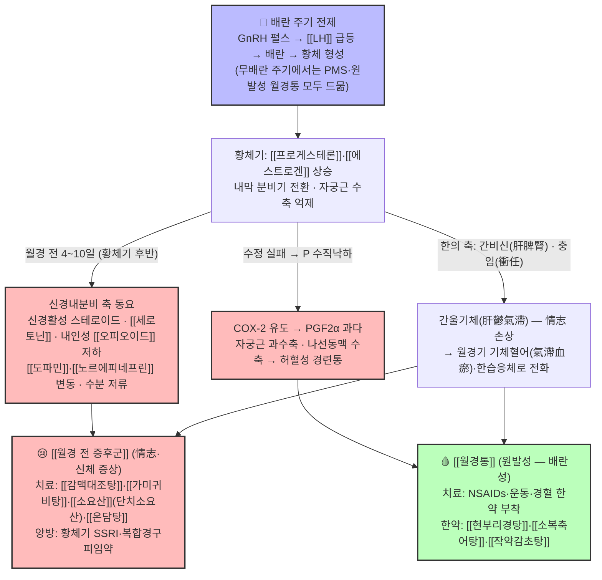

# 🩺 [Clinical Master-Dive] [[월경 전 증후군]]과 [[월경통]] — 배란 주기가 지불하는 '두 가지 대가': 황체기 신경내분비 폭풍(PMS)과 월경기 프로스타글란딘 경련(월경통)의 한양방 통합 시계열 병리·약리 심화 탐구

> *"같은 여성, 같은 주기, 그러나 시간창은 다르다. [[월경 전 증후군]]은 월경이 오기 **4~10일 전** 황체기 후반에 찾아와 '우울·과민·수분 저류·유방통'으로 얼굴을 드러내고 월경이 시작되면 사라진다. [[월경통]]은 월경이 시작되는 순간부터 **72시간 안에** 치골상부 경련통으로 터진다. 그런데 둘 다 공통의 전제가 있다 — 바로 **배란된 주기(황체의 존재)**다. 배란 없이 황체가 없으면 프로게스테론의 상승과 수직낙하가 없어서, PMS는 신경스테로이드 폭풍을, 월경통은 PGF2α 분자 폭포를 만들지 못한다. 한의학은 전자를 '간울(肝鬱)·신(神)의 병 — 情志'로, 후자를 '기체혈어(氣滯血瘀)·혈(血)의 병 — 不通則痛'으로 읽는다. 오늘의 큐레이션은 비오님 볼트 `3. 이론 공부/질환/부인과/`에서 서로를 아직 직접 백링크하지 못한 두 지식 노트 — 월경 전 정서·신체 증상의 [[월경 전 증후군]]과 월경기 통증의 [[월경통]] — 을 **한 달 주기의 두 시간창** 위에서 만나게 한다."*

---

## 🖼️ 시각적 개념 구조도 (Visual Architecture & Pathway)

> *배란 주기를 전제로, 황체기 후반(PMS)과 월경 개시기(월경통)로 갈라지는 시계열 메커니즘 맵입니다.*

---

## 🔗 1. 볼트 속 유기적 연관 노트 연결 (Organically Linked Vault Grounding)

오늘의 정식 큐레이션은 일요일 도메인 **부인과·월경(婦人科·月經) — 월경주기 시계열 축**의 후보 풀(`3. 이론 공부/질환/부인과/`)에서, 같은 배란 주기의 '월경 전(황체기 후반)'과 '월경기(개시~72h)'라는 **인접한 두 시간창**을 차지하면서도 서로 직접 백링크하지 않은 두 노트를 심층 결합합니다. (본 2호는 동일 도메인에서 이미 생성된 1호 [[무월경]]·[[월경곤란증]]의 '배란-무배란 축'과는 달리, **배란 주기가 정상 작동할 때의 두 증상 축**을 다룹니다.)

1. **Source Node A ([[월경 전 증후군]])** — `3. 이론 공부/질환/부인과/월경 전 증후군.md`
   - *볼트 원문 핵심 발췌:* "월경 전에 발생하는 월경통 이외의 증상들(주기적이고 지속적이고 월경과 관련되어 문제를 발생)… 월경이 있기 전 4-10일 사이에 증상이 나타나고, 이는 월경과 함께 사라짐… 원인 가설 — [[프로게스테론]] 원인설(황체기 E·P의 역전 현상 E>P), Nor-[[도파민]]설, [[비타민 B6]] 보조효소설, 저혈당설, 수분 저류, 체내 호르몬 알레르기설, **내인성 [[오피오이드]] 저하(B-[[엔돌핀]]·[[엔케팔린]] 등 수치 감소 — 황체기 직전 최고 → 월경기 최저점)**, 정신과적 문제… 진단 PAF: 주요우울·수분저류·불쾌감·충동·사회기능 장애 유형 분류… 치료 — 정서(情志) 이상에는 [[감맥대조탕]]·[[가미귀비탕]]·단치소요산([[가미소요산]])·[[온담탕]], 부종에는 [[영계출감탕]]·[[진무탕]], 두통·현훈에는 [[반하백출천마탕]]·[[천마구등음]]·[[귀비탕]] 등."
2. **Source Node B ([[월경통]])** — `3. 이론 공부/질환/부인과/월경통.md`
   - *볼트 원문 핵심 발췌:* "월경과 동반해 나타나는 하복부·골반 통증. 기질적 병변이 없는 **원발성 월경통**(가임기 여성의 50~90%)과 자궁내막증·선근증 등이 원인인 **속발성 월경통**으로 나뉜다… 원발성은 **배란 주기**(황체기 후 프로게스테론 하강)와 연관 — **무배란 주기에서는 드묾**… 핵심 기전: 배란 → 황체 → 프로게스테론 급격 하강 → 자궁내막 COX-2 유도 → **PGF2α 과다 생성** → 자궁근 과수축·혈관수축·허혈 → 통증… [[PGE2]]는 자궁근 이완·진통 방향 — PGF2α/PGE2 비율 상승이 통증 악화와 연관… 치료: NSAIDs(이부프로펜) 1차, 경구피임약 2차, 운동·경혈 한약 부착… 경혈 한약 부착 RCT(2026-09-06): SP6·SP10·CV4·CV8에 [[포황]]·[[유향]]·[[몰약]]·[[혈갈]] 외용 패치 — 총유효율 60.0% vs 34.5%… 한의 분류는 [[월경곤란증]] 총괄(기체울결·혈어형 최다)."

> **💡 핵심 연관 통찰 (Cross-Pollination):**
> 두 노트를 하나의 **월경주기 시계열(황체기 후반 → 월경 개시)** 위에 올려놓으면, 각각의 '고립된 증상 목록'이 **같은 분자 사건 — 프로게스테론의 상승(황체기)과 수직낙하(월경 개시)** — 의 양면으로 읽힙니다. 황체기 후반의 PMS는 '오르고 있던 P·신경스테로이드·β-엔돌핀이 최고점에서 꺾이며' 나타나는 신경내분비 동요(감정·수분·통각 과민)이고, 월경기 월경통은 'P의 급락이 COX-2를 유도해' 터뜨리는 프로스타글란딘 폭포(자궁 과수축·허혈성 통증)입니다. 임상적으로 둘은 **같은 여성에게 겹쳐 오는 경우가 많고**(월경 전에 예민하고 아팠던 여성이 월경 첫날 극심한 경련통을 호소), 그 연결고리를 한의학은 이미 '간울기체 → 기체혈어'라는 **변증의 시간적 전화(轉化)**로 설명해 왔습니다. 치료 축도 교차합니다 — PMS의 안신·소간제([[감맥대조탕]]·[[소요산]]·[[귀비탕]])는 '정서'를, 월경통의 활혈화어·지통제([[현부리경탕]]·[[소복축어탕]]·[[작약감초탕]])는 '혈(血)의 통증'을 표적으로 하며, 현대 약리학적으로는 각각 '세로토닌/GABA 신경전달'과 'COX/PGF2α 경로'라는 서로 다른 분자 표적에 정렬됩니다.

---

## 🩸 2. 현대 해부·생리 및 병태생리학적 심층 분석 (Anatomy, Physiology & Pathophysiology)

### ① 월경주기 시계열 — '두 시간창'의 해부·생리적 기반

- **HPO 축과 자궁내막 주기**: 시상하부 [[GnRH]] 펄스(arcuate nucleus, 60~120분) → 뇌하수체 전엽 [[FSH]]·[[LH]] → 난소 스테로이드 → 자궁내막. 볼트 [[프로게스테론]] 노트가 정리한 황체기 기능(경관점액 농축, 내막 분비선 전환, **자궁근 수축 감소**, 난관·장관운동성 증가 → 월경 시 설사)은 'P가 높은 동안' 몸 전체가 평활근 이완·분비 쪽으로 기울어 있음을 보여줍니다. 증식기 내막 6~7mm → 분비기 8~16mm(월경통 노트 원문) — 분비기 전환은 P가 있어야만 완성됩니다.
- **PMS의 시간창(황체기 후반, 월경 전 4~10일)**: 이 시기는 P·E2가 모두 높다가 **황체기 말에 정점에서 꺾이기 시작**하는 구간입니다. 볼트 [[월경 전 증후군]] 노트가 모아둔 8대 가설 — P 원인설(E>P 역전), Nor-[[도파민]] 변동, [[비타민 B6]] 보조효소 부족, 저혈당, 수분 저류, 호르몬 알레르기, 내인성 [[오피오이드]] 저하, 잠재 정신과 문제 — 은 모두 '황체기의 호르몬 환경 변화가 뇌 신경전달·수분 대사·통각 조절을 건드린다'는 한 방향을 향합니다. 현대 리뷰(Yonkers 등 2008)는 중등도~중증 PMS 유병률을 가임기 여성의 약 5~8%로 보고하며, 증상이 **난소 주기성에 의존**한다는 점(무배란 상태나 GnRH 작용제로 주기를 정지시키면 증상 소실)을 핵심 병인 근거로 제시합니다 — 연구 결과입니다.
- **월경통의 시간창(월경 개시~72시간)**: 배란 후 황체가 퇴화하면 P·E2가 급락하고, **프로게스테론의 수직낙하가 자궁내막 기능층의 COX-2를 유도**해 아라키돈산 → [[PGF2a|PGF2α]]·[[PGE2]]가 과다 생성됩니다(볼트 [[프로스타글란딘]] 노트: "프로게스테론이 떨어지면 COX가 나오고 프로스타글란딘이 나옴. 이때 Fα가 제일 문제"). PGF2α는 ① 자궁근층 과수축(자궁내압 60~120 mmHg 이상), ② 나선동맥 수축 → 자궁 허혈, ③ 말초 통각수용체 역치 저하를 일으켜 경련통을 만듭니다. 월경통 노트가 정확히 지적하듯 **무배란 주기에서는 이 폭포 자체가 없어 원발성 월경통이 드뭅니다** — 월경통은 역설적으로 '그 주기가 배란되었다'는 기능 지표입니다.

### ② PMS의 신경생물학 — '감정 조절' 축

- **세로토닌계**: 난소 스테로이드가 뇌 세로토닌 합성·수용체 감수성·수송체 발현을 조절한다는 것이 황체기 증상의 주요 병인 모델입니다. 이 때문에 **간헐적(황체기) 투여만으로도 효과가 입증된 SSRI**가 중증 PMS/PMDD의 표준 약물 요법으로 정립되어 있습니다(Yonkers 등 2008 — 연구 결과).
- **신경스테로이드·GABA-A 축**: 황체기 P의 대사체인 신경활성 스테로이드(알로프레그나놀론 계열)는 [[GABA]]-A 수용체를 조절하는데, PMDD 환자군에서 그 감수성·변동 패턴이 대조군과 다르다는 가설이 제시되어 있습니다(연구 결과). 볼트 [[세로토닌]]·[[도파민]]·[[GABA]] 노트와 연결해 보면, PMS는 '흥분-억제 신경전달의 평형이 황체기 호르몬 변동에 실시간으로 흔들리는 상태'로 읽을 수 있습니다.
- **내인성 오피오이드 저하(볼트 가설 7)**: B-[[엔돌핀]]·[[엔케팔린]] 등 내인성 오피오이드가 황체기 직전 최고 → 월경기 최저점을 찍는다는 볼트 원문은, '월경 전 예민함 + 월경기 통증 역치 저하'가 같은 오피오이드 곡선의 두 기울기에서 나올 수 있음을 시사합니다 — 월경통 환자의 통증 인지 악화와 PMS의 정서 악화가 한 분자 계통에서 교차하는 지점입니다.

### ③ 월경통의 병태생리 — '자궁 평활근·혈류' 축

- 원발성 월경통의 3대 기전(PGF2α 과다 → 자궁 과수축·허혈성 통증; PGE2와의 불균형; 말초 신경 감작)은 §2-①에서 정리했습니다. 여기에 정신사회적 요인(스트레스 → [[코르티솔]])이 통증 인지에 관여한다는 월경통 노트의 지적은, PMS와 월경통이 **같은 스트레스 축(코르티솔·카테콜아민)에 의해 동시에 증폭**될 수 있는 공통 게이트임을 보여줍니다.
- **속발성 월경통 감별**(72시간 경과·월경 과다·성교통 동반 시): [[자궁내막증]]·[[자궁샘근종]]·[[골반 염증성 질환|PID]] 등은 골반초음파(필요 시 MRI)로 감별 — 이 2호의 범위(원발성)를 넘어서는 레드플래그입니다.

### ④ 시계열 통합 표 — 두 노트를 '한 주기' 위에

| 지표 | 😢 [[월경 전 증후군]] | 🩸 [[월경통]] (원발성) |
| :--- | :--- | :--- |
| 시간창 | 월경 전 4~10일(황체기 후반) | 월경 개시 직후~72시간 |
| 소실 시점 | 월경 시작과 함께 소실 | 월경 2~3일 이후 감소 |
| 배란 전제 | 배란 주기 필요(황체기 존재) | 배란 주기 필요(무배란 주기엔 드묾) |
| 핵심 축 | 신경내분비·정서(세로토닌·도파민·오피오이드·수분) | COX-2 → PGF2α → 자궁근 과수축·허혈 |
| 주 증상 | 우울·과민·충동·수분 저류·유방통·식욕 증가 | 치골상부 경련통·대퇴 방산통·오심 |
| 한의 병기 | 간울기체·심비양허·장조 — 情志(신) | 기체혈어·한습응체 — 불통즉통(혈) |
| 대표 처방 | [[감맥대조탕]]·[[소요산]]·[[가미귀비탕]]·[[온담탕]]·[[영계출감탕]] | [[현부리경탕]]·[[소복축어탕]]·[[작약감초탕]] |
| 양방 대표 | 황체기 SSRI·복합경구피임약·GnRH 작용제(중증) | NSAIDs(이부프로펜) 1차·경구피임약 2차 |

> **임상 통찰**: PMS와 원발성 월경통은 배란 기능이 살아있다는 '공통의 증거'이므로, **같은 환자에서 둘 다 악화-호전 패턴이 사라지거나 무배란(희발월경·PCOS)으로 바뀌면** 배란 기능의 변화(난소 예비력 저하·[[다낭성 난소 증후군]]·갑상선 기능 이상 등)를 의심해 볼 수 있습니다. 반대로 '월경 전 증상이 없는 생리통'이라면 속발성(기질성) 원인 감별을 먼저 해야 합니다.

---

## 🔬 3. 분자약리학 및 본초·방제학적 심층 분석 (Molecular Pharmacology)

### ① '정서·안신' 축 — [[월경 전 증후군]] 처방군

- **[[감맥대조탕]](미노트화 — §6 제안)**: 《금궤요략(金匱要略)》 부인잡병 "婦人臟躁, 喜悲傷欲哭, 象如神靈所作, 數欠伸, 甘麥大棗湯主之" — [[감초]]·소맥(부소맥)·대조 **3미(三味)의 양심안신(養心安神)·화중완급방**. 감정 기복·울고 싶음·하품·정신 혼미 등 '장조(臟躁)' 표현이 중증 PMS의 정서 증상과 겹칩니다. 실험 연구는 국소 뇌혈류·심혈관계 반응(Jeong 등 2001)과 난소절제 동물의 부동화 스트레스 반응 억제(Moon 등 2002; Baek & Kim 2007)를 보고해, 에스트로겐 저하·스트레스 조건에서의 항스트레스 가능성을 시사합니다(연구 결과).
- **[[소요산]] 계열(간울혈허 — PMS의 대표 방향)**: [[시호]](사이코사포닌)·[[백작약]](파에오니플로린)·[[당귀]](페룰산)·[[백출]]·[[복령]]·[[감초]]·[[박하]]·[[생강]] — 볼트 [[소요산]] 노트가 정리한 현대 기전은 **해마 5-HT1A·BDNF 상향**(불안·우울 개선), **HPA축 코르티솔 정상화**(ACTH 과분비 억제), 난소-자궁 혈류·호르몬 수용체 감도 정상화입니다. 장내 미생물-HPA 축 연구(Chen 등 2020)와 종설(Zhang 등 2018)도 볼트 노트에 확보되어 있습니다. 화열(안면홍조·번열·짜증 폭발)이 동반되면 목단피·치자가 추가된 단치소요산([[가미소요산]])으로 전환 — 소요산 노트의 실전 선택 기준과 일치합니다.
- **[[귀비탕]]·[[가미귀비탕]](심비양허·사려과다형)**: 용안육·산조인·원지 등 안신약을 품은 심비(心脾) 보익 방향 — 불면·건망·심계·피로가 두드러진 PMS에 해당. [[온담탕]]·[[가미온담탕]]은 담열울결(痰熱鬱結) 방향으로, 정서 불안정 + 소화기 증상 + 설태가 두터운 경우의 선택지로 볼트 노트에 배열되어 있습니다.
- **수분 저류·신체 증상 축**: 체중 증가·부종형 PMS에는 이수소종(利水消腫)의 [[영계출감탕]](영계출감탕: [[복령]]·[[계지]]·[[백출]]·[[감초]]), 양허수범 방향의 [[진무탕]]이 배열됩니다. 두통·현훈형에는 담음두통의 [[반하백출천마탕]], 간양 계열 [[천마구등음]]·[[영각구등탕]]이, 열증 방향의 대상성 증상에는 [[서각지황탕]]이 각각 볼트 원문에 기록되어 있습니다. (※ 이들 처방 다수는 약리 공부/처방/ 정본 9분류 폴더에 정본 노트가 있으며, [[감맥대조탕]]·[[순경탕]]·[[청간인경탕]]·[[분심기음]]·[[삼황사물탕]] 등은 현재 미노트화 — §6 참조.)

### ② '활혈·지통' 축 — [[월경통]] 처방군

- **양방 1·2차(볼트 원문)**: NSAIDs([[이부프로펜]] 계열, 비선택적 COX 억제 → PGF2α 생성 차단)가 1차, 배란 억제로 PG 합성을 줄이는 경구피임약이 2차. [[PGF2a|PGF2α]]가 문제라는 볼트 [[프로스타글란딘]] 노트의 결론은 NSAID 우선 선택과 정확히 맞물립니다([[아세트아미노펜]]은 COX 억제·소염 효과가 약해 월경통 1차로 권장되지 않음).
- **경혈 한약 부착 RCT(2026-09-06 심층리뷰, PMID 41821745)**: SP6(삼음교)·SP10(혈해)·CV4(관원)·CV8(신궐)에 [[포황]]·[[유향]]·[[몰약]]·[[혈갈]] 외용 패치 — 월경 종료 다음날~다음 월경 전까지 1일 8시간 × 3주기 → **총유효율 60.0% vs 34.5%**, NRS·CMSS 유의 개선, 혈청 **PGF2α↓·PGE2↑**. 외용 활혈화어라도 임신·월경 중 부착 금지, 항응고제 복용·출혈 경향 환자는 상담 후 적용(월경통 노트 원문).
- **운동(비약물)**: 주 3회 45~60분 운동이 월경통 강도를 SMD −1.86만큼 낮춘다는 Cochrane 리뷰(PMID 31538328)가 볼트 월경통 노트에 정리되어 있습니다 — 낮은 확실성이나 부작용이 없어 1차 비약물 중재로 권장됩니다.
- **한약 처방군(총괄 [[월경곤란증]] 노트로 연결)**: 기체울결·혈어형(최다)에는 [[현부리경탕]](향부자·현호색·당귀·백작약·천궁·창출·오약·귤피·지각·목향·봉출·도인·홍화·육계 — 5대 이기약 + 파어약 + 온경약), 한응혈어형에는 [[소복축어탕]](소회향·건강·육계 + 포황·오령지 + 현호색·몰약), 긴장형에는 [[작약감초탕]](파에오니플로린의 세포 내 Ca²⁺ 동원 억제 → 자궁 평활근 경련 완화) — 모두 `2. 약리 공부/처방/05_활혈거어·지혈제`·`02_보익제`의 정본 노트로 연결됩니다. 참고로 월경통 노트의 '기체울결·혈어형' 변증 분류는 PMS의 '간울기체'가 시간적으로 혈분(血分)으로 전화된 상태로, §1의 변증 전화 모델과 한 계열을 이룹니다.

### ③ '한-양방 접점' 안전 포인트

- **NSAID + 한약 병용**: COX-1 억제에 따른 위장관 출혈 경향과 활혈파어제의 상가 효과를 고려해, 월경 과다·소화성 궤양 병력자에서는 병용 시 위장관 보호와 복약 간격 상담이 필요합니다.
- **SSRI(황체기 간헐 투여) + 안신 한약 병용**: 중증 PMS/PMDD에서 황체기 SSRI를 쓰는 경우, 한의 안신·소간제([[감맥대조탕]]·[[소요산]] 계열)와의 병용은 이론적으로 세로토닌계 상가 작용 가능성이 있어 **용량 변경 시 신경정신과·산부인과 협진**이 안전합니다(경험적 임상 원칙 — 연구 결과로 단정하지 않음).
- **활혈파어제 공통 금기**: 임신(유산 위험), 출혈성 경향, 월경 과다 환자의 월경기 사용 — PMS·월경통 양쪽 모두에서 '징하(癥瘕) 연관 시 출혈을 더 크게 만들 수 있다'는 원칙(월경곤란증 노트)이 처방 안전의 뼈대입니다.

---

## 💊 4. 한양방 통합 임상 프로토콜 (Integrated Clinical Protocol)

### 1단계: 시간창·증상 일기 감별 (Cycle Timing & Red Flag)

| 환자 군 | 핵심 질문 | 감별 포인트 | 행동 |
| :--- | :--- | :--- | :--- |
| 월경 전 증상형 | 증상이 월경 전 며칠부터? 월경 오면 소실되는가? | PMS(월경 전 4~10일) vs 지속성 우울·불안(월경과 무관) | **증상 일기(PAF) 최소 2주기** 기록 — 볼트 PAF 분류(주요우울·수분저류·불쾌감·충동·사회기능) 활용 |
| 심한 정서형 | 기능 장애(대인·학업·업무) 동반? 자해 사고? | PMDD 의심(기능 장애 동반) vs PMS | 정신건강의학과 협진; 황체기 SSRI 검토 |
| 월경기 통증형 | 통증 시작·소실 시점, 진통제 반응 | 원발성(개시~72h, 무배란 주기엔 드묾) vs 속발성(72h↑·월경 과다·성교통) | 속발성 의심 시 **골반초음파**(필요 시 MRI); 중재 전 영상 검사 |
| 공통 레드플래그 | 급성 복통 + 실신(난관임신), 38℃↑ 발열·대하(골반 염증성 질환), 월경 과다로 인한 빈혈 | 양방 응급 의뢰 기준 | 즉시 전원 |

### 2단계: 한의 변증·처방 매트릭스 (볼트 근거)

| 변증 | 핵심 소증 | PMS(월경 전) 처방 | 월경통(월경기) 처방 | 양방 병용 포인트 |
| :--- | :--- | :--- | :--- | :--- |
| 간울혈허(肝鬱血虛) | 협통·한숨·과민·월경 전 유방통·피로 | [[소요산]] / 화열 시 단치소요산([[가미소요산]]) | (기체혈어로 전화 시) [[현부리경탕]]·[[소복축어탕]] | 황체기 SSRI 병용 시 상가 작용 주의 |
| 장조·심비양허(臟躁·心脾兩虛) | 울고 싶음·喜怒無常·불면·건망·심계 | [[감맥대조탕]](미노트화)·[[귀비탕]]·[[가미귀비탕]] | — | 불면 동반 시 수면 위생 병행 |
| 담열울결(痰熱鬱結) | 정서 불안 + 소화 불량·구역·설태 후 | [[온담탕]]·[[가미온담탕]] | — | 과민성 장 증후군 동반 평가 |
| 수습 내정(水濕內停) | 체중 증가·부종·유방 팽만 | [[영계출감탕]]·[[진무탕]] | — | 염분 섭취·이뇨제 오남용 점검 |
| 담음·간양(頭痛·眩暈) | 월경 전 두통·현훈 | [[반하백출천마탕]]·[[천마구등음]]·[[귀비탕]] | — | 편두통 양방 치료와 병행 가능 |
| 기체혈어(氣滯血瘀) | 경련통·혈괴·통과 후 완화(월경통 최다형) | (간울기체로 시작) | [[현부리경탕]]·[[소복축어탕]]·[[작약감초탕]]·[[통경환]] | NSAID 병용 시 위장관 보호; 임신 배제 |
| 한습응체(寒濕凝滯) | 소복냉통·사지불온·흑색 혈괴 | — | [[소복축어탕]]·[[온경탕]] | 복부 온열 요법 병행 |

### 3단계: 침·생활·비약물 통합

- **경혈 활용**: SP6(삼음교)·SP10(혈해)·CV4(관원)·CV8(신궐)는 월경통 경혈 부착 RCT의 표적 경혈로 실측 근거가 확보되어 있고(PMID 41821745), 침·전침·온열(구)을 함께 적용할 수 있습니다. 다만 월경 과다 환자의 온열·활혈 자극은 주의(볼트 원문).
- **생활·정서 관리**: 운동(주 3회 45~60분 — 월경통 Cochrane 근거, PMID 31538328)과 수면·스트레스 관리는 PMS의 황체기 세로토닌 동요와 월경통의 통각 과민을 동시에 낮추는 공통 처방입니다. 증상 일기(PAF)는 변증의 시간적 전화(간울 → 기체혈어)를 환자 스스로 확인하게 하는 도구이기도 합니다.

---

## 📚 5. 전문 참고 문헌 및 교과서 인용 (References)

1. **볼트 노트 인용(1차)**: [[월경 전 증후군]]·[[월경통]]·[[월경곤란증]](3. 이론 공부/질환/부인과/), [[프로스타글란딘]]·[[프로게스테론]]·[[PGF2a]]·[[PGE2]]·[[세로토닌]]·[[도파민]]·[[코르티솔]]·[[오피오이드]]·[[GABA]](3. 이론 공부/호르몬, 신호전달물질/), [[소요산]]·[[가미소요산]]·[[귀비탕]]·[[가미귀비탕]]·[[온담탕]]·[[영계출감탕]]·[[진무탕]]·[[반하백출천마탕]]·[[천마구등음]]·[[영각구등탕]]·[[서각지황탕]]·[[현부리경탕]]·[[소복축어탕]]·[[작약감초탕]](2. 약리 공부/처방/).
2. 장중경(張仲景), 《금궤요략(金匱要略)》 권하 부인잡병 — 감맥대조탕 조문: "婦人臟躁, 喜悲傷欲哭, 象如神靈所作, 數欠伸, 甘麥大棗湯主之."
3. 송대(宋代), 《태평혜민화제국방(太平惠民和劑局方)》 부인규문 — 소요산.
4. 전국한의과대학 방제학교수 공편저, 《방제학》, 영림사 — 처방 구성·치법 표준.
5. Yonkers KA, O'Brien PMS, Eriksson E. Premenstrual syndrome. *The Lancet*, 2008;371(9619):1200-1210. (PMID 18395582; DOI 10.1016/S0140-6736(08)60527-9) — 중증 PMS 유병률 5~8%, 난소 주기성 의존, GnRH 작용제·에스트라디올·복합경구피임약·황체기 SSRI의 근거 리뷰.
6. Dawood MY. Primary dysmenorrhea: advances in pathogenesis and management. *Obstetrics & Gynecology*, 2006;108(2):428-441. — 원발성 월경통의 PGF2α 병인과 NSAID 1차 치료 표준 리뷰.
7. *Exercise for dysmenorrhoea*. Cochrane Database of Systematic Reviews, 2019. (PMID 31538328; 볼트 [[월경통]] 노트 인용) — 운동의 통증 강도 SMD −1.86(낮은 확실성).
8. *Efficacy and safety of Dysmenorrhea Patch acupoint application in women with primary dysmenorrhea: a randomized double-blind controlled trial*. Frontiers in Endocrinology, 2026. (PMID 41821745; DOI 10.3389/fendo.2026.1728199; 볼트 [[월경통]] 노트 인용) — SP6·SP10·CV4·CV8 포황·유향·몰약·혈갈 패치, 총유효율 60.0% vs 34.5%, PGF2α↓·PGE2↑.
9. Jeong HW, Min BI, Rho YH. Experimental effects of Gammaekdaejo-tang and its constituent herbs on the regional cerebral blood flow and cardiovascular system. *Korean Journal of Oriental Physiology & Pathology*, 2001;15(4):590-594.
10. Moon HJ, Im EM, Shin KH. Influence of Gammakdaejo-tang on brain Fos-like immunoreactivity in response to immobilization stress in ovariectomized rats. *The Journal of Oriental Obstetrics and Gynecology*, 2002;15(2):25-40.
11. Baek H, Kim JH. The effects of Gammaekdaejo-tang (Ganmaidazao-tang) on rats subjected to stress by immobilization. *Journal of Korean Oriental Medicine*, 2007;28(3):183-196.
12. Chen R, et al. Xiaoyaosan improves depressive-like behaviors in rats through regulating the gut microbiota and HPA axis. *Phytomedicine*, 2020;79:153348. (볼트 [[소요산]] 노트 인용)
13. Zhang Y, et al. Antidepressant effects of Xiaoyaosan: a review of current pharmacological mechanisms. *Biomedicine & Pharmacotherapy*, 2018;108:1475-1483. (볼트 [[소요산]] 노트 인용)

---

## 🌱 6. 정원 제안 (Gardener's Notes — 비파괴적 백링크 제안)

오늘의 융합이 드러낸 볼트 연결 공백을 검토 우선 원칙(비오님 지시)에 따라 **제안만** 기록합니다 (신규 생성 0건, 파일 수정 0건 — 리포트 1건만 산출).

1. **[[월경 전 증후군]] ↔ [[월경통]] 상호 백링크 신설 제안**: 두 노트는 현재 서로를 직접 링크하지 않는 반쪽 고아 상태입니다(월경통 '함께 보기'에 [[월경 전 증후군]] 미등재, PMS 노트는 '월경통 이외의 증상'으로만 언급). §4의 '시간창 감별' 한 줄을 서로의 '감별 질환' 란에 추가하면 월경주기 시계열 학습이 열립니다.
2. **[[월경 전 증후군]] ↔ [[월경곤란증]]·[[월경통]] 변증 연결 제안**: PMS 노트에는 변증 체계가 명시되어 있지 않아, 간울혈허(소요산)·장조(감맥대조탕)·심비양허(귀비탕) 축을 추가하면 월경곤란증의 '기체혈어 전화' 모델과 한 계열로 정합됩니다.
3. **미노트화 후보 등재 제안**: [[감맥대조탕]](장조·PMS 정서형의 핵심 후보 — 《금궤요략》 3미방), [[순경탕]], [[청간인경탕]], [[분심기음]], [[삼황사물탕]], [[소맥]](부소맥)·[[대조]] 본초 — 일일 10개 제한 내 승인 대기.
4. **처방명 정합성 점검 제안**: PMS 노트 원문의 '단치소요산'은 [[가미소요산]]으로 매핑 가능하나, **가감기국지황탕(→볼트 [[기국지황환]] 실존), 통규활혈탕(→[[통규탕]] 실존), 삼황사물탕(→[[삼황사심탕]]만 실존 — 처방 자체가 다름)** 은 파일명·처방명 불일치 소지가 있어 주간감사(일요일 23:00)의 원문 대조 대상으로 올려주시면 좋겠습니다.
5. **MOC 백링크 확인**: 본 리포트는 주간감사 전 산출물로, 처방 노트가 9분류 정본 폴더에 배치되었는지([[감맥대조탕]] 생성 시 08_치풍·안신·개규제 vs 04_이기·화해제 분류 검토 필요) 함께 점검 대상에 포함해 주세요.

---
*이 노트는 다빈치(Da Vinci) Clinical Knowledge Curation Bot이 2026-09-06(일) 14:00 크론으로 생성한 일요일 도메인(부인과·월경 — 월경주기 시계열 축) Master-Dive 2호(검증 실행, 신규 하위폴더 규약)입니다. 소스: [[월경 전 증후군]]·[[월경통]] (2노트 Cross-Pollination). 1호 파일(Clinical_Master_Dive_20260906.md)과 동일 날짜로 인해 `_2` 규약을 적용해 저장·업로드되었습니다.*
