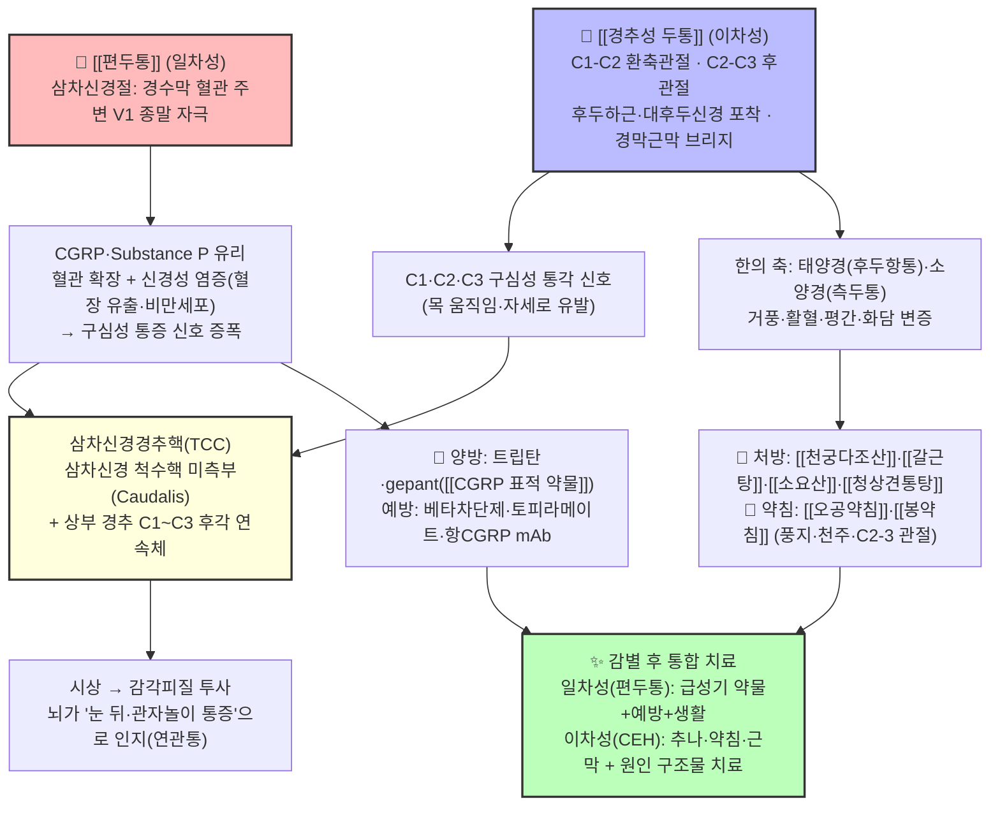

# 🩺 [Clinical Master-Dive] [[편두통]]과 [[경추성 두통]] — 머리 통증의 두 기원: 삼차혈관계(CGRP)와 삼차신경경추핵(TCC) 수렴 — 일차성·이차성 두통의 한양방 통합 감별과 치료 심화 탐구

> *"환자가 '관자놀이가 욱신욱신 쑤시고 빛이 싫다'고 호소할 때와, '목을 돌리면 뒤통수부터 눈 뒤쪽까지 뻐근하게 올라온다'고 호소할 때 — 한의학은 전자에서 풍열·간양상항(肝陽上亢)의 상충을, 후자에서 풍한습이 경항(頸項)에 응체된 태양경 두통을 읽는다. 현대 신경학은 두 통증을 각각 '삼차혈관계(trigeminovascular system)의 CGRP 폭풍'과 '상부 경추 C1~C3 구심성 신호의 삼차신경경추핵(TCC) 수렴' 위에 올려놓는다. 그리고 이 두 경로는 우연히도 **뇌줄기의 같은 중계소 — 삼차신경 척수핵 미측부와 상부 경추 후각이 이어지는 연속체** — 에서 만난다. 오늘의 큐레이션은 비오님 볼트 `3. 이론 공부/질환/신경계 질환/`에서 서로를 아직 직접 백링크하지 못한 두 지식 노트 — 중추에서 시작되는 일차성 두통의 대표 [[편두통]]과 목에서 시작되는 이차성 두통의 대표 [[경추성 두통]] — 을 하나의 '두통 신호 교차로' 위에서 만나게 한다."*

---

## 🖼️ 시각적 개념 구조도 (Visual Architecture & Pathway)

> *[[편두통]]의 삼차혈관계(CGRP) 경로와 [[경추성 두통]]의 C1~C3 구심성 경로가 삼차신경경추핵(TCC)에서 수렴해 '머리 통증'으로 인지되는 통합 메커니즘 맵입니다.*

---

## 🔗 1. 볼트 속 유기적 연관 노트 연결 (Organically Linked Vault Grounding)

오늘의 정식 큐레이션은 월요일 도메인 **신경계·두통(神經系·頭痛)**의 후보 풀(`3. 이론 공부/질환/신경계 질환/` — [[편두통]]·[[경추성 두통]]·[[안면신경마비]]·[[대상포진후신경통]]·[[중풍]] 등)에서, **'같은 중계소(TCC)에 도착하는 서로 다른 두 기원'**이라는 구조로 가장 타이트하게 얽힌 두 노트를 심층 결합합니다. 특히 [[경추성 두통]] 노트가 감별 표에서 [[편두통]]을 직접 거명하고 있으나, [[편두통]] 노트는 '함께 보기'에 [[경추성 두통]]을 아직 등재하지 못한 **반쪽 고아 관계**입니다.

1. **Source Node A ([[편두통]])** — `3. 이론 공부/질환/신경계 질환/편두통.md`
   - *볼트 원문 핵심 발췌:* "반복성의 중등도~중증 **박동성 두통**을 오심·구토·광음공포와 함께 일으키는 신경계 질환. 전 세계 장애수명손실 2위… 병태생리의 핵심은 삼차혈관계 활성화와 [[CGRP]] 유리, 이에 따른 중추 감작… 삼차혈관계(trigeminovascular system): 경수막 혈관 주변 삼차신경(C1~C2, V1) 종말이 활성화되면 [[CGRP]]·[[Substance P]] 등 신경펩타이드가 유리 → 혈관 확장+신경성 염증 → 구심성 통증 신호가 삼차신경핵·시상으로 전달… 반복 발작은 시상·변연계 등 중추의 감작([[중추 감작]])과 통증 조절 경로([[하행성 통증억제계]]) 기능 저하로 만성화… 급성기: NSAIDs·아세트아미노펜 → 트립탄/딧탄 / 예방: 베타차단제·토피라메이트·아미트립틸린·발프로에이트 / 최신: [[CGRP 표적 약물]](gepant·항CGRP 단일클론항체)… 한의 접근: 전침·이침·두침·추나로 경추성 긴장·후두신경 예민 완화 병행 가능."
2. **Source Node B ([[경추성 두통]])** — `3. 이론 공부/질환/신경계 질환/경추성 두통.md`
   - *볼트 원문 핵심 발췌:* "상부 경추(C1~C3)의 골관절·추간판·근막 병변으로 인해 발생하는 대표적인 이차성 두통… [[삼차신경경추핵]](Trigeminocervical nucleus)에서 C1-C3 감각신경과 [[삼차신경]] 안신경 분지가 수렴(Convergence)되어 안와 및 관자놀이로 연관통을 방사… 목 움직임에 의해 두통이 유발되며 상부 경추 후관절 및 후두하근 이완 추나요법과 풍지·천주혈 [[오공약침]] 치료의 핵심 적응증… 유병률: 전체 만성 두통 환자의 약 15~20%, 경추 외상(편타성 손상) 후 만성 두통 환자의 50% 이상… 이학적 검사: 경추 굴곡-회전 검사(FRT) — 정상 회전각 양측 44° 내외, C1-C2 병변 시 이환측 32° 이하로 제한(민감도·특이도 90% 이상)… 한약: 풍한습/기혈어체 → [[청상견통탕]], [[갈근탕]](경항강통 동반 시), [[소요산]](스트레스성 간울), [[천궁다조산]]."

> **💡 핵심 연관 통찰 (Cross-Pollination):**
> 두 노트는 '머리가 아프다'는 같은 증상 앞에서 **신호의 진행 방향이 정반대**입니다. [[편두통]]은 **중추 쪽 말단(삼차신경절-경수막 혈관)에서 시작해** CGRP·SP의 신경성 염증 폭포를 만들고, 그 구심성 신호가 아래로 내려와 삼차신경경추핵(TCC)에 실립니다. [[경추성 두통]]은 **가장 아래쪽 말단(환축관절·C2-C3 후관절·후두하근·대후두신경)에서 시작해** C1~C3 구심성이 *올라와* 같은 TCC의 2차 뉴런에 합류합니다. 곧, 이 둘은 서로 다른 기원이 **하나의 중계소에서 만나는 '수렴(convergence)의 두 얼굴'**이며, 뇌가 '눈 뒤·관자놀이'로 투사하는 연관통 지도가 같을 수밖에 없는 해부학적 이유입니다. 치료적으로 이 구조는 두 가지를 가르칩니다 — ① 감별이 먼저다: 편두통 환자에게 불필요한 도수·약침이, CEH 환자에게 값비싼 CGRP 예방약이 처방되지 않도록 '신호의 기원'을 찾아야 하고, ② 말초를 다스리는 한의 중재(추나·약침·근막·거풍지통제)는 TCC로 들어가는 C1~C3 입력 자체를 줄임으로써 **일차성 두통의 보조 예방**(후두신경 예민 완화)까지 겨냥할 수 있습니다.

---

## 🧠 2. 현대 해부·생리 및 병태생리학적 심층 분석 (Anatomy, Physiology & Pathophysiology)

### ① 두개내·두개외 통증 감각 지도 — '머리'는 어디서 아픈가

- **두개내 구조물의 감각 지배**: 뇌실질·뇌연수막·뇌실막·혈관(연수막 혈관 제외)은 통각에 둔감하고, 통증을 전달하는 두개내 구조는 **경수막(dura mater)·대혈관 근위부·경막동(정맥동) 주위**로 제한됩니다. 이들은 주로 **삼차신경 제1분지(V1, 안신경)와 제2분지** 및 상부 경추신경(C1~C2, 후두부 경막)의 지배를 받습니다 — 그래서 두개내 통증이 전두·안와·측두부로 투사되는 이유입니다.
- **두개외 구조물의 감각 지배**: 두피·두개골골막·근육·관절·경막(상부 경추)은 풍부한 통각수용기를 가집니다. 특히 **C1~C3**은 후두하근·환축관절·C2-C3 후관절·[[대후두신경]]·[[셋째후두신경]] 영역을 지배하며, 이 구역의 병변은 후두부 통증을 만들고 삼차신경 영역으로 연관통을 투사할 수 있습니다.
- **중계소(TCC)**: 삼차신경 척수핵의 미측부(pars caudalis)는 상부 경추 척수 후각과 **해부학적으로 단절 없이 연속**됩니다. 볼트 [[경추성 두통]] 노트가 정리한 대로, 이 연속체에서 C1~C3 유해 자극과 삼차신경 V1 유해 감각이 **동일한 2차 감각신경세포에 수렴**하면, 뇌는 '목의 통증'을 '눈 뒤·이마·관자놀이 통증'으로 착각 인지합니다.

### ② [[편두통]] — 삼차혈관계(Trigeminovascular) 이론과 CGRP

- **발작 생성 3단계 모델**(볼트 [[편두통]]·[[CGRP]] 노트 + Goadsby 등 2017 리뷰): ① 중추 신경축(시상하부·변연계 등)의 주기적 변동 → ② 삼차신경절 감각신경(C·Aδ 섬유)의 경수막 혈관 주변 종말 활성화 → ③ 말단에서 [[CGRP]]·[[Substance P]] 유리 → 혈관 확장·혈장 유출·비만세포 탈과립(신경성 염증) → 구심성 통증 신호 증폭 → TCC·시상·피질로 전파.
- **CGRP의 역할**: 37-아미노산 신경펩타이드로, CLR+RAMP1 수용체(Gs 결합 → cAMP↑)를 통해 혈관 평활근을 이완시킵니다. 편두통 발작 중 경정맥 CGRP 농도 상승, CGRP 정맥 주입 시 편두통 유발이 반복 확인되어 **인과적 매개** 근거가 강합니다(볼트 [[CGRP]] 노트 원문).
- **조짐(aura)**: 시각·감각 조짐은 일차 감각피질을 따라 퍼지는 **피질확산억제(CSD, Cortical Spreading Depression)**와 관련된 것으로 이해됩니다(연구 결과). 이후 이어지는 두통 단계는 CSD가 삼차신경 주변부를 활성화해 삼차혈관 경로를 켠다는 'CSD-삼차혈관 연결' 가설로 설명됩니다.
- **만성화(중추 감작)**: 반복 발작은 시상·변연계·편도체의 감작([[중추 감작]])과 [[하행성 통증억제계]](PAG-RVM-척수후각) 기능 저하를 초래해, 삽화성 → 만성(월 15일 이상)으로 이행합니다. 급성기 약물 잦은 사용(월 10일 이상)은 약물과용 두통(MOH)으로 만성화를 가속합니다.

### ③ [[경추성 두통]] — '아래에서 올라오는' 이차성 두통

- **병태생리 3경로**(볼트 노트 원문 + Bogduk & Govind 2009): ① **C1-C2 환축관절**: 회전 시 마찰·퇴행성 관절염 → C2 신경근 자극(FRT 제한의 해부학적 기반), ② **C2-C3 후관절**: 관절낭을 감싸는 [[셋째후두신경]](TON) 포착 → 후두-측두 방산통(제3후두신경 두통), ③ **후두하근·근경막 브리지**: 하두사근 등이 경막과 연결되는 근경막 브리지(myodural bridge)를 통해 두개내 감각 이상을 유발하고, [[대후두신경]] 포착이 후두통을 만듭니다.
- **임상 역학**: 전체 만성 두통의 15~20%, 편타성 손상(whiplash) 후 만성 두통의 50% 이상 — 장시간 스마트폰·PC 사용의 일자목/거북목 증가와 함께 한의원에서 흔히 만나는 두통형입니다(볼트 노트).
- **감별 3종 표**(볼트 [[경추성 두통]] 노트 §4 원문): 통증 편측성(CEH는 거의 항상 편측 고정 · 편두통은 편측 또는 교대), 시발점(CEH는 후두·목덜미 → 안와·전두부 / 편두통은 측두·안와), 목 움직임 유발(CEH에서 뚜렷 / 편두통 무관), 동반 증상(CEH는 목 가동범위 제한·동측 어깨 통증 / 편두통은 오심·구토·광음공포·조짐), 통증 양상(CEH는 둔·쑤시는 묵직 / 편두통은 박동성).

### ④ 통합 표 — 두 노트를 '기원 vs 중계소' 축 위에

| 지표 | 🌩️ [[편두통]] (일차성) | 🦴 [[경추성 두통]] (이차성) |
| :--- | :--- | :--- |
| ICHD-3 위치 | 일차성 두통 (1. 편두통) | 이차성 두통 (11. 두경부 통증 기인) |
| 신호 기원 | 삼차신경절-경수막 혈관 (중추 쪽 말단) | C1~C3 관절·근막·신경 포착 (말초 쪽 말단) |
| 분자 매개 | CGRP·SP — 신경성 염증 | 기계적·염증성 구심성 자극(국소 염증성 사이토카인) |
| 통증 위치 | 측두·안와부, 편측/교대 | 후두·목덜미 시작 → 안와·전두 투사, 편측 고정 |
| 유발 요인 | 수면·호르몬·스트레스·식이·빛소리 | 목 회전/신전·장시간 자세·외상 |
| 동반 증상 | 오심·구토·광음공포·조짐(aura) | 목 ROM 제한·동측 어깨 통증 |
| 만성화 | 중추 감작·MOH | 근막 연쇄·관절 퇴행 지속 |
| 한의 병기 | 소양경 두통·간양상항·풍열(상충) | 태양경 두통·풍한습응체·기혈어체(경항) |
| 대표 처방·중재 | 트립탄·[[CGRP 표적 약물]]·예방약 / 전침 | 추나·[[오공약침]]·근막 이완 / [[갈근탕]]·[[천궁다조산]] |

> **임상 통찰**: '편두통이면서 목이 아픈 환자'는 한 질환이 다른 질환을 흉내 내는 것이 아니라 **두 기원이 공존**할 수 있습니다. 상부 경추의 지속적 구심성 입력은 TCC의 2차 뉴런 흥분성을 높여 삼차혈관 신호를 증폭시키므로, 편두통 환자에서 동반된 경추·후두하근 긴장을 푸는 한의 중재는 단순 보조가 아니라 **TCC 입력 차단을 통한 예방적 기여**(Jull 2002 도수·운동 병용군 두통일수 감소 등 연구 결과)로 재해석될 수 있습니다.

---

## 🔬 3. 분자약리학 및 본초·방제학적 심층 분석 (Molecular Pharmacology)

### ① 양방 축 — 편두통 분자 표적

- **급성기 — 세로토닌·CGRP 표적**: 트립탄 계열은 5-HT1B/1D 수용체 작용으로 ① 두개내 확장 혈관 수축, ② 삼차신경 말단에서 CGRP·SP 유리 억제, ③ TCC 2차 뉴런 흥분 억제의 3중 기전을 냅니다. 최신 **gepant** 계열은 CGRP 수용체(CLR+RAMP1)를 직접 길항하며 혈관수축 기전이 없어 심혈관 위험군에서 선택 폭이 넓습니다(볼트 [[CGRP 표적 약물]] 노트).
- **예방 — 펩타이드·채널·신경조절 표적**: 베타차단제(프로프라놀롤), 토피라메이트(글루타메이트/탄산탈수효소·전압의존 Ca/Na 채널 조절), 아미트립틸린(하행성 통증억제계 세로토닌·노르에피네프린 재흡수 억제), 항CGRP 단일클론항체(erenumab·galcanezumab·fremanezumab·eptinezumab), 만성 편두통에 onabotulinumtoxinA. AAN 2026 예방 가이드라인 SR(RCT 217건, 볼트 실측 PMID 42673559)은 삽화성에서 galcanezumab·erenumab **고신뢰도**, 만성에서 fremanezumab·galcanezumab·onabotulinumtoxinA **고신뢰도** 효과를 보고합니다.
- **동반 질환별 선택**: 고혈압 → 베타차단제 / 비만 → 토피라메이트 / 불안·우울 → 아미트립틸린 (볼트 [[편두통]] 노트 원문). 급성기 약물은 월 10일 이하로 제한(약물과용 두통 예방).

### ② 한의 축 — [[천궁다조산]]을 축으로 한 '경(經) 따라 두통 잡기'

- **[[천궁다조산]](川芎茶調散) — 《태평혜민화제국방》 권제2(볼트 처방 노트)**: [[천궁]]·[[박하]](군) + [[백지]](양명-이마)·[[강활]](태양-후두항통)·[[세신]](소음-뼛속 심층통)(신) + [[방풍]]·[[형개]]·[[녹차]](좌) + [[감초]](사)의 **경락별 인경약 배오**는, 현대적 관점에서 '두부 신경지배 분절별 통증 매핑'(전두-안와 → V1, 측두 → V2·V3, 후두 → C2/C3 후지)과 놀랍도록 평행합니다. 처방 노트는 [[천궁]] 리구스티라이드의 뇌혈관 연축 완화·5-HT 조절, [[백지]]·[[세신]]의 삼차신경절 CGRP 방출 차단·진통, 녹차 카페인의 대뇌피질 혈관 수축 작용을 분자 근거로 제시합니다(볼트 실측). **금기**: 간양상항·음허화왕(안면홍조·고혈압) 두통, [[세신]] 1일 3g 용량 제한.
- **[[갈근탕]]**(《상한론》 태양병, 경항강통 동반): 갈근이 후두하·승모근 상부의 근긴장성 항강(項强)을 풀면서 표증을 발산 — CEH의 '목 뻣뻣함 + 두통' 축에 대응(볼트 [[경추성 두통]] 노트).
- **[[소요산]]**(《화제국방》, 스트레스성 간울): 간울기체가 두통·긴장·수면 장애로 표출되는 삽화성 두통 환자의 '정서 축'에 대응 — 양방의 아미트립틸린·SSRI 선택(불안·우울 동반 편두통)과 기능적으로 평행한 축입니다.
- **[[청상견통탕]]**(볼트 [[경추성 두통]] 노트의 풍한습/기혈어체 처방): 현재 처방 노트 미생성(미노트화 후보 — §6 참조).
- **약침 — [[오공약침]]·[[봉약침]]**: 볼트 [[오공약침]] 노트는 지네 유래 펩타이드가 ① 감각신경 전압개폐성 나트륨 통로(Nav1.7) 과흥분 차단(이소성 발화 억제), ② Substance P·CGRP의 후각 방출 억제 → 중추 감작 완화, ③ NF-κB 하향 조절로 TNF-α·IL-1β·[[COX-2]]·[[iNOS]] 억제의 3중 기전을 제시합니다. CEH에서 대후두신경 포착·C2-C3 후관절염 부위(풍지·천주·완골)에 0.3~0.5cc 점적 — **C1~C3 구심성 입력을 줄이는 분자적 도구**로, 편두통의 후두부 예민 동반 시에도 응용 가능합니다.

### ③ '한-양방 접점' 안전 포인트

- **천궁다조산·거풍 온성약 vs 고혈압·간양 편두통**: 박동성 두통+안면홍조+고혈압(간양상항) 환자에게 온성 거풍약을 먼저 쓰면 상충(上衝)이 악화될 수 있습니다 — 양방의 '조절 안 된 고혈압에서 트립탄 금기' 원칙과 방향이 같습니다. 이 경우 청열평간(예: 평간·청열 계열) 처방과 혈압 조절(베타차단제)을 우선합니다.
- **약물과용 두통(MOH)**: 편두통 환자가 한의원에 오기 전 이미 진통제를 매일 복용 중인 경우, 침·약침이 통증을 줄여도 금단성 MOH 악화가 있을 수 있어 '급성기 약물 사용 일수 기록'을 먼저 확인합니다.
- **경추 고속 회전 수기 주의**: CEH의 상부 경추 치료에서 과도한 회전·신전 수기와 동맥박리(vertebral artery dissection)의 이론적 위험을 고려해, 고위험군(50대 이후 갑작스러운 후두통·신경학적 증상)은 시행 전 영상·전원 판단을 합니다(연구 결과 기반 주의).

---

## 💊 4. 한양방 통합 임상 프로토콜 (Integrated Clinical Protocol)

### 1단계: 레드플래그·이차성 두통 감별 (감별이 곧 1차 치료)

| 환자 군 | 핵심 질문·검사 | 감별 포인트 | 행동 |
| :--- | :--- | :--- | :--- |
| 레드플래그 공통 | 벼락 두통(thunderclap), 국소 신경결손, 50세 이후 첫 두통, 진행성/아침 두통+구토, 발열·수막자극, 암·면역저하, 두부외상 | 지주막하출혈·뇌종양·동맥박리·수막염 등 2차성 | 즉시 응급·신경과 전원 |
| 편두통형 | 박동성·편측/교대·오심·광음공포·조짐, 월 두통일수, 급성기 약물 일수 | ICHD-3 진단 기준(발작 5회↑·4~72h·2/4 특징·1/2 동반) | 두통일기·MIDAS/HIT-6, 약물과용 두통(MOH) 배제 |
| 경추성 의심 | 후두·목덜미 시작, 목 움직임 유발, 편측 고정, 동측 어깨 통증, 외상력 | FRT(굴곡-회전 검사): 이환측 32°↓, C1-C2 압통 방사통 재현 | 경추 X-ray(굴곡신전)·필요 시 MRI; 후두신경 차단 반응 |

### 2단계: 변증·처방 매트릭스 (볼트 근거)

| 변증 (경락·병기) | 핵심 소증 | 대표 처방·중재 | 양방 병용 포인트 |
| :--- | :--- | :--- | :--- |
| 풍한 — 태양경(후두항통) | 뒷목 뻣뻣함 + 후두통, 오한, 맥 부 | [[갈근탕]]·[[천궁다조산]](강활 인경) + 풍지·천주 자침 | NSAID 단기 병용; 경추 추나 동시 |
| 풍열/간양상항(소양·측두 박동통) | 측두부 욱신욱신, 안면홍조, 불면, 화 잘 남 | 청열평간 축 + [[천궁다조산]] 금기 확인; 양방: 베타차단제(고혈압) | 혈압 측정; 트립탄 병용 시 금기 대조 |
| 간울기체(스트레스성) | 긴장·우울·협만·수면 장애 동반 두통 | [[소요산]] + 정서 관리 | 아미트립틸린/SSRI 선택과 병행 가능 |
| 풍한습·기혈어체(CEH 축) | 목 회전 시 두통 유발, 후두하 압통, 담·저림 | [[청상견통탕]](미노트화)·[[갈근탕]] + [[오공약침]]·[[봉약침]]·추나 | NSAID·근이완제 단기 병용; 영상 선별 |
| 담음(오심·현훈 동반) | 어지럼+오심+백태, 비만 체질 | 화담·거습 계열 + 반하 계열 가감 | 전정성 어지럼 동반 시 감별(이비인후과) |

### 3단계: 침·추나·생활 통합 프로토콜

- **경혈 배합(부위별)**: 후두항통(CEH) — 풍지(GB20)·천주(BL10)·완골(GB12)·아시혈(후두하삼각), C2-C3 후관절 협척 자극; 측두·안와통(편두통) — 태양·두유·율곡·현로(담경 측두부), 관자놀이 아시혈; 원위 배혈 — 합곡(LI4)·태충(LR3, 사관 — 간양 하강), 외관(TE5)·족임읍(GB41, 소양경), 후계(SI3, 태양경 통관).
- **전침(EA)**: 저주파(2Hz) 전침은 편두통 예방에 Cochrane SR 근거(Linde 2016 — 월 두통일수 감소, 연구 결과)가 있고, 통증 조절 내인성 오피오이드·하행성 억제계 활성화 경로로 이해됩니다. CEH의 후두하근에는 저강도 2Hz를 국소·근위 배합으로.
- **추나·근막**: C0-C1/C1-C2 관절가동화, 후두하근막 이완술(후두골 기저 견인), 경추 생리적 전만 회복(거북목) — Jull 2002 무작위 시험(도수+운동 병용군에서 유의한 두통 개선, PMID 12221344) 및 Chaibi & Russell 2012 도수요법 SR(PMID 22460941)과 방향이 일치합니다(연구 결과).
- **생활·예방**: 두통 일기(유발인자: 수면 리듬·식이·월경 주기·스트레스), 스마트폰·PC 자세 교정(거북목), 목 주변 신장 운동, 급성기 약물 사용 일수 기록 — 편두통 예방의 '월 두통일수 50% 감소' 목표에 한의 중재를 8~12주 단위로 평가합니다.

---

## 📚 5. 전문 참고 문헌 및 교과서 인용 (References)

1. **볼트 노트 인용(1차)**: [[편두통]]·[[경추성 두통]](3. 이론 공부/질환/신경계 질환/), [[CGRP]](3. 이론 공부/호르몬, 신호전달물질/), [[천궁다조산]](2. 약리 공부/처방/08_치풍·안신·개규제/), [[갈근탕]](01_해표제), [[소요산]](04_이기·화해제), [[오공약침]](2. 약리 공부/약침/), [[중추 감작]]·[[하행성 통증억제계]](3. 이론 공부/의학개념/).
2. Headache Classification Committee of the International Headache Society (IHS). The International Classification of Headache Disorders, 3rd edition (ICHD-3). *Cephalalgia*, 2018;38(1):1-211. [PMID: 29368949](https://pubmed.ncbi.nlm.nih.gov/29368949/) · DOI: [10.1177/0333102417738202](https://doi.org/10.1177/0333102417738202) — 일차성·이차성 두통의 표준 분류.
3. Sjaastad O, Fredriksen TA, Pfaffenrath V; The Cervicogenic Headache International Study Group. Cervicogenic headache: diagnostic criteria. *Headache*, 1998;38(6):442-445. [PMID: 9664748](https://pubmed.ncbi.nlm.nih.gov/9664748/) · DOI: [10.1046/j.1526-4610.1998.3806442.x](https://doi.org/10.1046/j.1526-4610.1998.3806442.x) — CEH 진단 기준(편측 고정·목 유발·차단 반응).
4. Sjaastad O, Fredriksen TA. Cervicogenic headache: criteria, classification and epidemiology. *Clin Exp Rheumatol*, 2000;18(2 Suppl 19):S3-S6. [PMID: 10824278](https://pubmed.ncbi.nlm.nih.gov/10824278/) — 볼트 [[경추성 두통]] 노트 원문 인용.
5. Bogduk N, Govind J. Cervicogenic headache: an assessment of the evidence on clinical diagnosis, invasive tests, and treatment. *Lancet Neurol*, 2009;8(10):959-968. [PMID: 19747657](https://pubmed.ncbi.nlm.nih.gov/19747657/) · DOI: [10.1016/S1474-4422(09)70209-1](https://doi.org/10.1016/S1474-4422(09)70209-1) — TCC 수렴 메커니즘·상부 경추 중재 근거.
6. Goadsby PJ, Holland PR, Martins-Oliveira M, Hoffmann J, Schankin C, Akerman S. Pathophysiology of migraine: a disorder of sensory processing. *Physiol Rev*, 2017;97(2):553-622. [PMID: 28179394](https://pubmed.ncbi.nlm.nih.gov/28179394/) · DOI: [10.1152/physrev.00034.2015](https://doi.org/10.1152/physrev.00034.2015) — 삼차혈관계·CSD·중추 감작 통합 모델의 표준 리뷰.
7. Linde K, Allais G, Brinkhaus B, et al. Acupuncture for the prevention of episodic migraine. *Cochrane Database Syst Rev*, 2016;(6):CD001218. [PMID: 27351677](https://pubmed.ncbi.nlm.nih.gov/27351677/) · DOI: [10.1002/14651858.CD001218.pub3](https://doi.org/10.1002/14651858.CD001218.pub3) — 침의 삽화성 편두통 예방 근거.
8. Jull G, Trott P, Potter H, et al. A randomized controlled trial of exercise and manipulative therapy for cervicogenic headache. *Spine*, 2002;27(17):1835-1843. [PMID: 12221344](https://pubmed.ncbi.nlm.nih.gov/12221344/) · DOI: [10.1097/00007632-200209010-00004](https://doi.org/10.1097/00007632-200209010-00004) — 도수+운동 병용의 CEH 치료 효과.
9. Chaibi A, Russell MB. Manual therapies for cervicogenic headache: a systematic review. *J Headache Pain*, 2012;13(5):351-359. [PMID: 22460941](https://pubmed.ncbi.nlm.nih.gov/22460941/) · DOI: [10.1007/s10194-012-0436-7](https://doi.org/10.1007/s10194-012-0436-7) — CEH 도수요법 체계적 고찰.
10. AAN·미국두통학회 공동 SR(2026) — 삽화성·만성 편두통 예방약 효과 비교(RCT 217건). [PMID: 42673559](https://pubmed.ncbi.nlm.nih.gov/42673559/) · DOI: [10.1212/WNL.0000000000218112](https://doi.org/10.1212/WNL.0000000000218112) — 볼트 [[편두통]] 노트 실측 인용.
11. 송대(宋代), 《태평혜민화제국방(太平惠民和劑局方)》 권제2 — 천궁다조산(川芎茶調散) 출전. / 장중경(張仲景), 《상한론(傷寒論)》 — 갈근탕.
12. Ropper AH, Samuels MA, Klein JP. *Adams and Victor's Principles of Neurology*, 11th ed. McGraw-Hill, 2019 — 두통·뇌신경·통증 경로의 표준 신경학 교과서.
13. 전국한의과대학 방제학교수 공편저, 《방제학》, 영림사 — 천궁다조산·갈근탕·소요산 구성·치법 표준.

---

## 🌱 6. 정원 제안 (Gardener's Notes — 비파괴적 백링크 제안)

오늘의 융합이 드러낸 볼트 연결 공백을 검토 우선 원칙(비오님 지시)에 따라 **제안만** 기록합니다 (신규 생성 0건, 파일 수정 0건 — 본 리포트 1건만 산출).

1. **[[편두통]] ↔ [[경추성 두통]] 상호 백링크 신설 제안**: [[경추성 두통]] 노트 §4 감별 표는 [[편두통]]을 거명하나, [[편두통]] '함께 보기'에는 [[경추성 두통]]이 미등재 — '감별 질환' 란에 ICHD-3 위치(일차 vs 이차)·FRT 한 줄을 추가하면 두 기원의 대비 학습이 열립니다.
2. **미노트화 후보 등재 제안**: ① [[삼차신경경추핵]] — [[경추성 두통]] 노트 §2가 핵심 개념으로 링크하나 파일이 없음(3. 이론 공부/의학개념/신경생리·수용기/ 신설 제안), ② [[청상견통탕]] — CEH 노트의 한약 치료에 등장하나 처방 노트 없음(2. 약리 공부/처방 분류 후보), ③ [[긴장형 두통]] — CEH 노트 §4 표의 제3축이나 별도 질환 노트 없음(신경계 질환 폴더 후보). 일일 10개 제한 내 승인 대기.
3. **[[CGRP 표적 약물]] 폴더 위치 점검 제안**: 현재 `2. 약리 공부/양방 약/05_호흡기·감기·알레르기/` 하위에 존재 — 신경계 약물(gepant·항CGRP mAb)이므로 `04_정신신경계`가 더 정합적. 주간감사(일요일 23:00)의 분류 대조 대상으로 포함 제안.
4. **형식 정합성 점검 제안**: `3. 이론 공부/질환/근골격계 질환/두경부/두통.md`(원문 필기 — googleusercontent 이미지 링크 포함)는 신경계 질환/두통 총론과의 관계(이중 소재)와 표준 템플릿 적용 여부를 주간감사에서 함께 점검 대상으로.
5. **MOC 백링크 확인**: 본 리포트는 주간감사 전 산출물로, 신경계 질환 MOC(두통 계열)에 오늘의 연관 통찰(일차성/이차성 수렴 구조) 한 줄이 향후 MOC 동기화 시 반영될 수 있도록 연결 후보로 남겨 둡니다.

---
*이 노트는 다빈치(Da Vinci) Clinical Knowledge Curation Bot이 2026-09-07(월) 14:00 크론으로 생성한 월요일 도메인(신경계·두통 — 삼차혈관계·TCC 수렴 축) Master-Dive입니다. 소스: [[편두통]]·[[경추성 두통]] (2노트 Cross-Pollination).*
