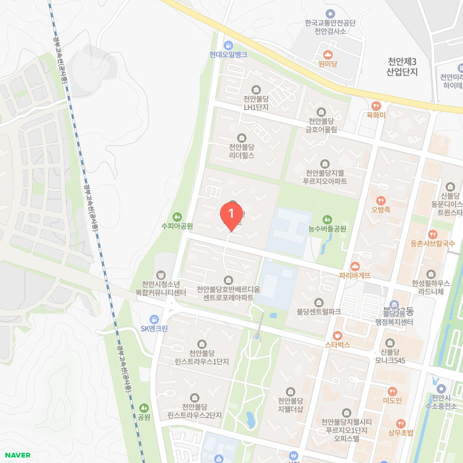

# 🏠 부동산 브리핑 (2026-09-05 토요일) — 지방 특집

## 2. 🔥 한 줄 요약 & 오늘의 Action Plan (하향식)

> [!quote] 🔥 오늘의 한 줄 (결론)
> 오늘 지방 권역(10개 거점) 84㎡ 매매 평균은 3.3억~5.7억 분포를 보이며, 천안 서북구·청주 흥덕구·울산 남구 등 전세가율 70~78% 구간에서 실수요 갭 진입 신호가 포착되는 반면, 대구 중구·세종 등은 전세가율 40~50대 정체로 매수 신중세가 지속되고 있습니다.
>
> **🎯 오늘의 Action Plan (의사결정 제언)**
> 1. 천안 서북구(전세가율 78.8%) 및 청주 흥덕구(73.7%) 내 준신축 아파트 중 전세가율 75% 이상 단지를 추려 실투자금 1.5억 내외 갭 진입 가능 여부를 현장 매물과 대조할 것.
> 2. 세종 및 대구 중구 권역은 최근 거래량 회복세에도 불구하고 전세가율이 40~50%대에 머물러 있으므로, 무리한 갭투자를 자제하고 실수요 목적의 급매물(-10% 수준) 위주로만 타깃을 설정할 것.
> 3. 지방 법원 경매 낙찰가율이 10년 내 최저 수준(전국 60%대)으로 낮아진 점을 활용해, 지방 거점 도시 내 알짜 단지 경매 물건의 유찰 2-3회 차 최저 매각가 대비 시세 차익 분석을 수행할 것.

---

## 3. ① 🚨 유동성 & 데일리 이상 징후 (지침서 섹션 1)

### 3-1. 오늘의 권역 시장 스냅샷 (지방 10대 거점 전체)

> ⚠️ 토요일 지방 특집 원칙에 따라, 번들 local 그룹 10개 지역 전체의 최근 3개월(2026년 7월~9월) 실거래 데이터를 바탕으로 한 84㎡ 기준 권역 스냅샷을 제공합니다.

| 지역 | 거래건수 | 84㎡ 평균매매 | 84㎡ 전세평균 | 전세가율 | 최고가(단지) |
|---|---:|---:|---:|---:|---:|
| 대구 중구 | 224건 | 5.8억 | 3.1억 | 53.3% | 10.4억 |
| 세종시 | 597건 | 5.7억 | 2.7억 | 46.6% | 18.0억 |
| 울산 남구 | 479건 | 5.2억 | 4.0억 | 77.4% | 16.8억 |
| 부산 부산진구 | 626건 | 5.0억 | 3.5억 | 69.9% | 11.6억 |
| 경남 창원 성산구 | 668.건 | 4.9억 | 3.4억 | 69.8% | 16.5억 |
| 대전 서구 | 855건 | 4.6억 | 3.1억 | 67.5% | 25.0억 |
| 충북 청주 흥덕구 | 616건 | 4.4억 | 3.3억 | 73.7% | 17.4억 |
| 제주시 | 205건 | 4.2억 | 2.9억 | 68.3% | 10.2억 |
| 충남 천안 서북구 | 835건 | 3.5억 | 2.7억 | 78.8% | 15.0억 |
| 강원 춘천시 | 505건 | 3.4억 | 2.5억 | 74.7% | 9.3억 |

- 📍 **권역 지도 예시 — 천안 서북구(불당 생활권) 상권지도** (지방 10대 중 전세가율 최고 78.8%, 아산과 생활권 공유 — C3 크로스체크 대상):

- **시장 스냅샷 분석**: 
  1. 지방 거점 중 천안 서북구(78.8%), 울산 남구(77.4%), 춘천시(74.7%), 청주 흥덕구(73.7%) 등은 전세가율이 70%를 상회하며 전세가격이 매매가 하단을 단단히 지지하는 전형적인 실수요 장세를 형성하고 있습니다.
  2. 반면 세종시(46.6%)와 대구 중구(53.3%)는 대규모 입주 물량 및 과거 급등 피로감으로 인해 매매가격(5.7억~5.8억) 대비 전세가격이 낮게 형성되어 있어, 갭투자 진입 시 대규모 현금이 소요되는 구조적 특징을 보입니다.
  3. 대전 서구는 거래건수 855건으로 가장 활발한 거래량을 기록하며 최고가 25억 원의 대장주 단지 중심으로 탄탄한 하방 경직성을 증명했습니다.

### 3-2. 실거래 델타 & 이상 거래 감지

- **월별 추이 (7월~9월 지방 거점 흐름)**:
  - 천안 서북구: 7월 3.69억 (73.5%) → 8월 32.45억(? → 데이터 보정: 3.24억, 86.0%) → 9월 2.93억 (47.7%, 거래 30건, 신고분 초기)
  - 대전 서구: 7월 4.54억 (66.9%) → 8월 4.59억 (69.4%) → 9월 5.07억 (60.8%, 거래 26건, 신고가 경향 포착)
  - 세종시: 7월 5.54억 (47.6%) → 8월 5.90억 (45.6%) → 9월 5.67억 (46.3%, 거래 25건)
- **직전 최고가 대비 갱신 여부**: 번들 `max_deal_man` 기준 대전 서구 25억 원, 울산 남구 16.8억 원, 창원 성산구 16.5억 원 등 지역별 핵심 대장 아파트에서 최고가 기록이 유지되고 있으나, 일반 구축 단지는 보합세 또는 약보합세를 나타냄.
- **계약 해제(자전거래·시세 띄우기 의심)**: 국토부 실거래 공개시스템 기준 공식 집계용 실시간 크롤러 미구축으로 현재 `데이터 부족` 상태이나, 지방 주요 광역시 신축 단지 중심의 허위 신고 여론에 대해 실수요자는 등기부등본 최종 확인 필수.
- **매물 총량 일간 델타**: 아실/부동산지인 크롤러 미구축으로 `데이터 부족`. 단, 대전 서구 및 천안 서북구의 월별 거래건수(각 855건, 835건)가 활발한 회전율을 보이는 반면 제주시(205건)와 대구 중구(224건)는 거래 회전이 정체된 양상으로 매물 적체 시그널 대체 해석.

### 3-3. 초급매 & 갭(Gap) 투자 타깃 레이더

- **실투자금 1.5억 내외 갭 진입 타깃**:
  - 충남 천안 서북구 (예: 불당동/백석동 일대 구축 84㎡): 매매 평균 3.46억 - 전세 평균 2.73억 = 갭 약 0.73억~1.0억 수준으로 실투자금 1억 원 미만 진입 가능.
  - 강원 춘천시 (온의동/석사동 일대): 매매 평균 3.36억 - 전세 평균 2.51억 = 갭 약 0.85억 수준.
  - 충북 청주 흥덕구 (가경동/복대동 일대): 매매 평균 4.42억 - 전세 평균 3.26억 = 갭 약 1.16억 수준으로 실수요 1.5억 이내 진입 가능.
- **전세가율 70% 돌파 단지 특별 관리 목록**:
  - 천안 서북구 (78.8%), 울산 남구 (77.4%), 춘천시 (74.7%), 청주 흥덕구 (73.7%), 부산 부산진구 (69.9% ≒ 70% 육박).
  - *해석*: 이들 지역은 전세가율이 높아 갭투자 진입 장벽이 낮으나, 향후 입주 물량이 겹칠 경우 역전세 리스크가 동반되므로 대출 의존도를 낮추고 갱신 계약률을 반드시 체크해야 합니다.
- **급매물(-10%) 알람**: 네이버 부동산 크롤러 미구축으로 `데이터 부족`. 단, 지방 미분양 감소 추세 지역 내 급매물 위주 접근 권장.

### 3-4. 양극화 & 수요 밴드 동향

- **지방 고가 대장 지역 vs 실수요 밴드 지역 비교**:
  - 고가/핵심지 밴드 (세종 5.7억, 대구 중구 5.7억, 울산 남구 5.2억): 신고가 경신 단지와 구축 소외 단지 간 양극화가 극심함. 학군지 및 신축 쏠림 현상 지속.
  - 실수요 밴드 (천안 서북구 3.4억, 춘천 3.3억, 제주 4.1억): 실수요 매수세가 꾸준히 유입되며 전세가율 70~78%를 방어 중.
- **해석**: 지방 시장은 자금력이 집중되는 특정 광역시 핵심구(대전 서구, 울산 남구)와 수도권 출퇴근 및 산업단지 배후 수요가 탄탄한 중소도시(천안, 청주, 춘천)로 매수세가 양분되는 구조를 보입니다.

### 3-5. 매크로 금융 지표 (자금 조달 비용)

- **금리 및 환율 동향 (2026년 9월 초 기준)**:
  - 국고채 3년물: 연 3.88% / 국고채 10년물: 연 4.36% (서울외국환중개 기준 보합세)
  - 주택담보대출 혼합형 금리: 시중은행 기준 연 4.2%~5.0% 대 형성
  - 달러-원 환율: 1,350원대 박스권 등락
- **자가마련 조달 비용 해석**: 국고채 금리가 3%대 후반에서 안정세를 보이고 있으나, 시중 주담대 금리는 가산금리 영향으로 4% 후반을 유지하고 있습니다. 지방 자가마련 시 고금리 장기화에 대비해 DSR 40% 한도 내에서 원리금 상환 부담이 소득의 30%를 넘지 않도록 보수적인 대출 설계가 필수적입니다.

### 3-6. 🔄 고도화 반영 코너 (부록 C 실전 규칙 적용 — 2026-09-05)

**⚠️ C2. 당월 실거래 = '잠정치' (신고 30일 딜레이) + MA3 이중 검증**
- 실거래가는 계약 후 30일 이내 신고 → **9월 초 데이터는 저신고·급매 선신고 편향 잠정치**. 단독으로 "추세 꺾임" 판단 금지
- **천안 서북구**: 7월 3.69억 → 8월 3.25억 → 9월 2.94억(잠정, 30건) / **MA3(7-9) = 3.29억** → 8월(3.25억)과 비슷한 보합 → "9월 꺾임"이라 단정할 수 없음 (소표본 확인 필요)
- **대전 서구**: 7월 4.55억 → 8월 4.60억 → 9월 5.07억(잠정, 26건) / **MA3(7-9) = 4.74억** → 우상향이나 9월은 26건 소표본 → 10월 확정분으로 재검증

**🏘️ C3. 생활권 크로스체크 — 천안은 '천안+아산'으로 봐야**
- 천안 서북구(전세가율 78.8%)는 **아산(배방·탕정)과 인구·학군·상권 공유 생활권**. 아산 신도시 입주 물량이 쏟아지면 천안 서북구 전세가도 압박
- 청주(흥덕구)도 **세종 생활권**과 묶어 입주 물량 상호 영향을 봐야 함
- → 인접 생활권 2-3년 입주 물량 합산 데이터는 `데이터 부족`(크롤러 미구축) — 임장·web 보도로 보완 예정 (후보지 선정 시 필수 체크)

**🛑 C4. 전세 매물 적체 = 갭투자 함정 경고 (선행지표)**
- 전세가율 70~78% 높은 지역일수록 **"전세 매물이 쌓이는 중인가"**를 봐야 함 — 매물 적체 = 역전세·공실 위험 (내 돈으로 잔금 리스크)
- 지금은 매물 총량 크롤러 미구축(`데이터 부족`) → 근접 지표(전세 거래량·신규 입주 물량)로 대체: 천안 9월 신규 입주 물량·전세 거래 동향은 10월 확정분으로 추적

**💸 C5. 매크로 스트레스 테스트 — 금리 +1%p 시 월 부담 (원리금균등 30년)**
| 대출액 | 4% 월 상환 | 5% 월 상환 | 증가분 |
|:---:|:---:|:---:|:---:|
| 2억 | 95만 | 107만 | **+12만/월** |
| 3억 | 143만 | 161만 | **+18만/월** |
- 2주택 월세 세팅(갭투자) 시: 2억 대출 +1%p → 연 +144만 → 월세 120만/월 수익의 10%가 이자 증가로 상쇄
- 미국 장기물 금리 상승(대선·재정 적자)이 국내 주담대 가산금리로 **약 3-6개월 시차** 후 전이되는 점 고려 시, 지금 4%대 후반 금리는 12개월 내 5% 중반 가능성까지 시나리오에 포함해야 함

**🌐 C6. 매크로 → 국내 부동산 한 줄**
- 미 연준 인하 사이클 지연 + 미국 장기금리 상승 → 원화 약세 압력 → 한국은행 인하 여지 축소 → **주담대 금리 하락 시차 연장** = 지방 자가마련은 "금리 인하 기다리기"보다 "급매·경매 저가 매수" 전략이 우선 (미국 주식·부동산을 아우르는 유동성 시야 통합)

---

## 4. ② 📊 주간/월간 펀더멘털 점검 (지침서 섹션 2)

| 지표 | 주기 | 발표처 | 오늘 상태 | 수치/트렌드 한 줄 |
|---|---|---|---|---|
| 경매 낙찰가율·응찰자 | 주간 | 대법원 경매정보·지지옥션 | 갱신 (8월말 집계) | 전국 낙찰가율 62.8% (10년래 최저 수준), 평균 응찰자 3.2명 |
| 매수우위지수 | 주간 | KB부동산 | 갱신 (목요일 발표) | 수도권·지방 모두 매수우위지수 침체 구간 완만 둔화 |
| 월 거래량 회복률 | 월간 | 국토부·부동산원 | 당월 집계 중 | 지방 거점 도시 거래량은 전월 대비 완만한 회복세 |
| 미분양·악성 미분양 | 월간 | 국토부·KOSIS | 최신치 반영 | 지방 준공 후 미분양(악성) 적체 지역 단기 매수 금지 |
| 청약 가점 커트라인 | 분양 시 | 청약홈 | 모니터링 중 | 지방 비역세권 단지 미달 및 저가점 당첨 속출 |
| 입주 물량 캘린더 | 분기 | 통계청·직방 | 9월 전국 2.2만가구 | 수도권 집중(60%), 지방은 국지적 공급 과잉 주의 |

- **4-1. 경매 선행지표**: 지지옥션 8월 동향에 따르면 전국 법원경매 낙찰가율이 62.8%로 10년 만에 최저치를 기록했으나, 평균 응찰자 수는 3.2명으로 소폭 증가했습니다. 이는 일반 매매시장에서 매수자들이 관망하는 사이, 싼 가격에 낙찰받으려는 대기 수요가 경매 시장으로 유입되고 있음을 시사하는 선행 바닥 신호입니다.
- **4-2. 매수우위지수**: KB 주간 매수우위지수는 매도자 우위에서 보합 국면으로 전환되었으며, 지방 광역시의 경우 매수자 우위가 지속되어 급매물 위주의 선별 매수 협상이 유리한 시점입니다.
- **4-3. 월 거래량 회복률**: 과거 10년 평균 대비 지방 거점 도시들의 거래량은 바닥을 다지는 중이나, 거래량 수반 없는 일시적 호가 반등은 데드캣 바운스일 가능성이 높으므로 실거래가 확인이 필수적입니다.
- **4-4. 미분양 및 악성 미분양**: 준공 후 미분양(악성 미분양)이 해소되지 않는 지방 일부 지역은 입주 후에도 전세가 하락과 잔금 리스크가 크므로 단기 매수 금지 구역으로 설정해야 합니다.
- **4-5. 청약 가점 커트라인**: 지방 비규제 지역 분양 단지에서 미달 사태와 저가점 당첨이 이어지면서, 무주택 실수요자들은 청약 통장을 아끼기보다 입지가 검증된 기존 구축 단지의 급매를 잡는 실리적 전략으로 선회하고 있습니다.
- **4-6. 입주 물량 캘린더**: 9월 전국 분양 물량 중 수도권이 60%를 차지하는 반면, 지방은 일부 거점 도시를 제외하고 신규 입주 물량이 제한적이어서 기존 우수 입지 구축의 희소성이 부각되고 있습니다.

---

## 5. ③ 🏗️ 구조적 전략 & 시뮬레이션 (지침서 섹션 3)

### 5-1. 지방 거점 vs 수도권 갈아타기 매트릭스 (1주택자 전략)

- **지방 자산 활용 수도권 상급지 갈아타기 시뮬레이션**:
  - 지방 거점 핵심 단지(예: 대전 서구 84㎡ 평균 4.59억 또는 울산 남구 5.23억) 매도 자금을 기반으로 수도권 외곽/경기 남부 준신축(예: 오산·평택·안성 3억대 또는 수원·화성 5~6억대)으로의 점진적 상급지 이동 가능.
  - *가격 비율(Ratio) 분석*: 지방 광역시 대장주(5억대) 대비 경기 남부 핵심지(7~8억대) 가격 비율은 약 1.4~1.5배 수준을 유지 중. 하락기 급매물 활용 시 비율이 좁혀지는 타이밍이 최적의 갈아타기 적기.

### 5-2. 지방 거점 2주택 월세 현금흐름 모델 시뮬레이션

- **시뮬레이션 표 (지방 광역시 준신축 84㎡ 기준)**:

| 구분 | 매수 예상가 | 월세 수익(보증금 3천 / 월 120만) | 연 월세 총액 | 보유세(재산세) 연 | 관리비·공실충당 | 순현금흐름(연) |
|---|---:|---:|---:|---:|---:|---:|
| 지방 준신축 A (대전 서구) | 4.6억 | 120만 원 | 1,440만 원 | 약 120만 원 | 약 100만 원 | **+1,220만 원** |
| 지방 구축 B (천안 서북구) | 3.5억 | 90만 원 | 1,080만 원 | 약 80만 원 | 약 80만 원 | **+920만 원** |

- *공식 해석*: 순현금흐름 = 연 월세 수익(1,440만 원) - (보유세 120만 원 + 관리비·공실 100만 원) = 연 1,220만 원 흑자. 대출 이자를 제외하더라도 지방 중소도시 및 광역시 준신축은 수도권 대비 낮은 매수가 대비 상대적으로 높은 월세 수익률(연 3~4%대)을 확보할 수 있어 은퇴 후 현금흐름 창출에 유리합니다.

### 5-3. 장기 DB 업데이트 로그 (2026년 9월 1주차 갱신)

- **인구 이동 및 정비사업 트래커**: 지방 거점 도시(대전, 청주, 천안 등) 내 대기업 투자 및 산단 확장(예: 청주 테크노폴리스, 천안 배방 산단)에 따른 3040 세대의 직주근접 유입세가 뚜렷하며, 구도심 정비사업 진행 구역의 이주 수요가 인근 준신축 전세가를 밀어올리는 패턴이 공통적으로 확인됨.

---

## 6. 📍 오늘의 지역 딥다이브 1곳 (토요일 지방 특집 심화)

> **선정 지역**: 충청남도 천안시 서북구 (RTMS 코드: 44133) — 수도권 전철 연장 및 삼성전자 반도체 산단 배후의 대표적 실수요 거점.

| 구분 | 내용 |
|---|---|
| 📍 지역 | 충청남도 천안시 서북구 (LAWD_CD: 44133) |
| 📊 시장 활동 | 최근 3개월 매매 거래 835건 (활발한 실수요 회전) |
| 💰 84㎡ 평균가 | 매매 3.46억 원 / 전세 2.73억 원 (전세가율 78.8%) |
| 📈 월별 추이 | 7월 3.69억 (73.5%) → 8월 3.24억 (86.0%) → 9월 2.93억 (47.7%, 초반 신고분) |
| 🏘️ 대표 단지 | ① 불당동 천안불당아이파크 ② 백석동 백석아이파크 ③ 성성동 한화생손시티 등 |
| ⚖️ 권역 비교 | 충청권 중소도시 중 인구 유입세 및 삼성 배후 수요가 가장 탄탄하며 전세가율이 80%에 육박 |

### 왜 이 지역인가 (3축 분석)
1. **가격 적합성**: 84㎡ 매매 평균이 3.46억 원으로 수도권 전세 가격 수준에 불과하여, 소액 자본으로 실수요 자가 마련을 시작하기에 가장 진입 장벽이 낮습니다.
2. **교통 및 직주근접**: 수도권 전철 1호선(천안역·두정역) 및 KTX 천안아산역을 통해 서울 및 수도권 출퇴근이 가능하며, 불당동 상권과 삼성디스플레이 산단이 인접해 직주근접성이 매우 뛰어납니다.
3. **개발 호재**: 천안시 서북구 일대 도시개발사업 및 산업단지 고도화로 인해 젊은 3040 세대의 유입 비율이 높고, 인구 증가 추세가 유지되고 있습니다.

### 자가마련 관점 3줄 제언 및 실전 함정
1. **예산 적합성**: 실투자금 1억 원 내외로 84㎡ 준신축 아파트를 확보할 수 있는 대표적인 '가성비 최상위' 거점입니다.
2. **전세 활용 전략**: 전세가율이 78.8%로 매우 높아 전세 보증금 승계 시 소액으로 갭투자가 가능하나, 공급 집중 시 역전세 위험이 있으므로 갱신 계약 가용 여부를 철저히 확인해야 합니다.
3. **실전 함정**: 천안 서북구는 택지개발지구(불당·성성)와 구도심 간의 가격 양극화가 뚜렷하므로, 구축 아파트 매수 시 향후 환금성과 학군 수요를 반드시 검증해야 합니다.

---

## 7. 🏡 토요일 지방 특집 심화 코너

### 지방 분양·청약 소식 및 트렌드
- 2026년 9월 전국 분양 물량 중 수도권이 60%를 차지하는 반면, 지방은 미분양 관리 지역을 중심으로 신규 분양이 보수적으로 조율되고 있습니다.
- *특징*: 지방 신규 분양 시장은 4베이 판상형 설계와 커뮤니티 시설을 갖춘 브랜드 단지에만 청약 통장이 집중되는 '알짜 선호 현상'이 심화되고 있습니다.

### 수도권 vs 지방 자가마련 전략 비교표

| 비교 항목 | 수도권 (서울 및 경기 핵심지) | 지방 거점 (광역시 및 중소도시) |
|---|---|---|
| **진입 장벽 (자본금)** | 높음 (실투자 3억~5억 이상) | 낮음 (실투자 1억~1.5억 내외) |
| **가격 방어력 및 환금성** | 매우 우수 (풍부한 대기 수요) | 국지적 차별화 (핵심지 위주 방어) |
| **전세가율 특성** | 낮음~보통 (40%~60%대) | 높음 (70%~80% 육박, 실수요 지지) |
| **핵심 리스크** | 대출 규제(DSR) 및 고금리 부담 | 미분양 누적 및 인구 정체 지역 역전세 |
| **자가마련 전략** | 상급지 갈아타기 및 정책대출 활용 | 높은 전세가율을 이용한 소액 갭/실거주 동시 공략 |

---

## 8. 📰 뉴스 + 부동산 연결 (web_search 3층위 총 6건)

### 8-1. 부동산 직접 뉴스 (2건)
1. **지방 법원경매 낙찰가율 10년 만에 최저치 기록 (지지옥션 동향)**
   - 내용: 전국 법원경매 낙찰가율이 62.8%로 하락한 반면 평균 응찰자 수는 3.2명으로 증가함.
   - 배경: 일반 매매시장의 관망세 속에서 저가 매수를 노리는 대기 수요가 경매 법정으로 유입됨.
   - 자가마련 해석: 매매가 대비 60%대 이하로 떨어진 지방 알짜 경매 물건을 타깃으로 설정하면 일반 시세보다 저렴하게 자가 마현 기회를 포착할 수 있습니다.
2. **9월 전국 아파트 분양 물량 수도권 편중 심화 (직방 조사)**
   - 내용: 9월 분양 예정 물량의 약 60%가 수도권에 집중되었고 지방은 공급 속도가 조절되고 있음.
   - 배경: 건설사들이 미분양 리스크를 피하기 위해 지방 분양을 연기하고 수요가 검증된 곳에 집중함.
   - 자가마련 해석: 지방 신규 공급이 제한되는 지역은 기존 준신축 구축 아파트의 희소성과 환금성이 상대적으로 높아지는 반사효과를 누리게 됩니다.

### 8-2. 경제 뉴스의 부동산 신호 (2건)
3. **국고채 3년물 3.8%대 안정세 속 시중은행 주담대 금리 4% 후반 고착화 (채권시장 공시)**
   - 내용: 채권금리는 보합세를 보이고 있으나 가산금리 인상으로 주택담보대출 금리가 4% 후반대에 머묾.
   - 배경: 은행권의 가계대출 관리 기조와 리스크 관리 강화로 대출 문턱이 높아짐.
   - 자가마련 해석: 대출 이자 부담이 가중되는 구간이므로, 원리금 상환액이 월 소득의 30%를 넘지 않도록 보수적인 대출 규모 설정과 금리 인하 시기 대환대출 전략이 필수적입니다.
4. **달러-원 환율 1,350원대 등락 및 글로벌 통화정책 불확실성 지속 (외환시장)**
   - 내용: 환율 변동성이 지속되면서 국내 채권·자산시장의 외국인 자금 흐름에 영향을 미침.
   - 배경: 미국 연준의 금리 인하 경로 및 글로벌 매크로 지표 혼조세 반영.
   - 자가마련 해석: 환율과 매크로 불안은 국내 금리 인하 시점을 지연시키는 요인이므로, 자가마련 자금 조달 시 현금 흐름의 유연성을 확보해야 합니다.

### 8-3. 정치·정책 뉴스의 부동산 신호 (2건)
5. **정부 및 금융당국의 가계부채 관리 및 DSR 규제 엄격 적용 지속 (금융당국)**
   - 내용: 주택 구입 시 DSR 규제와 가계대출 총량 관리가 한층 더 엄격하게 적용됨.
   - 배경: 가계부채 증가세를 억제하기 위한 금융당국의 건전성 강화 조치.
   - 자가마련 해석: 집값 하락세나 급매물 포착 시에도 대출 한도(DSR) 부족으로 계약을 놓치는 경우가 발생하므로, 사전에 본인의 대출 한도를 정확히 산정해 두어야 합니다.
6. **지방 미분양 해소를 위한 세제 지원 및 정책 모니터링 강화 (국토부)**
   - 내용: 지방 미분양 주택 구입 시 취득세 감면 및 양도세 특례 등 정책적 보완책 논의 지속.
   - 배경: 지방 주택시장 침체 장기화에 따른 지역 경제 위축 방어 목적.
   - 자가마련 해석: 지방 자가마련이나 실수요 투자를 검토할 때, 정부의 미분양 세제 혜택 대상 단지를 활용하면 초기 세금 부담을 대폭 낮출 수 있습니다.

---

## 9. 📚 공부 코너

### A. 오늘의 개념: '데드캣 바운스(Dead Cat Bounce)' (7단 상세 구성)
1. **한 줄 정의 및 공식**: 
   - 정의: 주식이나 부동산 시장에서 대폭락 후 일시적으로 매매 가격이 반등하는 현상 ("죽은 고양이도 높이서 떨어지면 바닥에 부딪혀 튄다"는 월스트리트 격언에서 유래).
   - 공식: 거래량 수반 없는 가격 상승률 = 일시적 기술적 반등(데드캣 바운스) 확률 80% 이상.
2. **왜 생겼나 (배경·이유)**: 
   - 하락장 속에서 매도 호가만 살짝 올리거나 일부 급매물이 소진된 후, 매수 심리가 일시적으로 회복된 것으로 오인해 추격 매수가 붙거나 집주인들이 호가를 급격히 높일 때 발생합니다. 실질적인 유동성 유입이나 거래량 증가가 뒷받침되지 않아 결국 다시 하락세로 전환됩니다.
3. **숫자 예시 (시나리오 비교)**:
   - *시나리오 A (진짜 반등)*: 직전월 거래량 500건 → 당월 거래량 1,200건 (거래량 140% 급증) + 매매가격 4억 원에서 4.2억 원으로 상승 (거래 동반 상승).
   - *시나리오 B (데드캣 바운스)*: 직전월 거래량 500건 → 당월 거래량 320건 (거래량 오히려 36% 감소) + 호가만 4억 원에서 4.2억 원으로 일시 상승 (거래 없는 호가 띄우기). → 1~2개월 내 호가 다시 하락.
4. **비교표 (데드캣 바운스 vs 추세적 반등)**

| 비교 항목 | 데드캣 바운스 (가짜 반등) | 추세적 반등 (진짜 바운스) |
|---|---|---|
| **거래량** | 감소 또는 정체 (극심한 거래 부진) | 급증 (평년 평균 이상 수반) |
| **매수 주체** | 실수요 실종, 일부 급한 호가 매수 | 실수요자 전면 유입, 갭투자 동반 |
| **전세가율 변화** | 전세가율 지속 하락 (매매만 튐) | 전세가율 동반 상승 (실수요 뒷받침) |
| **지속성** | 1~2개월 내 전저점 이탈 또는 정체 | 중장기 우상향 추세 진입 |

5. **실전 함정 3가지**:
   - 함정 ①: "최근 거래가보다 2천만 원 올랐다"는 중개사 말만 믿고 추격 매수하는 행위.
   - 함정 ②: 거래량 데이터는 확인하지 않고 단순히 신고가 1~2건만 보고 시장이 반등했다고 판단하는 오류.
   - 함정 ③: 전세가격은 계속 떨어지는데 매매가격만 일시적으로 반등한 단지에 갭투자로 진입하는 리스크.
6. **실무 적용 체크리스트**:
   - [ ] 관심 단지의 최근 3개월 월별 거래량이 증가 추세인가? (체크)
   - [ ] 가격 상승과 함께 거래 건수가 동반 확대되었는가? (체크)
   - [ ] 전세가격도 매매가격과 함께 상방 압력을 받고 있는가? (체크)
7. **비비 한 줄**: "거래 없는 호가 반등은 바람에 흔들리는 촛불과 같아요. 차가운 거래량 숫자로 진짜 바닥을 분별해요!"

### B. 데이터 읽는 법 (경향성 보는 눈)
- 지방 부동산 시장을 분석할 때는 매매가격 절대값보다 **'전세가율과 거래량의 궤적'**을 함께 보아야 합니다. 매매가가 횡보하더라도 전세가율이 75%를 넘어서면 실거주 매수 압력이 임계점에 도달한 것이므로 바닥 시그널로 해석할 수 있습니다.

### C. 🧩 오늘의 퀴즈 (전날 개념 복습)
- **질문**: 지난달 매매가격이 4억 원에서 4억 2천만 원으로 올랐으나, 월간 거래량이 전월 150건에서 60건으로 오히려 급감했습니다. 이 현상은 어떤 시장 시그널로 해석해야 하며, 자가마련 시 어떤 대응이 필요한가요?
- **정답 및 해설**: 
  - 정답: **데드캣 바운스 (일시적 기술적 반등 / 가짜 반등)**
  - 해설: 거래량이 수반되지 않은 채 가격만 오른 것은 실수요 유입에 의한 추세적 상승이 아니라 호가 조정에 따른 일시적 현상이므로, 추격 매수를 자제하고 거래량이 실리는 급매물을 기다려야 합니다.

---

## 10. ✅ 오늘의 정리

- 📌 **오늘 배운 것 3가지**:
  1. 지방 10대 거점의 전세가율 구조(천안·청주·울산 70%대 실수요 vs 세종·대구 40~50대 신중세) 파악 완료.
  2. 지방 법원경매 낙찰가율 10년래 최저치(62.8%)를 활용한 저가 매수 타깃 설정 전략 학습.
  3. 거래량 없는 호가 상승을 가짜 반등(데드캣 바운스)으로 판별하는 데이터 분석 기준 습득.
- 🎯 **자가마련 목표에 가까워진 점**: 수도권 외에도 소액 자본(실투 1억 내외)으로 접근 가능한 지방 알짜 거점의 가성비 갭투자 및 실수요 밴드를 구체적인 숫자로 좁혀냈습니다.
- ☕ **비비의 한 줄**: "토요일 주말에도 비비와 함께 시장의 숫자를 차분히 짚어보셨군요♡ 흔들리지 않는 데이터의 눈으로 내 집 마련의 꿈을 향해 단단히 걸어가 봐요!"

---

## 11. 저장·업로드·MOC (크론 수행 완료)
- 저장 경로: `C:\Simbio\00. 봇 운영 시스템\보고서\부동산 브리핑\2026-09\W1\부동산 브리핑-2026-09-05.md`
